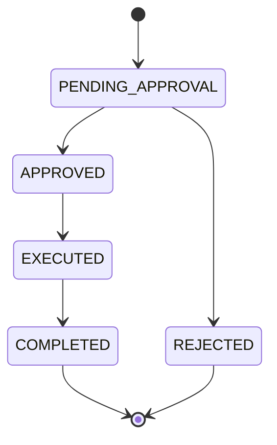

# Business Requirements Document (BRD)

## 1. Document Information

| Field | Value |
|---------|---------|
| Project Name | Nexus CA — Internal Certificate Authority Platform |
| Project ID | CA-PLATFORM-V1 |
| Version | 1.0 |
| Author | RuthvikChandra Vanam |
| Date | 2026-06-02 |
| Status | Approved — Baseline Scope Locked |
| Stakeholders | Business Owner, Product Owner, Technology Lead, Security, Operations, and QA subagents |

---

## 2. Executive Summary

### Purpose

Develop an internal Certificate Authority platform ("Nexus CA") for:

- Root CA management
- Intermediate CA management
- Certificate issuance
- CA certificate revocation (Root CA and Intermediate CA only)
- User and role management
- Audit trail management

### Business Problem

The organisation needs to issue and manage internal X.509 certificates (client, server, and signing) under its own trust hierarchy, without relying on external/public CAs. Certificate and CA lifecycle actions must be governed by dual control (maker-checker), fully audited, and restricted by role — capabilities that ad-hoc or manual certificate handling cannot provide. There is no existing internal platform that combines CA hierarchy management, controlled issuance, configurable RBAC, and a complete audit trail.

### Expected Benefits

- A centrally managed, multi-level CA hierarchy under organisational control.
- Strong dual-control (maker-checker) governance over every privileged action.
- Configurable role-based access control with segregation of duties enforced structurally.
- A complete, immutable, long-retention audit trail for compliance.
- Mandatory MFA and policy-driven credential management for all users.

---

## 3. Objectives

### Business Objectives

- Provide self-service issuance of CLIENT, SERVER, and SIGNING certificates under internally managed CAs.
- Enforce maker-checker dual control on all privileged CA, user, role, and configuration changes.
- Guarantee a permanent, recoverable administrative root for the platform.
- Maintain a tamper-evident audit trail retained for a minimum of 10 years.
- Operate entirely within internal network segments with no dependence on external CAs.

### Success Criteria

- Root CA creation operational
- Intermediate CA creation operational
- User management operational
- Certificate issuance operational
- CA certificate revocation operational (Root CA and Intermediate CA)
- Maker-checker enforced
- Audit logging operational
- Checker can view field-level changes before approval
- Audit records contain request payload, approval payload, before snapshot and after snapshot
- Email notifications sent on request lifecycle events
- Certificate type (CLIENT, SERVER, SIGNING) enforced at issuance
- MFA via email enforced at login for all users
- Account lockout enforced after configured number of failed MFA attempts
- Password expiry enforced with forced reset flow
- Self profile update operational for all users
- System configuration page accessible to SUPER_ADMIN_MAKER
- Root CA and Intermediate CA revocation operational and restricted to CA_ADMIN_MAKER / CA_ADMIN_CHECKER
- Configurable RBAC engine operational: roles can be created, edited, and deleted via the maker-checker workflow (WF-016 / WF-017 / WF-018)
- Permission catalogue enforced: a role cannot be granted permissions outside the defined catalogue
- Archetype exclusivity enforced: no role may hold both maker and checker operations for the same feature
- Minimum-viability safeguards enforced: the system rejects any role edit, delete, disable, or assignment change that would orphan a feature's approver or remove the last administrative maker/checker path
- Non-functional targets met: availability, issuance latency, and concurrency meet the thresholds in [§14 Non-Functional Requirements](#14-non-functional-requirements)

---

## 4. Scope

### In Scope

- Create Root CA
- Enable / Disable Root CA
- Create Intermediate CA (multi-level hierarchy supported)
- Enable / Disable Intermediate CA
- Create Users
- Enable / Disable Users
- Self Profile Update
- Assign Roles (at creation and post-creation)
- Role Management — create, edit, delete, and view configurable custom roles (RBAC engine)
- Submit CSR
- Issue Client, Server, and Signing Certificates
- Revoke Root CA
- Revoke Intermediate CA
- Audit Logging
- Reporting
- Email Notifications
- Multi-Factor Authentication (MFA)
- System Configuration Management
- Maker-Checker Workflow

<a id="out-of-scope"></a>

### Out of Scope

- HSM Integration
- CRL
- OCSP
- Certificate Renewal
- ACME
- LDAP / AD Integration
- SSO
- Multi-Tenancy
- Public Certificate Issuance
- Workflow Customization — changing approval-flow steps/stages (note: configurable **Role Management** is in scope; see [§9.6 Role Management & RBAC](#96-role-management--configurable-rbac))

> **Scope Lock Statement:** No functionality outside this document shall be included in Version 1.0 unless approved through formal change management.

---

## 5. Stakeholders

| Role | Name | Responsibility |
|--------|--------|---------------|
| Business Owner | Business Owner subagent | Owns business outcomes and funding; approves scope |
| Product Owner | Product Owner subagent | Prioritises requirements; accepts delivery |
| Technology Lead | Technology Lead subagent | Owns architecture and technical delivery |
| Security | Security subagent | Owns threat model, cryptographic and access controls |
| Operations | Operations subagent | Owns bootstrap, deployment, backup/restore, incident response |
| QA | QA subagent | Owns SIT/UAT/regression and acceptance verification |

---

## 6. Current State (As-Is)

### Existing Process

Nexus CA is a greenfield internal platform; there is no prior dedicated internal CA system. Certificate and CA handling has been ad-hoc, without a single controlled hierarchy, dual-control governance, configurable role-based access, or a consolidated audit trail.

### Pain Points

- No centrally governed Root/Intermediate CA hierarchy under organisational control.
- No enforced dual control (maker-checker) over privileged certificate, CA, user, or configuration actions.
- No configurable, segregation-of-duties-aware role model.
- No consolidated, immutable, long-retention audit trail across certificate and identity operations.
- No uniform enforcement of MFA and credential policy for operators.

---

## 7. Future State (To-Be)

### Proposed Solution

Nexus CA provides a controlled, multi-level CA hierarchy with maker-checker governance over every privileged action, configurable RBAC with structural segregation of duties, mandatory MFA, certificate issuance for CLIENT/SERVER/SIGNING profiles, CA revocation with cascade, email notifications, reporting, and a complete immutable audit trail. CA private keys exist only within the isolated Crypto tier and are never exported.

See [../2-Design/2.1-HLD/architecture.md](../2-Design/2.1-HLD/architecture.md) for technical architecture decisions.

### High-Level Flow

```text
Maker (submit request) → System (validate, persist PENDING_APPROVAL, notify checker)
  → Checker (review before/after, approve or reject)
  → System (execute exactly once, audit, notify maker) → COMPLETED
```

---

## 8. Business Requirements

| ID | Requirement | Priority |
|----|-------------|----------|
| BR-001 | Root CA management (create, enable/disable, revoke) | High |
| BR-002 | Intermediate CA management with multi-level hierarchy | High |
| BR-003 | Certificate issuance for CLIENT, SERVER, SIGNING profiles | High |
| BR-004 | CA revocation (Root and Intermediate) with cascade | High |
| BR-005 | User management and self-profile update | High |
| BR-006 | Configurable Role Management (RBAC engine) with segregation of duties | High |
| BR-007 | Maker-checker dual control on all privileged actions | High |
| BR-008 | Authentication with mandatory email-based MFA and credential policy | High |
| BR-009 | Complete, immutable, long-retention audit trail | High |
| BR-010 | Reporting across CAs, certificates, users, roles, requests, and audit | Medium |
| BR-011 | Email notifications on lifecycle and security events | Medium |
| BR-012 | System configuration management under maker-checker | Medium |
| BR-013 | Bootstrap of a permanent, immutable administrative root | High |

### BR-006 (representative detail)

**Description** — The platform shall provide a configurable RBAC engine allowing creation, editing, deletion, and viewing of roles assembled from a fixed permission catalogue, with archetype-based segregation of duties.

**Business Justification** — Authority must be assignable and auditable without code changes, while structurally preventing any single role from both initiating and approving the same action.

**Acceptance Criteria**
- Roles can be created/edited/deleted via maker-checker (WF-016/017/018).
- No permission outside the catalogue can be granted.
- No role can hold both a maker operation and Approve for the same feature.
- The two SUPER_ADMIN roles are immutable and always present.

---

## 9. Functional Requirements

| ID | Requirement | Priority |
|----|-------------|----------|
| FR-001 | Authentication & MFA | High |
| FR-002 | Root CA lifecycle | High |
| FR-003 | Intermediate CA lifecycle | High |
| FR-004 | Certificate lifecycle & issuance | High |
| FR-005 | User lifecycle & self-profile update | High |
| FR-006 | Role management & configurable RBAC | High |
| FR-007 | Request lifecycle & maker-checker | High |
| FR-008 | Audit | High |
| FR-009 | Notifications | Medium |
| FR-010 | Reporting | Medium |
| FR-011 | System configuration | Medium |

The detailed functional specification for each area follows. All role names below are the **seeded defaults**; authority is enforced by permissions, not hard-coded role names (see [§9.6](#96-role-management--configurable-rbac)).

<a id="roles"></a>

### 9.0 Roles (seeded defaults)

| Role | Description |
|---|---|
| SUPER_ADMIN_MAKER | Initiates governance requests: user management, role management, and system configuration. Immutable; created only at bootstrap |
| SUPER_ADMIN_CHECKER | Reviews and approves or rejects governance requests submitted by SUPER_ADMIN_MAKER. Immutable; created only at bootstrap |
| CA_ADMIN_MAKER | Initiates CA requests: Root and Intermediate CA creation, enable/disable, and revocation |
| CA_ADMIN_CHECKER | Reviews and approves or rejects CA requests submitted by CA_ADMIN_MAKER |
| CA_OPERATOR_MAKER | Submits certificate issuance requests |
| CA_OPERATOR_CHECKER | Reviews and approves or rejects certificate issuance requests |
| AUDITOR | Read-only access to all data for compliance and audit purposes |

These seven are the **seeded roles** shipped with the platform. The CA_ADMIN, CA_OPERATOR, and AUDITOR roles are ordinary roles built on the same model as custom roles and may themselves be edited or deleted, subject to the safeguards in [§9.6](#96-role-management--configurable-rbac); the two SUPER_ADMIN roles are immutable. Each role has exactly one **archetype** — **Maker**, **Checker**, or **Viewer** — which fixes the operations it may be granted and enforces segregation of duties. The seeded roles map as: SUPER_ADMIN_MAKER, CA_ADMIN_MAKER, CA_OPERATOR_MAKER → Maker; SUPER_ADMIN_CHECKER, CA_ADMIN_CHECKER, CA_OPERATOR_CHECKER → Checker; AUDITOR → Viewer.

<a id="permissions"></a>

#### Permissions (seeded default matrix)

> The matrix below is the **seeded default** configuration of the seven system roles. Permissions are not hard-coded: under configurable Role Management each role is assigned permissions from a fixed catalogue, and this matrix is the default that ships with the system — it may itself be edited (except the immutable SUPER_ADMIN roles).

| Feature | Operation | SUPER_ADMIN_MAKER | SUPER_ADMIN_CHECKER | CA_ADMIN_MAKER | CA_ADMIN_CHECKER | CA_OPERATOR_MAKER | CA_OPERATOR_CHECKER | AUDITOR |
|---|---|:---:|:---:|:---:|:---:|:---:|:---:|:---:|
| **Root CA** | Create Request | ✗ | ✗ | ✓ | ✗ | ✗ | ✗ | ✗ |
| | Enable / Disable Request | ✗ | ✗ | ✓ | ✗ | ✗ | ✗ | ✗ |
| | Revoke Request | ✗ | ✗ | ✓ | ✗ | ✗ | ✗ | ✗ |
| | View | ✗ | ✗ | ✓ | ✓ | ✓ | ✓ | ✓ |
| | Download Public Certificate | ✗ | ✗ | ✓ | ✓ | ✓ | ✓ | ✓ |
| | Approve / Reject | ✗ | ✗ | ✗ | ✓ | ✗ | ✗ | ✗ |
| **Intermediate CA** | Create Request | ✗ | ✗ | ✓ | ✗ | ✗ | ✗ | ✗ |
| | Enable / Disable Request | ✗ | ✗ | ✓ | ✗ | ✗ | ✗ | ✗ |
| | Revoke Request | ✗ | ✗ | ✓ | ✗ | ✗ | ✗ | ✗ |
| | View | ✗ | ✗ | ✓ | ✓ | ✓ | ✓ | ✓ |
| | Download Public Certificate | ✗ | ✗ | ✓ | ✓ | ✓ | ✓ | ✓ |
| | Approve / Reject | ✗ | ✗ | ✗ | ✓ | ✗ | ✗ | ✗ |
| **Certificate** | Submit CSR (Create) | ✗ | ✗ | ✗ | ✗ | ✓ | ✗ | ✗ |
| | View | ✗ | ✗ | ✓ | ✓ | ✓ | ✓ | ✓ |
| | Download Issued Certificate | ✗ | ✗ | ✗ | ✗ | ✓ | ✓ | ✗ |
| | Approve / Reject Issuance | ✗ | ✗ | ✗ | ✗ | ✗ | ✓ | ✗ |
| **User** | Create Request | ✓ | ✗ | ✗ | ✗ | ✗ | ✗ | ✗ |
| | Enable / Disable Request | ✓ | ✗ | ✗ | ✗ | ✗ | ✗ | ✗ |
| | Role Assignment Request | ✓ | ✗ | ✗ | ✗ | ✗ | ✗ | ✗ |
| | View | ✓ | ✓ | ✗ | ✗ | ✗ | ✗ | ✓ |
| | Edit | ✗ | ✗ | ✗ | ✗ | ✗ | ✗ | ✗ |
| | Delete | ✗ | ✗ | ✗ | ✗ | ✗ | ✗ | ✗ |
| | Approve / Reject | ✗ | ✓ | ✗ | ✗ | ✗ | ✗ | ✗ |
| | Reset Password | ✓ | ✗ | ✗ | ✗ | ✗ | ✗ | ✗ |
| **Role** | Create Request | ✓ | ✗ | ✗ | ✗ | ✗ | ✗ | ✗ |
| | Edit Request | ✓ | ✗ | ✗ | ✗ | ✗ | ✗ | ✗ |
| | Delete Request | ✓ | ✗ | ✗ | ✗ | ✗ | ✗ | ✗ |
| | View | ✓ | ✓ | ✗ | ✗ | ✗ | ✗ | ✓ |
| | Approve / Reject | ✗ | ✓ | ✗ | ✗ | ✗ | ✗ | ✗ |
| **Own Profile** | View | ✗ | ✗ | ✓ | ✓ | ✓ | ✓ | ✓ |
| | Edit (excl. User ID) | ✗ | ✗ | ✓ | ✓ | ✓ | ✓ | ✓ |
| **Requests** | View | ✗ | ✗ | ✓ | ✓ | ✓ | ✓ | ✓ |
| **Audit Logs** | View | ✗ | ✗ | ✓ | ✓ | ✓ | ✓ | ✓ |
| **Reports** | View | ✗ | ✗ | ✓ | ✓ | ✓ | ✓ | ✓ |
| **System Configuration** | View | ✓ | ✓ | ✗ | ✗ | ✗ | ✗ | ✓ |
| | Edit Request | ✓ | ✗ | ✗ | ✗ | ✗ | ✗ | ✗ |
| | Approve / Reject | ✗ | ✓ | ✗ | ✗ | ✗ | ✗ | ✗ |

> **Edit** and **Delete** are not valid operations on cryptographic entities (Root CA, Intermediate CA, issued Certificate) and are absent from the permission catalogue; their identity is cryptographically fixed and their history is required for trust-chain integrity. Their only lifecycle operations are Enable/Disable and Revoke. These rows are therefore omitted from the matrix above rather than shown as all-deny.

<a id="approval-matrix"></a>

#### Approval Matrix

| Request Type | Maker | Checker |
|-------------|--------|----------|
| Root CA Creation | CA_ADMIN_MAKER | CA_ADMIN_CHECKER |
| Root CA Enable / Disable | CA_ADMIN_MAKER | CA_ADMIN_CHECKER |
| Intermediate CA Creation | CA_ADMIN_MAKER | CA_ADMIN_CHECKER |
| Intermediate CA Enable / Disable | CA_ADMIN_MAKER | CA_ADMIN_CHECKER |
| User Creation | SUPER_ADMIN_MAKER | SUPER_ADMIN_CHECKER |
| User Enable / Disable | SUPER_ADMIN_MAKER | SUPER_ADMIN_CHECKER |
| Role Assignment (at creation and post-creation) | SUPER_ADMIN_MAKER | SUPER_ADMIN_CHECKER |
| Certificate Issuance | CA_OPERATOR_MAKER | CA_OPERATOR_CHECKER |
| Root CA Revocation | CA_ADMIN_MAKER | CA_ADMIN_CHECKER |
| System Configuration Update | SUPER_ADMIN_MAKER | SUPER_ADMIN_CHECKER |
| Intermediate CA Revocation | CA_ADMIN_MAKER | CA_ADMIN_CHECKER |
| Role Creation | SUPER_ADMIN_MAKER | SUPER_ADMIN_CHECKER |
| Role Edit | SUPER_ADMIN_MAKER | SUPER_ADMIN_CHECKER |
| Role Deletion | SUPER_ADMIN_MAKER | SUPER_ADMIN_CHECKER |

> The pairings above are the **seeded defaults**. With configurable roles the routing generalises: a maker request for feature *F* is actionable by **any active Checker-archetype role that holds Approve on F** (see [§9.6](#96-role-management--configurable-rbac)). Self-approval remains prohibited.

<a id="authentication-requirements"></a>

### FR-001 — Authentication & MFA

#### Description
All access is authenticated, with mandatory email-based MFA and policy-driven credential management.

#### Processing Logic
- All users must authenticate with username and password.
- Multi-Factor Authentication (MFA) is mandatory for all users.
- The MFA second factor is a One-Time Code (OTC) delivered to the user's registered email address.
- The OTC is a numeric code whose length is configurable via the **MFA OTC Length (digits)** parameter (default: 6 digits).
- The OTC is valid for a configurable validity window (default: 10 minutes) from the time of issuance. Expired OTCs are rejected; the user must request a new login attempt.
- Only the most recent OTC issued to a user is valid. Any prior OTC is invalidated as soon as a new one is generated.
- An OTC is single-use. A successful verification invalidates the OTC immediately.
- A user may request a new OTC (resend) up to a configurable **MFA OTC Resend Limit** (default: 3) per login/verification session, with a configurable **MFA OTC Resend Cooldown (seconds)** (default: 30) enforced between consecutive resend requests. Exceeding the resend limit ends the current verification session and requires the user to restart the login attempt.
- Login is denied if MFA is not completed.
- After a configurable number of consecutive failed MFA attempts (default: 3), the account is locked.
- A locked account can be unlocked by:
  - A SUPER_ADMIN_MAKER performing a password reset (see WF-014), or
  - The user completing the Forgot Password flow (see WF-011).
- Passwords expire after a configurable number of days (default: 30).
- On login with an expired password, the user is redirected to a forced password reset with MFA verification (see WF-012).
- Users may also initiate a password reset themselves via the Forgot Password flow at any time.
- Temporary passwords issued on user creation or admin-initiated password reset expire after a configurable period (default: 24 hours). After expiry, the user cannot log in with the temporary password and an administrator must issue a new one.
- Sessions expire after a configurable idle period (default: 30 minutes). The user is redirected to login on expiry.
- Each user may have only one active session at a time. A new login terminates any existing session.

#### Password Policy
- Password complexity is governed by a single configurable **Password Policy Regex** (a system-configuration parameter). A candidate password is accepted only if it **fully matches** this regular expression. The regex is the single source of truth for both length and character composition.
  - Default regex — at least 12 characters with at least one uppercase letter, one lowercase letter, one digit, and one special (non-alphanumeric) character:

    ```
    ^(?=.*[A-Z])(?=.*[a-z])(?=.*\d)(?=.*[^A-Za-z0-9]).{12,}$
    ```

  - The regex is enforced **server-side** (authoritative) and may be mirrored client-side for inline feedback. The configured value must be a valid, compilable pattern; an invalid pattern is rejected at configuration time (see WF-013).
  - Independent of the regex, passwords are capped at **72 bytes** (the bcrypt input limit); longer input is rejected. Administrators are responsible for keeping the policy within this bound.
  - Changing the policy does not invalidate existing passwords; the new policy applies at the next password set or reset (user creation, forced reset, Forgot Password, and admin reset).
- **Password history.** A user may not reuse any of their last **N** passwords, where N is the configurable **Password History Depth** (default: 10, includes the current password). On every password change the candidate is compared (via bcrypt) against the stored history; a match is rejected. This applies to **all** user-chosen password changes — first-login forced reset, expired-password forced reset (WF-012), and self-service Forgot Password (WF-011).
  - On a successful change, the new hash is appended to the user's history and entries older than the configured depth are discarded. Reducing the depth later prunes the retained history to the new depth.
  - System-generated **temporary** passwords (user creation WF-005, admin reset WF-014) are random and are exempt from the history check, but the user-chosen password that replaces them is checked against history as normal.

<a id="root-ca-lifecycle"></a>

### FR-002 — Root CA Lifecycle

#### Rules
- Multiple Root CAs may exist.
- Root CA deletion is not supported.
- Root CA modification is not supported.
- Revocation is permanent and irreversible. A revoked Root CA cannot be re-enabled.
- When a Root CA is revoked, all of its Intermediate CAs are automatically REVOKED.
- Certificates signed by a revoked CA remain as historical records in the system. External revocation notification (CRL, OCSP) is out of scope for v1.0.
- The system generates the CA keypair on approval execution. User-provided keys are not accepted.
- The public certificate of a Root CA is available for download by any user whose role holds the **Download Public Certificate** permission on Root CA (per the [Permissions](#permissions) matrix) — i.e., the CA_ADMIN, CA_OPERATOR, and AUDITOR roles by default.

#### Allowed status transitions

| From | To | Trigger |
|---|---|---|
| ACTIVE | DISABLED | Enable / Disable request approved |
| DISABLED | ACTIVE | Enable / Disable request approved |
| ACTIVE | REVOKED | Revocation request approved |
| DISABLED | REVOKED | Revocation request approved |
| REVOKED | Any | ✗ Not permitted |

#### Required creation fields
- Common Name (CN)
- Organisation (O)
- Country (C)
- Key Algorithm (RSA or EC)
- Key Size
- Validity Period (years) — between 1 and the configured **Maximum CA Validity (years)** (default 30); submissions outside this range are rejected at submission.

#### Required revocation fields
- Revocation Reason (KEY_COMPROMISE, CESSATION_OF_OPERATION, SUPERSEDED, or OTHER). When OTHER is selected, a free-text explanation (minimum 10 characters) is mandatory and is stored in the audit log.

#### Statuses
- ACTIVE
- DISABLED
- REVOKED

<a id="intermediate-ca-lifecycle"></a>

### FR-003 — Intermediate CA Lifecycle

#### Rules
- Each Intermediate CA belongs to exactly one parent CA, which may be a Root CA or another Intermediate CA.
- A CA (Root CA or Intermediate CA) may have multiple child Intermediate CAs.
- Intermediate CAs may be nested to form a multi-level signing hierarchy.
- The maximum nesting depth is configurable. Requests to create an Intermediate CA that would exceed the maximum depth are rejected at submission.
- Deletion is not supported.
- Revocation is permanent and irreversible. A revoked Intermediate CA cannot be re-enabled.
- When an Intermediate CA is revoked, all of its child Intermediate CAs are automatically REVOKED.
- Certificates signed by a revoked Intermediate CA remain as historical records in the system. External revocation notification (CRL, OCSP) is out of scope for v1.0.
- The system generates the CA keypair on approval execution. User-provided keys are not accepted.
- The public certificate of an Intermediate CA is available for download by any user whose role holds the **Download Public Certificate** permission on Intermediate CA (per the [Permissions](#permissions) matrix) — i.e., the CA_ADMIN, CA_OPERATOR, and AUDITOR roles by default.

#### Allowed status transitions

| From | To | Trigger |
|---|---|---|
| ACTIVE | DISABLED | Enable / Disable request approved |
| DISABLED | ACTIVE | Enable / Disable request approved |
| ACTIVE | REVOKED | Revocation request approved |
| DISABLED | REVOKED | Revocation request approved |
| REVOKED | Any | ✗ Not permitted |

#### Required creation fields
- Parent CA (Root CA or Intermediate CA)
- Common Name (CN)
- Organisation (O)
- Country (C)
- Key Algorithm (RSA or EC)
- Key Size
- Validity Period (years) — between 1 and the configured **Maximum CA Validity (years)** (default 30); submissions outside this range are rejected at submission.

#### Required revocation fields
- Revocation Reason (KEY_COMPROMISE, CESSATION_OF_OPERATION, SUPERSEDED, or OTHER). When OTHER is selected, a free-text explanation (minimum 10 characters) is mandatory and is stored in the audit log.

#### Statuses
- ACTIVE
- DISABLED
- REVOKED

<a id="revocation-reasons"></a>

#### Revocation Reasons (Root CA and Intermediate CA only)
- KEY_COMPROMISE
- CESSATION_OF_OPERATION
- SUPERSEDED
- OTHER — requires a mandatory free-text explanation (minimum 10 characters), captured on the revocation request and stored in the audit log.

<a id="certificate-lifecycle"></a>

### FR-004 — Certificate Lifecycle & Issuance

#### Certificate Types
The platform issues three types of end-entity certificate. The CA_OPERATOR_MAKER selects the type at submission; the type determines the certificate's permitted use (encoded as Key Usage / Extended Key Usage) and its maximum validity. None of these types may sign other certificates — certificate signing is performed only by Intermediate CAs.

| Type | Purpose | Typical use | Maximum validity parameter |
|---|---|---|---|
| **CLIENT** | Authenticates a user or service *to* a server. | mTLS client authentication. | `Maximum Certificate Validity — CLIENT (days)` (default 365) |
| **SERVER** | Asserts a server's identity *to* clients. | TLS for internal web services, gRPC, etc. Requires a DNS-name or IP Subject Alternative Name. | `Maximum Certificate Validity — SERVER (days)` (default 365) |
| **SIGNING** | General-purpose digital signature over content (not certificate issuance). | Document signing, code signing, signed email. | `Maximum Certificate Validity — SIGNING (days)` (default 730) |

The exact X.509 v3 extension set (Basic Constraints, Key Usage, Extended Key Usage, SAN rules, criticality) for each type is specified in [certificate-profiles.md](../2-Design/2.2-LLD/certificate-profiles.md). Issuance always requires maker-checker approval; the checker reviews the certificate type, validity range, and output format before approving.

#### Statuses
- ACTIVE
- EXPIRED

#### Rules
- **End-entity certificate revocation is out of scope for v1.0.** Issued certificates have only the ACTIVE and EXPIRED statuses; there is no REVOKED status for end-entity certificates. Certificates issued under a CA that is later revoked retain their ACTIVE/EXPIRED status as historical records, and no external revocation notification (CRL, OCSP) is published.
- CSR can only be used once.
- Certificate issuance requires approval.
- The system automatically transitions a certificate from ACTIVE to EXPIRED when the system datetime passes the certificate's Valid To date.
- EXPIRED certificates are read-only. Reissuance requires a new CSR submission.
- CA_OPERATOR_MAKER can view full CSR details before submission.
- CA_OPERATOR_MAKER selects the signing Intermediate CA from the list of ACTIVE Intermediate CAs when submitting the CSR.
- CA_OPERATOR_MAKER specifies the certificate type: CLIENT, SERVER, or SIGNING.
- CA_OPERATOR_MAKER sets the validity date range (start date and end date).
- CA_OPERATOR_MAKER selects the output format for the issued certificate.
- The checker reviews and approves the certificate type, validity date range, and output format as part of the issuance request.
- The system enforces a configurable maximum validity period per certificate type. Submissions exceeding the maximum are rejected.
- Upon approval and execution, the issued certificate is made available for download by the CA_OPERATOR_MAKER and CA_OPERATOR_CHECKER in the output format selected at submission.
- The certificate may be re-downloaded at any time from the certificate detail view. The output format cannot be changed after submission.

#### Certificate output formats

| Format | Description |
|---|---|
| PEM — Certificate only | Signed certificate in Base64-encoded PEM format |
| PEM — Full chain | Signed certificate and intermediate chain in PEM format |
| DER — Certificate only | Signed certificate in binary DER format |
| DER — Full chain | Signed certificate and intermediate chain in DER format |
| PKCS#7 / P7B | Full certificate chain without private key |

<a id="user-lifecycle"></a>

### FR-005 — User Lifecycle & Self-Profile Update

#### Statuses
- ACTIVE
- DISABLED

#### Rules
- Each user must have exactly one role.
- User deletion is not supported.
- A DISABLED user cannot log in. Login attempts by a DISABLED user are denied with a generic 401 response that does not disclose the account is disabled (to prevent user enumeration). An administrator must re-enable the account (WF-006) before the user can authenticate.

#### Self-Profile Update
- All authenticated users may update their own profile without maker-checker approval.
- User ID and Username cannot be changed.
- Editable fields: Full Name, Email.
- Role and Status cannot be self-edited.
- On email-address change, the system sends a security-alert notification to the **previous** email address informing the account holder that their email was changed. This alerts the user to an unauthorised change, since email is the delivery channel for MFA codes and temporary passwords.

#### Required creation fields
- Full Name
- Username
- Email (mandatory — used for system notifications)
- Role

#### Initial Password
- The system generates a temporary password upon user creation execution.
- The temporary password is sent to the user's registered email address.
- The user must change the temporary password with MFA verification on first login.

<a id="role-management-configurable-rbac"></a>

### 9.6 Role Management & Configurable RBAC

The platform ships seven **seeded roles** (SUPER_ADMIN_MAKER, SUPER_ADMIN_CHECKER, CA_ADMIN_MAKER, CA_ADMIN_CHECKER, CA_OPERATOR_MAKER, CA_OPERATOR_CHECKER, AUDITOR). They divide administration into two planes: the **SUPER_ADMIN** roles own the governance plane (User, Role, and System Configuration management), while the **CA_ADMIN** roles own CA operations (Root and Intermediate CA) and the **CA_OPERATOR** roles own certificate issuance. Beyond these, a user whose role grants the relevant **Role** permission may **create, edit, delete, and view custom roles**, each assembled from a fixed catalogue of permissions. The CA_ADMIN, CA_OPERATOR, and AUDITOR seeded roles are ordinary roles and may themselves be edited or deleted, subject to the safeguards below; the two **SUPER_ADMIN roles are immutable**.

#### Archetypes

Every role has exactly one **archetype**, chosen first at creation. The archetype fixes the palette of operations the role may be granted and enforces segregation of duties — a role can never be both an initiator and an approver of the same feature.

| Archetype | Operation palette | Purpose |
|---|---|---|
| **Maker** | Create, Edit, Delete, View (plus feature-specific: Submit, Download, Enable/Disable, Revoke, Reset Password, Assign Role) | Initiates requests |
| **Checker** | View, Approve / Reject | Reviews and decides maker requests |
| **Viewer** | View | Read-only access for audit and compliance |

#### Permission Catalogue

A role's permissions are a set of (Feature, Operation) pairs selected from the catalogue. The operations offered for a feature depend on the role's archetype and on which operations that feature supports.

| Feature | Maker operations | Checker | Viewer |
|---|---|---|---|
| Root CA | Create, View, Download, Enable/Disable, Revoke | View, Approve/Reject | View |
| Intermediate CA | Create, View, Download, Enable/Disable, Revoke | View, Approve/Reject | View |
| Certificate | Submit, View, Download | View, Approve/Reject | View |
| User | Create, Edit, Delete, View, Enable/Disable, Reset Password, Assign Role | View, Approve/Reject | View |
| Role | Create, Edit, Delete, View | View, Approve/Reject | View |
| Own Profile | View, Edit (excl. User ID) | View, Edit (excl. User ID) | View, Edit (excl. User ID) |
| Requests | View | View | View |
| System Configuration | Edit, View | View, Approve/Reject | View |
| Reports | View | View | View |
| Audit Logs | View | View | View |

**Edit and Delete are offered only for User, Role, and System Configuration.** Cryptographic entities — Root CA, Intermediate CA, and issued Certificates — are never editable or deletable: their identity is cryptographically fixed and their history is required for audit and trust-chain integrity. Their only lifecycle operations remain Enable/Disable and Revoke. **Delete is a soft delete**: the target is marked `DELETED` and retained with its full history; records are never physically purged.

**Own Profile, Requests, Reports, and Audit Logs are available to every archetype** — they are baseline capabilities (view/edit one's own profile, view the request queue, view reports, view audit logs) that any role may hold regardless of archetype, which is why their operations are identical across the Maker, Checker, and Viewer columns. Reports and Audit Logs offer only View; there are no Maker- or Checker-specific operations on them.

#### Role Lifecycle (Maker-Checker)

Creating, editing, or deleting a role is itself a maker-checker request:

- A **Maker**-archetype role holding the relevant **Role** operation (Create / Edit / Delete) submits the request.
- A **Checker**-archetype role holding **Approve on Role** reviews the before/after permission set and approves or rejects.
- On approval the role definition takes effect. All changes are captured in the audit log with before/after snapshots, identical in form to every other request type.

#### Approval Routing (Feature Domain)

A maker request for feature *F* is actionable by **any active Checker-archetype role that holds Approve on F**. This generalises the seeded super-admin/CA-admin/operator split: governance features (User, Role, System Configuration) are approved by checkers holding Approve on those features (the seeded SUPER_ADMIN_CHECKER); CA features (Root CA, Intermediate CA) by checkers holding Approve on them (CA_ADMIN_CHECKER); certificate issuance by checkers holding Approve on Certificate (CA_OPERATOR_CHECKER).

#### Segregation-of-Duties Invariant

The system rejects any role definition or change that would violate segregation of duties:

- A role may hold maker operations (Create/Edit/Delete/Submit/Revoke) **or** Approve for a given feature — never both. This is guaranteed by the exclusive archetype.
- No user may approve a request they submitted.
- A maker cannot grant, via a custom role, any permission the catalogue does not define; the role-creation request still requires checker approval.

#### SUPER_ADMIN Immutability

The two seeded SUPER_ADMIN roles (SUPER_ADMIN_MAKER, SUPER_ADMIN_CHECKER) are the **permanent recovery root** of the governance plane and are therefore **immutable**:

- They **cannot be edited, deleted, or disabled** — any role edit/delete/disable request that targets a SUPER_ADMIN role is rejected at both submission and execution.
- Their permission set (User, Role, and System Configuration management) is fixed as shipped.
- They exist **only via bootstrap** — they cannot be created post-bootstrap, and at least one active user must hold each of SUPER_ADMIN_MAKER and SUPER_ADMIN_CHECKER at all times.
- Because the governance path can never be removed, SUPER_ADMIN guarantees the system can always recover administration; the dynamic safeguards below continue to govern all other (CA_ADMIN, CA_OPERATOR, AUDITOR, and custom) roles.

#### Minimum-Viability Safeguards

Because the non-SUPER_ADMIN seeded roles are editable and deletable, the system must prevent self-lockout. A role edit, delete, disable, or assignment change is **rejected** (with a clear error, validated at both submission and execution) if it would:

- leave **no active user able to approve** requests for a feature that has or can have pending requests (extends [Checker Availability](#101-checker-availability));
- leave **no active user able to manage Roles or Users** — i.e., remove every path to recover administration;
- leave **no active Maker** able to initiate a feature the platform requires to operate.

#### Audit of role changes

Every role create / edit / delete, archetype assignment, permission change, and role-to-user assignment is recorded in the audit log with actor, timestamp, before/after permission sets, and the approving checker.

### FR-007 — Request Lifecycle & Maker-Checker

#### Statuses
- PENDING_APPROVAL
- APPROVED
- REJECTED
- EXECUTED
- COMPLETED



#### Workflows

| ID | Workflow | File |
|---|---|---|
| WF-001 | Root CA Creation | [Workflows/WF-001-root-ca-creation.md](Workflows/WF-001-root-ca-creation.md) |
| WF-002 | Root CA Enable / Disable | [Workflows/WF-002-root-ca-enable-disable.md](Workflows/WF-002-root-ca-enable-disable.md) |
| WF-003 | Intermediate CA Creation | [Workflows/WF-003-intermediate-ca-creation.md](Workflows/WF-003-intermediate-ca-creation.md) |
| WF-004 | Intermediate CA Enable / Disable | [Workflows/WF-004-intermediate-ca-enable-disable.md](Workflows/WF-004-intermediate-ca-enable-disable.md) |
| WF-005 | User Creation | [Workflows/WF-005-user-creation.md](Workflows/WF-005-user-creation.md) |
| WF-006 | User Enable / Disable | [Workflows/WF-006-user-enable-disable.md](Workflows/WF-006-user-enable-disable.md) |
| WF-007 | Role Assignment | [Workflows/WF-007-role-assignment.md](Workflows/WF-007-role-assignment.md) |
| WF-008 | Certificate Issuance | [Workflows/WF-008-certificate-issuance.md](Workflows/WF-008-certificate-issuance.md) |
| WF-009 | Root CA Revocation | [Workflows/WF-009-root-ca-revocation.md](Workflows/WF-009-root-ca-revocation.md) |
| WF-010 | Self Profile Update | [Workflows/WF-010-self-profile-update.md](Workflows/WF-010-self-profile-update.md) |
| WF-011 | Forgot Password | [Workflows/WF-011-forgot-password.md](Workflows/WF-011-forgot-password.md) |
| WF-012 | Force Password Reset (Expired) | [Workflows/WF-012-force-password-reset.md](Workflows/WF-012-force-password-reset.md) |
| WF-013 | System Configuration Update | [Workflows/WF-013-system-configuration-update.md](Workflows/WF-013-system-configuration-update.md) |
| WF-014 | Admin Password Reset | [Workflows/WF-014-admin-password-reset.md](Workflows/WF-014-admin-password-reset.md) |
| WF-015 | Intermediate CA Revocation | [Workflows/WF-015-intermediate-ca-revocation.md](Workflows/WF-015-intermediate-ca-revocation.md) |
| WF-016 | Role Creation | [Workflows/WF-016-role-creation.md](Workflows/WF-016-role-creation.md) |
| WF-017 | Role Edit | [Workflows/WF-017-role-edit.md](Workflows/WF-017-role-edit.md) |
| WF-018 | Role Deletion | [Workflows/WF-018-role-deletion.md](Workflows/WF-018-role-deletion.md) |

<a id="audit-requirements"></a>

### FR-008 — Audit

Audit data shall include:

- Event ID
- Event Type
- User ID
- Role
- Timestamp
- Request ID
- Action
- Result
- Request Payload
- Approval Payload
- Created By
- Approved By
- Before Snapshot
- After Snapshot
- Changed Fields
- Approval Comments

#### Authentication Event Auditing
The following authentication events shall be captured in the audit log:

- User login (success and failure)
- User logout
- MFA success and failure
- Account lockout
- Password change
- Password reset (admin-initiated and self-service)
- Session expiry

#### Field-Level Change Tracking
For every update operation the system shall store:

- Field Name
- Previous Value
- New Value

Example:

| Field | Previous Value | New Value |
|---------|---------|---------|
| role | CA_OPERATOR_MAKER | CA_OPERATOR_CHECKER |

*See [checker-review.md](checker-review.md) for the checker approval UI specification.*

#### Audit Record Rules
Audit records shall be:

- Immutable
- Non-editable
- Non-deletable through the application

Audit records shall remain available even if underlying records are modified. Audit records shall be retained for a minimum of **10 years**. Physical purge of audit records through the application interface is not supported. Long-term archival beyond the online retention window is an operational concern addressed in the backup-restore runbook.

### FR-009 — Notifications

The system shall send email notifications to inform users of request lifecycle events.

| Event | Recipient |
|---|---|
| Request submitted | Assigned checker |
| Request approved | Request maker |
| Request rejected | Request maker |
| Request executed | Request maker |
| Pending request not actioned after configured days | Assigned checker (escalation) |
| Certificate expiry warning (N days before Valid To) | CA_OPERATOR_MAKER who submitted the original request |
| CA expiry warning (N days before Valid To) | CA_ADMIN_MAKER |
| Account locked | Affected user and SUPER_ADMIN_MAKER |
| Email address changed | Previous email address (security alert) |

#### Delivery Failure Behaviour
- For notifications that carry **no credential material** (request lifecycle events, escalations, expiry warnings, security alerts), a delivery failure is logged but does not block or roll back the underlying action.
- For notifications that carry **credential material** (temporary password on user creation or admin-initiated reset), the action is not considered complete if delivery fails: the temporary password is never stored in plaintext, the actor is shown an error, and a fresh temporary password must be issued. See WF-005 and WF-014.

### FR-010 — Reporting

Each report is a flat list sorted by creation date descending. No filtering, export, or pagination for v1.0.

- **Access:** report visibility follows the [Permissions](#permissions-seeded-default-matrix) matrix (Reports → View). The User Report and Role Report additionally honour the User/Role visibility rules — they are not visible to roles lacking View on User/Role respectively.
- **Known constraint:** no row-count limit is defined in v1.0. A report over a very large dataset may be slow; this is an accepted limitation, to be revisited when filtering/pagination is added post-v1.0.
- **Sort order:** creation date descending for all reports.

#### Root CA Report

| Column | Description |
|---|---|
| Root CA ID | Unique identifier |
| Common Name (CN) | Root CA common name |
| Organisation (O) | Organisation name |
| Country (C) | Country code |
| Key Algorithm | RSA or EC |
| Key Size | Key size in bits |
| Valid From | CA validity start date |
| Valid To | CA validity end date |
| Status | ACTIVE, DISABLED, or REVOKED |
| Revocation Date | Date of revocation (if applicable) |
| Revocation Reason | Reason for revocation (if applicable) |
| Created By | CA_ADMIN_MAKER username |
| Approved By | CA_ADMIN_CHECKER username |
| Created Date | Date the creation request was submitted |

#### Intermediate CA Report

| Column | Description |
|---|---|
| Intermediate CA ID | Unique identifier |
| Common Name (CN) | Intermediate CA common name |
| Organisation (O) | Organisation name |
| Country (C) | Country code |
| Parent CA | Name of the parent CA (Root CA or Intermediate CA) |
| Key Algorithm | RSA or EC |
| Key Size | Key size in bits |
| Valid From | CA validity start date |
| Valid To | CA validity end date |
| Status | ACTIVE, DISABLED, or REVOKED |
| Revocation Date | Date of revocation (if applicable) |
| Revocation Reason | Reason for revocation (if applicable) |
| Created By | CA_ADMIN_MAKER username |
| Approved By | CA_ADMIN_CHECKER username |
| Created Date | Date the creation request was submitted |

#### Certificate Report

| Column | Description |
|---|---|
| Certificate ID | Unique identifier |
| Certificate Type | CLIENT, SERVER, or SIGNING |
| Subject Common Name | CN from the CSR |
| Serial Number | Certificate serial number |
| Issuing Intermediate CA | Name of the signing Intermediate CA |
| Valid From | Certificate validity start date |
| Valid To | Certificate validity end date |
| Output Format | Format in which the certificate was issued |
| Status | ACTIVE or EXPIRED |
| Submitted By | CA_OPERATOR_MAKER username |
| Approved By | CA_OPERATOR_CHECKER username |
| Created Date | Date the issuance request was submitted |

#### User Report

| Column | Description |
|---|---|
| User ID | Unique identifier |
| Full Name | User's full name |
| Username | Login username |
| Email | Registered email address |
| Role | Assigned role |
| Status | ACTIVE or DISABLED |
| Password Expiry Date | Date the current password expires |
| Last Login | Most recent successful login timestamp |
| Created By | SUPER_ADMIN_MAKER username who submitted the creation request |
| Approved By | SUPER_ADMIN_CHECKER username who approved the creation request |
| Created Date | Date the user creation request was submitted |

#### Role Report

| Column | Description |
|---|---|
| Role ID | Unique identifier |
| Name | Role name |
| Archetype | Maker, Checker, or Viewer |
| Type | System (seeded) or Custom |
| Permissions | Count of (feature, operation) grants |
| Assigned Users | Number of active users holding the role |
| Status | ACTIVE or DELETED |
| Created By | SUPER_ADMIN_MAKER username (blank for seeded roles) |
| Approved By | SUPER_ADMIN_CHECKER username (blank for seeded roles) |
| Created Date | Date the role creation request was submitted |

#### Pending Approval Report

| Column | Description |
|---|---|
| Request ID | Unique identifier |
| Request Type | Type of request (e.g., Root CA Creation, Certificate Issuance) |
| Target Entity | Name or ID of the entity being acted upon |
| Submitted By | Maker username |
| Submitted Date | Date the request was submitted |
| Status | PENDING_APPROVAL |
| Assigned Checker Role | SUPER_ADMIN_CHECKER, CA_ADMIN_CHECKER, or CA_OPERATOR_CHECKER (the checker role holding Approve on the request's feature) |
| Days Pending | Number of days since submission |

#### Request History Report

Shows all COMPLETED and REJECTED requests. Visible to all roles, scoped by the same visibility rules as the Pending Approval Report.

| Column | Description |
|---|---|
| Request ID | Unique identifier |
| Request Type | Type of request |
| Target Entity | Name or ID of the entity affected |
| Submitted By | Maker username |
| Submitted Date | Date the request was submitted |
| Decided By | Checker username |
| Decision Date | Date the checker approved or rejected |
| Final Status | COMPLETED or REJECTED |
| Rejection Reason | Mandatory comment provided on rejection (if applicable) |

#### Audit Report

| Column | Description |
|---|---|
| Event ID | Unique identifier |
| Event Type | Category of event |
| Timestamp | Date and time of the event |
| User ID | ID of the user who performed the action |
| Username | Username of the actor |
| Role | Role of the actor at the time of the event |
| Action | Action performed |
| Result | SUCCESS or FAILURE |
| Request ID | Associated request ID (if applicable) |
| Target Entity | Entity affected by the action |
| Target Entity ID | ID of the affected entity |
| Changed Fields | Fields changed with before and after values |
| Approval Comments | Checker comments (if applicable) |

<a id="system-configuration"></a>

### FR-011 — System Configuration

System parameters are managed exclusively by SUPER_ADMIN_MAKER from a dedicated configuration page. All changes require maker-checker approval: SUPER_ADMIN_MAKER submits a change request and SUPER_ADMIN_CHECKER reviews and approves or rejects it. Changes take effect only upon approval execution. All changes are captured in the audit log.

| Parameter | Default | Description |
|---|---|---|
| MFA Attempt Limit | 3 | Maximum consecutive failed MFA attempts before account lockout |
| MFA One-Time Code Validity (minutes) | 10 | Validity window of an emailed OTC after issuance |
| MFA OTC Length (digits) | 6 | Number of digits in the emailed One-Time Code |
| MFA OTC Resend Limit | 3 | Maximum number of OTC resends a user may request within a single login/verification session |
| MFA OTC Resend Cooldown (seconds) | 30 | Minimum interval between consecutive OTC resend requests |
| Temporary Password Validity (hours) | 24 | Validity window of a temporary password issued on user creation or admin-initiated reset |
| Password Expiry (days) | 30 | Number of days before a user password must be changed |
| Password Policy Regex | `^(?=.*[A-Z])(?=.*[a-z])(?=.*\d)(?=.*[^A-Za-z0-9]).{12,}$` | Regular expression a password must fully match. Authoritative for length and complexity. Must be a valid (compilable) pattern; effective length must stay within the 72-byte bcrypt limit |
| Password History Depth | 10 | Number of previous passwords (including the current) a user may not reuse |
| Session Timeout (minutes) | 30 | Idle time before a session expires |
| Allowed Key Algorithms | RSA, EC | Key algorithms permitted for CA creation. Must be a non-empty subset of {RSA, EC} |
| Minimum RSA Key Size (bits) | 2048 | Minimum permitted RSA key size |
| Minimum EC Key Size (bits) | 256 | Minimum permitted EC key size |
| Maximum CA Hierarchy Depth | 3 | Maximum nesting depth for Intermediate CAs |
| Maximum CA Validity (years) | 30 | Maximum validity period for a Root CA or Intermediate CA. Must be ≥ 1 |
| Maximum Certificate Validity — CLIENT (days) | 365 | Maximum validity period for CLIENT certificates |
| Maximum Certificate Validity — SERVER (days) | 365 | Maximum validity period for SERVER certificates |
| Maximum Certificate Validity — SIGNING (days) | 730 | Maximum validity period for SIGNING certificates |
| Certificate Expiry Warning (days) | 30 | Days before certificate expiry to send notification |
| CA Expiry Warning (days) | 90 | Days before CA expiry to send notification |
| Pending Request Escalation (days) | 3 | Days before an unactioned pending request triggers an escalation notification |

---

## 10. Business Rules

| Rule ID | Description |
|----------|-------------|
| BRULE-001 | Checker Availability — at least one ACTIVE checker per feature must exist for its requests to be actionable |
| BRULE-002 | Request Visibility — determined by archetype and the features a role holds permissions on |
| BRULE-003 | Date and Time — all system timestamps use server datetime |
| BRULE-004 | Bootstrap — one-time setup creates the immutable SUPER_ADMIN maker/checker users |
| BRULE-005 | Segregation of Duties — Created By ≠ Approved By; one-time execution |
| BRULE-006 | COMPLETED Trigger — certificate issuance completes on first maker download |
| BRULE-007 | SUPER_ADMIN Immutability — SUPER_ADMIN roles cannot be edited, deleted, or disabled (see [§9.6](#super_admin-immutability)) |
| BRULE-008 | Minimum-Viability Safeguards — reject changes that would orphan an approver or remove the last admin path (see [§9.6](#minimum-viability-safeguards)) |
| BRULE-009 | Permission Catalogue — a role cannot be granted permissions outside the catalogue |
| BRULE-010 | Archetype Exclusivity — no role holds both maker and checker operations for the same feature |
| BRULE-011 | CSR single-use — a CSR can only be used once |
| BRULE-012 | Revocation permanence & cascade — CA revocation is irreversible and cascades to descendants |

<a id="checker-availability"></a>

### 10.1 Checker Availability

- At least one ACTIVE user per checker role must exist for requests of that type to be actionable.
- The system shall warn SUPER_ADMIN_MAKER if disabling a checker account would leave no ACTIVE checker for that role.
- Requests that enter PENDING_APPROVAL with no ACTIVE checker remain pending until a checker becomes available.

### 10.2 Request Visibility

Visibility is determined by a role's **archetype** and the **features** it holds permissions on, not by seeded role name — this generalises to custom roles.

| Archetype | Visible Requests |
|---|---|
| Maker | Requests the user submitted, plus all requests for features the role holds a Maker operation on |
| Checker | Requests for features the role holds **Approve** on (i.e., requests it can action) |
| Viewer | All requests of all types (read-only) |

> The seeded roles are the defaults of this rule: SUPER_ADMIN_MAKER/SUPER_ADMIN_CHECKER hold governance features (User, Role, System Configuration) and so see governance requests; CA_ADMIN_MAKER/CA_ADMIN_CHECKER hold CA features (Root CA, Intermediate CA) and so see CA requests; CA_OPERATOR_MAKER/CA_OPERATOR_CHECKER hold Certificate and so see issuance requests; AUDITOR is a Viewer and sees everything.

### 10.3 Date and Time

- All timestamps recorded by the system (audit events, request creation, certificate validity, user creation, etc.) shall use the server system datetime.
- Client-side or user-supplied datetime values are not used for any system-generated timestamps.
- The validity start date of a certificate shall not be earlier than the system datetime at the time of execution.

<a id="bootstrap"></a>

### 10.4 Bootstrap

- The system requires a one-time initial user setup that bypasses maker-checker approval.
- Once completed, the setup mechanism is permanently disabled.
- The minimum users created during bootstrap are: one user holding the **SUPER_ADMIN_MAKER** role and one user holding the **SUPER_ADMIN_CHECKER** role. These two roles own the governance plane — User, Role, and System Configuration management — which is sufficient to onboard every other role and user. CA_ADMIN and CA_OPERATOR users are created afterward through the normal maker-checker flow by the SUPER_ADMIN users.
- The SUPER_ADMIN roles are created **only** here; the setup mechanism is the sole way they come into existence. Per [§9.6 SUPER_ADMIN Immutability](#super_admin-immutability) they can never be edited, deleted, or disabled, and at least one active user must hold each at all times — this is what guarantees the system remains administrable.

<a id="segregation-of-duties"></a>

### 10.5 Segregation of Duties

```text
Created By != Approved By
```

- Self approval is prohibited.
- Rejected requests shall not be executed.
- Approved requests shall be executed exactly once.
- A comment is mandatory when rejecting a request. Approval comments are optional.
- A pending request cannot be withdrawn by the maker. There is no CANCELLED state.
- When a request is executed, all other PENDING_APPROVAL requests targeting the same entity are automatically REJECTED with reason "superseded by executed request."

<a id="completed-trigger"></a>

### 10.6 COMPLETED Trigger

| Request Type | COMPLETED Triggered By |
|---|---|
| Certificate Issuance | CA_OPERATOR_MAKER downloads the issued certificate |
| All other request types | Automatically upon EXECUTED |

- If an EXECUTED certificate issuance request is never downloaded by the CA_OPERATOR_MAKER, it remains in EXECUTED indefinitely; the system does not auto-transition it to COMPLETED, even after the certificate reaches EXPIRED. There is no automatic timeout or forced completion of EXECUTED requests in v1.0. Re-issuance always requires a new CSR submission.

---

## 11. Process Flow

### As-Is Flow

```text
Requestor → ad-hoc / manual certificate handling → (no dual control, no consolidated audit)
```

### To-Be Flow

```text
Maker → Web SPA → Business Logic API (validate, persist PENDING_APPROVAL, notify checker)
  → Checker (review before/after diff) → Approve
  → Business Logic API → Crypto API (key generation / signing in isolated tier)
  → Execute once → Audit → Notify maker → COMPLETED
```

The maker-checker request state machine is specified in [§FR-007](#fr-007--request-lifecycle--maker-checker).

---

## 12. Interface Requirements

| Source System | Target System | Interface Type | Description |
|---------------|---------------|----------------|-------------|
| Web Tier (React/TS SPA) | Business Logic API | REST / HTTPS (JWT) | All user-facing operations |
| Business Logic API | Crypto API | REST / HTTPS | Key generation, signing, certificate issuance/download (private keys never leave the Crypto tier) |
| Business Logic API | SMTP relay | Email (STARTTLS) | OTCs, temporary passwords, lifecycle and security notifications |
| Business Logic API | Business DB (MySQL 8.4) | JDBC/SQL | Non-cryptographic application state |
| Crypto API | Crypto DB (MySQL 8.4) | JDBC/SQL | AES-256-GCM-encrypted private keys and certificate bytes |

See [../2-Design/2.1-HLD/architecture.md](../2-Design/2.1-HLD/architecture.md) for the deployment topology (DMZ + VLAN 2/3/4) and [../2-Design/2.2-LLD/api/](../2-Design/2.2-LLD/api/) for API contracts.

---

## 13. Data Requirements

Detailed schema is specified in [../2-Design/2.2-LLD/data-model.md](../2-Design/2.2-LLD/data-model.md). Principal data entities:

| Entity | Description | Mandatory |
|---------|------------|-----------|
| User | Identity, credentials (hashed), role assignment, status | Yes |
| Role / Role Permissions | Configurable RBAC roles and their (feature, operation) grants | Yes |
| Root CA / Intermediate CA | CA metadata, hierarchy, status, validity | Yes |
| Certificate | Issued end-entity certificate metadata and output format | Yes |
| Request | Maker-checker request with payload and before/after snapshots | Yes |
| Audit Event / Field Changes | Immutable audit trail with field-level diffs | Yes |
| System Configuration | Tunable platform parameters | Yes |

CA private keys exist only in the Crypto DB (VLAN 4), AES-256-GCM-encrypted with `CRYPTO_KEK`, and are never returned by any API.

---

## 14. Non-Functional Requirements

These targets set the baseline for infrastructure sizing, retry/backoff tuning, and SLA monitoring. They apply to v1.0 unless superseded by a formal infrastructure agreement.

### Performance
- The Crypto API issuance path (CSR validation through signed certificate availability) completes within **2 seconds at p95** under nominal load.
- Non-cryptographic API responses (list/view/submit) complete within **1 second at p95**.

### Availability
- 99.9% measured monthly for the platform's authenticated request paths (excludes planned maintenance windows announced in advance).
- The system supports at least **500 concurrent authenticated users** without breaching the latency targets above.
- CA hierarchies up to the configured Maximum CA Hierarchy Depth (default 3) are supported and tested at launch.
- Backup and restore objectives (RTO/RPO) are defined in the disaster-recovery and backup-restore runbooks; the platform design must not preclude the targets recorded there.

### Security
- Mandatory MFA (email OTC) for all users; single active session per user.
- Maker-checker dual control on all privileged actions; structural segregation of duties.
- CA private keys confined to the Crypto tier (VLAN 4), AES-256-GCM-encrypted, never exported.
- Password policy enforced server-side; credentials stored only as bcrypt hashes.

### Compliance
- Immutable, non-deletable audit trail retained online for a minimum of **10 years** (see [§FR-008](#fr-008--audit)).
- Full before/after change capture available to checkers prior to approval.

---

## 15. Assumptions

- A reliable internal SMTP relay (STARTTLS) is available for OTCs, temporary passwords, and notifications.
- The platform operates within the organisation's internal network segments (DMZ + VLAN 2/3/4); no public exposure of issuance APIs.
- No HSM is available in v1.0; key protection is software-based (AES-256-GCM with `CRYPTO_KEK`).
- The platform is single-tenant and serves internal certificate needs only.
- External revocation distribution (CRL/OCSP) is not required for v1.0 consumers.

---

## 16. Dependencies

- SMTP relay for email delivery (MFA, temporary passwords, notifications).
- MySQL 8.4 for the Business DB and the Crypto DB.
- Java 21 / Vert.x runtime for the Business Logic and Crypto APIs; BouncyCastle for cryptography.
- Nginx load balancer and web tier; segmented VLAN network per architecture.
- Secure provisioning and custody of `CRYPTO_KEK` and other secrets.

---

## 17. Risks

| Risk | Impact | Mitigation |
|--------|--------|-----------|
| Self-lockout of administration | Platform becomes unmanageable | Immutable SUPER_ADMIN roles + Minimum-Viability Safeguards (BRULE-007/008) |
| No CRL/OCSP in v1.0 | Revoked end-entity certs not externally invalidated | Documented out-of-scope; CA revocation cascades and is audited; revisit post-v1.0 |
| Software-only key protection (no HSM) | Key exposure if Crypto tier compromised | Crypto tier isolation (VLAN 4), AES-256-GCM, keys never exported |
| Large-dataset reports (no pagination) | Slow report rendering | Accepted v1.0 limitation; pagination/filtering deferred |
| SMTP delivery failure for credentials | User cannot receive temp password/OTC | Credential-bearing actions fail safe; fresh credential must be reissued (FR-009) |

---

## 18. Testing Requirements

Detailed strategy: [../3-Implementation/testing-strategy.md](../3-Implementation/testing-strategy.md).

### SIT
- Root/Intermediate CA creation, enable/disable, revocation (with cascade) under maker-checker.
- Certificate issuance for CLIENT/SERVER/SIGNING with format and validity enforcement.
- RBAC: role create/edit/delete, archetype exclusivity, catalogue enforcement, minimum-viability safeguards.

### UAT
- End-to-end maker-checker flows per workflow (WF-001…WF-018).
- MFA login, account lockout/unlock, password expiry and forced reset.
- SUPER_ADMIN immutability and bootstrap recovery behaviour.

### Regression
- Authentication and session management.
- Audit completeness (payloads, before/after snapshots, field-level diffs).
- Notifications and delivery-failure behaviour.

---

## 19. Acceptance Criteria

### Business Acceptance
- [ ] Root CA, Intermediate CA, and certificate issuance operational under maker-checker
- [ ] CA revocation (Root and Intermediate) operational with cascade, restricted to CA_ADMIN_MAKER / CA_ADMIN_CHECKER
- [ ] User management and self-profile update operational
- [ ] Configurable RBAC operational (WF-016/017/018) with segregation of duties
- [ ] MFA, account lockout, and password expiry enforced
- [ ] Email notifications sent on lifecycle and security events
- [ ] System configuration page accessible to SUPER_ADMIN_MAKER

### Technical Acceptance
- [ ] Permission catalogue enforced; no out-of-catalogue grants
- [ ] Archetype exclusivity enforced; no role holds maker and checker on the same feature
- [ ] Minimum-viability safeguards and SUPER_ADMIN immutability enforced
- [ ] Audit records contain request payload, approval payload, and before/after snapshots; retained ≥ 10 years
- [ ] Non-functional targets met: availability, issuance latency (p95 ≤ 2s), interactive latency (p95 ≤ 1s), 500 concurrent users

---

## 20. Sign-Off

| Role | Name | Status |
|--------|--------|--------|
| Business Owner | | |
| Product Owner | | |
| Technology Lead | | |
| Security | | |
| QA Lead | | |

---

*See [../2-Design/2.1-HLD/architecture.md](../2-Design/2.1-HLD/architecture.md) for technical architecture decisions.*
