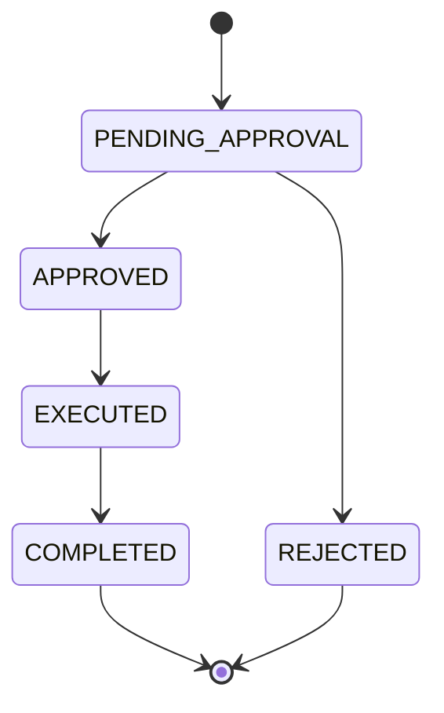

# Business Requirements Document (BRD)

# Certificate Authority (CA) Platform

Version: 1.0
Status: Baseline Scope Locked — amended to add configurable Role Management (RBAC engine); see [§Role Management](#role-management-configurable-rbac)

## Purpose

Develop an internal Certificate Authority platform for:

- Root CA management
- Intermediate CA management
- User and role management
- Certificate issuance
- CA certificate revocation (Root CA and Intermediate CA only)
- Audit trail management

---

## Scope

### In Scope

- Create Root CA
- Enable / Disable Root CA
- Create Intermediate CA (multi-level hierarchy supported)
- Enable / Disable Intermediate CA
- Create Users
- Enable / Disable Users
- Self Profile Update
- Assign Roles (at creation and post-creation)
- Role Management — create, edit, delete, and view configurable custom roles (RBAC engine)
- Submit CSR
- Issue Client, Server, and Signing Certificates
- Revoke Root CA
- Revoke Intermediate CA
- Audit Logging
- Reporting
- Email Notifications
- Multi-Factor Authentication (MFA)
- System Configuration Management
- Maker-Checker Workflow

### Out of Scope

- HSM Integration
- CRL
- OCSP
- Certificate Renewal
- ACME
- LDAP / AD Integration
- SSO
- Multi-Tenancy
- Public Certificate Issuance
- Workflow Customization — changing approval-flow steps/stages (note: configurable **Role Management** is in scope; see [§Role Management](#role-management-configurable-rbac))

---

## Roles

### Role Descriptions

| Role | Description |
|---|---|
| ADMIN_MAKER | Initiates administrative requests: CA management, user management, certificate revocation, and system configuration |
| ADMIN_CHECKER | Reviews and approves or rejects administrative requests submitted by ADMIN_MAKER |
| OPERATOR_MAKER | Submits certificate issuance requests |
| OPERATOR_CHECKER | Reviews and approves or rejects certificate issuance requests |
| AUDITOR | Read-only access to all data for compliance and audit purposes |

These five are the **seeded roles** shipped with the platform. They are ordinary roles built on the same model as custom roles and may themselves be edited or deleted, subject to the safeguards in [§Role Management](#role-management-configurable-rbac). Each role has exactly one **archetype** — **Maker**, **Checker**, or **Viewer** — which fixes the operations it may be granted and enforces segregation of duties. The seeded roles map as: ADMIN_MAKER, OPERATOR_MAKER → Maker; ADMIN_CHECKER, OPERATOR_CHECKER → Checker; AUDITOR → Viewer.

### Permissions

> The matrix below is the **seeded default** configuration of the five system roles. Permissions are not hard-coded: under configurable Role Management (see [§Role Management](#role-management-configurable-rbac)) each role is assigned permissions from a fixed catalogue, and this matrix is the default that ships with the system — it may itself be edited.

| Feature | Operation | ADMIN_MAKER | ADMIN_CHECKER | OPERATOR_MAKER | OPERATOR_CHECKER | AUDITOR |
|---|---|:---:|:---:|:---:|:---:|:---:|
| **Root CA** | Create Request | ✓ | ✗ | ✗ | ✗ | ✗ |
| | Enable / Disable Request | ✓ | ✗ | ✗ | ✗ | ✗ |
| | Revoke Request | ✓ | ✗ | ✗ | ✗ | ✗ |
| | View | ✓ | ✓ | ✓ | ✓ | ✓ |
| | Download Public Certificate | ✓ | ✓ | ✓ | ✓ | ✓ |
| | Edit | ✗ | ✗ | ✗ | ✗ | ✗ |
| | Delete | ✗ | ✗ | ✗ | ✗ | ✗ |
| | Approve / Reject | ✗ | ✓ | ✗ | ✗ | ✗ |
| **Intermediate CA** | Create Request | ✓ | ✗ | ✗ | ✗ | ✗ |
| | Enable / Disable Request | ✓ | ✗ | ✗ | ✗ | ✗ |
| | Revoke Request | ✓ | ✗ | ✗ | ✗ | ✗ |
| | View | ✓ | ✓ | ✓ | ✓ | ✓ |
| | Download Public Certificate | ✓ | ✓ | ✓ | ✓ | ✓ |
| | Edit | ✗ | ✗ | ✗ | ✗ | ✗ |
| | Delete | ✗ | ✗ | ✗ | ✗ | ✗ |
| | Approve / Reject | ✗ | ✓ | ✗ | ✗ | ✗ |
| **Certificate** | Submit CSR (Create) | ✗ | ✗ | ✓ | ✗ | ✗ |
| | View | ✓ | ✓ | ✓ | ✓ | ✓ |
| | Download Issued Certificate | ✗ | ✗ | ✓ | ✓ | ✗ |
| | Edit | ✗ | ✗ | ✗ | ✗ | ✗ |
| | Delete | ✗ | ✗ | ✗ | ✗ | ✗ |
| | Approve / Reject Issuance | ✗ | ✗ | ✗ | ✓ | ✗ |
| **User** | Create Request | ✓ | ✗ | ✗ | ✗ | ✗ |
| | Enable / Disable Request | ✓ | ✗ | ✗ | ✗ | ✗ |
| | Role Assignment Request | ✓ | ✗ | ✗ | ✗ | ✗ |
| | View | ✓ | ✓ | ✗ | ✗ | ✓ |
| | Edit | ✗ | ✗ | ✗ | ✗ | ✗ |
| | Delete | ✗ | ✗ | ✗ | ✗ | ✗ |
| | Approve / Reject | ✗ | ✓ | ✗ | ✗ | ✗ |
| | Reset Password | ✓ | ✗ | ✗ | ✗ | ✗ |
| **Own Profile** | View | ✓ | ✓ | ✓ | ✓ | ✓ |
| | Edit (excl. User ID) | ✓ | ✓ | ✓ | ✓ | ✓ |
| **Requests** | View | ✓ | ✓ | ✓ | ✓ | ✓ |
| **Audit Logs** | View | ✓ | ✓ | ✓ | ✓ | ✓ |
| **Reports** | View | ✓ | ✓ | ✓ | ✓ | ✓ |
| **System Configuration** | View | ✓ | ✓ | ✗ | ✗ | ✓ |
| | Edit Request | ✓ | ✗ | ✗ | ✗ | ✗ |
| | Approve / Reject | ✗ | ✓ | ✗ | ✗ | ✗ |

---

## Approval Matrix

| Request Type | Maker | Checker |
|-------------|--------|----------|
| Root CA Creation | ADMIN_MAKER | ADMIN_CHECKER |
| Root CA Enable / Disable | ADMIN_MAKER | ADMIN_CHECKER |
| Intermediate CA Creation | ADMIN_MAKER | ADMIN_CHECKER |
| Intermediate CA Enable / Disable | ADMIN_MAKER | ADMIN_CHECKER |
| User Creation | ADMIN_MAKER | ADMIN_CHECKER |
| User Enable / Disable | ADMIN_MAKER | ADMIN_CHECKER |
| Role Assignment (at creation and post-creation) | ADMIN_MAKER | ADMIN_CHECKER |
| Certificate Issuance | OPERATOR_MAKER | OPERATOR_CHECKER |
| Root CA Revocation | ADMIN_MAKER | ADMIN_CHECKER |
| System Configuration Update | ADMIN_MAKER | ADMIN_CHECKER |
| Intermediate CA Revocation | ADMIN_MAKER | ADMIN_CHECKER |
| Role Creation | ADMIN_MAKER | ADMIN_CHECKER |
| Role Edit | ADMIN_MAKER | ADMIN_CHECKER |
| Role Deletion | ADMIN_MAKER | ADMIN_CHECKER |

> The pairings above are the **seeded defaults**. With configurable roles the routing generalises: a maker request for feature *F* is actionable by **any active Checker-archetype role that holds Approve on F** (see [§Role Management](#role-management-configurable-rbac)). Self-approval remains prohibited.

---

## Role Management (Configurable RBAC)

The platform ships five **seeded roles** (ADMIN_MAKER, ADMIN_CHECKER, OPERATOR_MAKER, OPERATOR_CHECKER, AUDITOR). Beyond these, a user whose role grants the relevant **Role** permission may **create, edit, delete, and view custom roles**, each assembled from a fixed catalogue of permissions. The seeded roles are ordinary roles and may themselves be edited or deleted, subject to the safeguards below.

### Archetypes

Every role has exactly one **archetype**, chosen first at creation. The archetype fixes the palette of operations the role may be granted and enforces segregation of duties — a role can never be both an initiator and an approver of the same feature.

| Archetype | Operation palette | Purpose |
|---|---|---|
| **Maker** | Create, Edit, Delete, View (plus feature-specific: Submit, Download, Enable/Disable, Revoke, Reset Password, Assign Role) | Initiates requests |
| **Checker** | View, Approve / Reject | Reviews and decides maker requests |
| **Viewer** | View | Read-only access for audit and compliance |

### Permission Catalogue

A role's permissions are a set of (Feature, Operation) pairs selected from the catalogue. The operations offered for a feature depend on the role's archetype and on which operations that feature supports.

| Feature | Maker operations | Checker | Viewer |
|---|---|---|---|
| Root CA | Create, View, Download, Enable/Disable, Revoke | View, Approve/Reject | View |
| Intermediate CA | Create, View, Download, Enable/Disable, Revoke | View, Approve/Reject | View |
| Certificate | Submit, View, Download | View, Approve/Reject | View |
| User | Create, Edit, Delete, View, Enable/Disable, Reset Password, Assign Role | View, Approve/Reject | View |
| Role | Create, Edit, Delete, View | View, Approve/Reject | View |
| System Configuration | Edit, View | View, Approve/Reject | View |
| Reports | — | — | View |
| Audit Logs | — | — | View |

**Edit and Delete are offered only for User, Role, and System Configuration.** Cryptographic entities — Root CA, Intermediate CA, and issued Certificates — are never editable or deletable: their identity is cryptographically fixed and their history is required for audit and trust-chain integrity. Their only lifecycle operations remain Enable/Disable and Revoke. **Delete is a soft delete**: the target is marked `DELETED` and retained with its full history; records are never physically purged.

### Role Lifecycle (Maker-Checker)

Creating, editing, or deleting a role is itself a maker-checker request:

- A **Maker**-archetype role holding the relevant **Role** operation (Create / Edit / Delete) submits the request.
- A **Checker**-archetype role holding **Approve on Role** reviews the before/after permission set and approves or rejects.
- On approval the role definition takes effect. All changes are captured in the audit log with before/after snapshots, identical in form to every other request type.

### Approval Routing (Feature Domain)

A maker request for feature *F* is actionable by **any active Checker-archetype role that holds Approve on F**. This generalises the seeded admin/operator split: administrative features (CA, User, Role, System Configuration) are approved by checkers holding Approve on those features; certificate issuance is approved by checkers holding Approve on Certificate.

### Segregation-of-Duties Invariant

The system rejects any role definition or change that would violate segregation of duties:

- A role may hold maker operations (Create/Edit/Delete/Submit/Revoke) **or** Approve for a given feature — never both. This is guaranteed by the exclusive archetype.
- No user may approve a request they submitted.
- A maker cannot grant, via a custom role, any permission the catalogue does not define; the role-creation request still requires checker approval.

### Minimum-Viability Safeguards

Because seeded roles are editable and deletable, the system must prevent self-lockout. A role edit, delete, disable, or assignment change is **rejected** (with a clear error, validated at both submission and execution) if it would:

- leave **no active user able to approve** requests for a feature that has or can have pending requests (extends [Checker Availability](#checker-availability));
- leave **no active user able to manage Roles or Users** — i.e., remove every path to recover administration;
- leave **no active Maker** able to initiate a feature the platform requires to operate.

### Audit

Every role create / edit / delete, archetype assignment, permission change, and role-to-user assignment is recorded in the audit log with actor, timestamp, before/after permission sets, and the approving checker.

---

## Authentication Requirements

- All users must authenticate with username and password.
- Multi-Factor Authentication (MFA) is mandatory for all users.
- The MFA second factor is a One-Time Code (OTC) delivered to the user's registered email address.
- The OTC is valid for a configurable validity window (default: 10 minutes) from the time of issuance. Expired OTCs are rejected; the user must request a new login attempt.
- Only the most recent OTC issued to a user is valid. Any prior OTC is invalidated as soon as a new one is generated.
- An OTC is single-use. A successful verification invalidates the OTC immediately.
- Login is denied if MFA is not completed.
- After a configurable number of consecutive failed MFA attempts (default: 3), the account is locked.
- A locked account can be unlocked by:
  - An ADMIN_MAKER performing a password reset (see WF-014), or
  - The user completing the Forgot Password flow (see WF-011).
- Passwords expire after a configurable number of days (default: 30).
- On login with an expired password, the user is redirected to a forced password reset with MFA verification (see WF-012).
- Users may also initiate a password reset themselves via the Forgot Password flow at any time.
- Temporary passwords issued on user creation or admin-initiated password reset expire after a configurable period (default: 24 hours). After expiry, the user cannot log in with the temporary password and an administrator must issue a new one.
- Sessions expire after a configurable idle period (default: 30 minutes). The user is redirected to login on expiry.
- Each user may have only one active session at a time. A new login terminates any existing session.
- Passwords must meet the following complexity requirements:
  - Minimum length as configured (default: 12 characters)
  - At least one uppercase letter
  - At least one lowercase letter
  - At least one number
  - At least one special character

---

## Business Rules

### Checker Availability

- At least one ACTIVE user per checker role must exist for requests of that type to be actionable.
- The system shall warn ADMIN_MAKER if disabling a checker account would leave no ACTIVE checker for that role.
- Requests that enter PENDING_APPROVAL with no ACTIVE checker remain pending until a checker becomes available.

### Request Visibility

| Role | Visible Requests |
|---|---|
| ADMIN_MAKER | All administrative requests |
| ADMIN_CHECKER | All administrative requests |
| OPERATOR_MAKER | All operational (certificate issuance) requests |
| OPERATOR_CHECKER | All operational (certificate issuance) requests |
| AUDITOR | All requests of all types |

### Date and Time

- All timestamps recorded by the system (audit events, request creation, certificate validity, user creation, etc.) shall use the server system datetime.
- Client-side or user-supplied datetime values are not used for any system-generated timestamps.
- The validity start date of a certificate shall not be earlier than the system datetime at the time of execution.

### Bootstrap

- The system requires a one-time initial user setup that bypasses maker-checker approval.
- Once completed, the setup mechanism is permanently disabled.
- The minimum users created during bootstrap are one ADMIN_MAKER and one ADMIN_CHECKER. These accounts must be preserved to ensure the system remains operational.

### Segregation of Duties

```text
Created By != Approved By
```

- Self approval is prohibited.
- Rejected requests shall not be executed.
- Approved requests shall be executed exactly once.
- A comment is mandatory when rejecting a request. Approval comments are optional.
- A pending request cannot be withdrawn by the maker. There is no CANCELLED state.
- When a request is executed, all other PENDING_APPROVAL requests targeting the same entity are automatically REJECTED with reason "superseded by executed request."

### COMPLETED Trigger

| Request Type | COMPLETED Triggered By |
|---|---|
| Certificate Issuance | OPERATOR_MAKER downloads the issued certificate |
| All other request types | Automatically upon EXECUTED |

---

## Root CA Lifecycle

Rules:

- Multiple Root CAs may exist.
- Root CA deletion is not supported.
- Root CA modification is not supported.
- Revocation is permanent and irreversible. A revoked Root CA cannot be re-enabled.
- When a Root CA is revoked, all of its Intermediate CAs are automatically REVOKED.
- Certificates signed by a revoked CA remain as historical records in the system. External revocation notification (CRL, OCSP) is out of scope for v1.0.
- The system generates the CA keypair on approval execution. User-provided keys are not accepted.
- The public certificate of a Root CA is available for download by all authenticated users.

Allowed status transitions:

| From | To | Trigger |
|---|---|---|
| ACTIVE | DISABLED | Enable / Disable request approved |
| DISABLED | ACTIVE | Enable / Disable request approved |
| ACTIVE | REVOKED | Revocation request approved |
| DISABLED | REVOKED | Revocation request approved |
| REVOKED | Any | ✗ Not permitted |

Required creation fields:

- Common Name (CN)
- Organisation (O)
- Country (C)
- Key Algorithm (RSA or EC)
- Key Size
- Validity Period (years)

Required revocation fields:

- Revocation Reason (KEY_COMPROMISE, CESSATION_OF_OPERATION, SUPERSEDED, or OTHER)

Statuses:

- ACTIVE
- DISABLED
- REVOKED

---

## Intermediate CA Lifecycle

Rules:

- Each Intermediate CA belongs to exactly one parent CA, which may be a Root CA or another Intermediate CA.
- A CA (Root CA or Intermediate CA) may have multiple child Intermediate CAs.
- Intermediate CAs may be nested to form a multi-level signing hierarchy.
- The maximum nesting depth is configurable. Requests to create an Intermediate CA that would exceed the maximum depth are rejected at submission.
- Deletion is not supported.
- Revocation is permanent and irreversible. A revoked Intermediate CA cannot be re-enabled.
- When an Intermediate CA is revoked, all of its child Intermediate CAs are automatically REVOKED.
- Certificates signed by a revoked Intermediate CA remain as historical records in the system. External revocation notification (CRL, OCSP) is out of scope for v1.0.
- The system generates the CA keypair on approval execution. User-provided keys are not accepted.
- The public certificate of an Intermediate CA is available for download by all authenticated users.

Allowed status transitions:

| From | To | Trigger |
|---|---|---|
| ACTIVE | DISABLED | Enable / Disable request approved |
| DISABLED | ACTIVE | Enable / Disable request approved |
| ACTIVE | REVOKED | Revocation request approved |
| DISABLED | REVOKED | Revocation request approved |
| REVOKED | Any | ✗ Not permitted |

Required creation fields:

- Parent CA (Root CA or Intermediate CA)
- Common Name (CN)
- Organisation (O)
- Country (C)
- Key Algorithm (RSA or EC)
- Key Size
- Validity Period (years)

Required revocation fields:

- Revocation Reason (KEY_COMPROMISE, CESSATION_OF_OPERATION, SUPERSEDED, or OTHER)

Statuses:

- ACTIVE
- DISABLED
- REVOKED

---

## Certificate Lifecycle

Statuses:

- ACTIVE
- EXPIRED

Rules:

- CSR can only be used once.
- Certificate issuance requires approval.
- The system automatically transitions a certificate from ACTIVE to EXPIRED when the system datetime passes the certificate's Valid To date.
- EXPIRED certificates are read-only. Reissuance requires a new CSR submission.
- OPERATOR_MAKER can view full CSR details before submission.
- OPERATOR_MAKER selects the signing Intermediate CA from the list of ACTIVE Intermediate CAs when submitting the CSR.
- OPERATOR_MAKER specifies the certificate type: CLIENT, SERVER, or SIGNING.
- OPERATOR_MAKER sets the validity date range (start date and end date).
- OPERATOR_MAKER selects the output format for the issued certificate.
- The checker reviews and approves the certificate type, validity date range, and output format as part of the issuance request.
- The system enforces a configurable maximum validity period per certificate type. Submissions exceeding the maximum are rejected.
- Upon approval and execution, the issued certificate is made available for download by the OPERATOR_MAKER and OPERATOR_CHECKER in the output format selected at submission.
- The certificate may be re-downloaded at any time from the certificate detail view. The output format cannot be changed after submission.

Certificate output formats:

| Format | Description |
|---|---|
| PEM — Certificate only | Signed certificate in Base64-encoded PEM format |
| PEM — Full chain | Signed certificate and intermediate chain in PEM format |
| DER — Certificate only | Signed certificate in binary DER format |
| DER — Full chain | Signed certificate and intermediate chain in DER format |
| PKCS#7 / P7B | Full certificate chain without private key |

---

## User Lifecycle

Statuses:

- ACTIVE
- DISABLED

Rules:

- Each user must have exactly one role.
- User deletion is not supported.

Self-Profile Update:

- All authenticated users may update their own profile without maker-checker approval.
- User ID and Username cannot be changed.
- Editable fields: Full Name, Email.
- Role and Status cannot be self-edited.

Required creation fields:

- Full Name
- Username
- Email (mandatory — used for system notifications)
- Role

Initial Password:

- The system generates a temporary password upon user creation execution.
- The temporary password is sent to the user's registered email address.
- The user must change the temporary password with MFA verification on first login.

---

## Request Lifecycle

Statuses:

- PENDING_APPROVAL
- APPROVED
- REJECTED
- EXECUTED
- COMPLETED



---

## Workflows

| ID | Workflow | File |
|---|---|---|
| WF-001 | Root CA Creation | [Workflows/WF-001-root-ca-creation.md](Workflows/WF-001-root-ca-creation.md) |
| WF-002 | Root CA Enable / Disable | [Workflows/WF-002-root-ca-enable-disable.md](Workflows/WF-002-root-ca-enable-disable.md) |
| WF-003 | Intermediate CA Creation | [Workflows/WF-003-intermediate-ca-creation.md](Workflows/WF-003-intermediate-ca-creation.md) |
| WF-004 | Intermediate CA Enable / Disable | [Workflows/WF-004-intermediate-ca-enable-disable.md](Workflows/WF-004-intermediate-ca-enable-disable.md) |
| WF-005 | User Creation | [Workflows/WF-005-user-creation.md](Workflows/WF-005-user-creation.md) |
| WF-006 | User Enable / Disable | [Workflows/WF-006-user-enable-disable.md](Workflows/WF-006-user-enable-disable.md) |
| WF-007 | Role Assignment | [Workflows/WF-007-role-assignment.md](Workflows/WF-007-role-assignment.md) |
| WF-008 | Certificate Issuance | [Workflows/WF-008-certificate-issuance.md](Workflows/WF-008-certificate-issuance.md) |
| WF-009 | Root CA Revocation | [Workflows/WF-009-root-ca-revocation.md](Workflows/WF-009-root-ca-revocation.md) |
| WF-010 | Self Profile Update | [Workflows/WF-010-self-profile-update.md](Workflows/WF-010-self-profile-update.md) |
| WF-011 | Forgot Password | [Workflows/WF-011-forgot-password.md](Workflows/WF-011-forgot-password.md) |
| WF-012 | Force Password Reset (Expired) | [Workflows/WF-012-force-password-reset.md](Workflows/WF-012-force-password-reset.md) |
| WF-013 | System Configuration Update | [Workflows/WF-013-system-configuration-update.md](Workflows/WF-013-system-configuration-update.md) |
| WF-014 | Admin Password Reset | [Workflows/WF-014-admin-password-reset.md](Workflows/WF-014-admin-password-reset.md) |
| WF-015 | Intermediate CA Revocation | [Workflows/WF-015-intermediate-ca-revocation.md](Workflows/WF-015-intermediate-ca-revocation.md) |

---

## Revocation Reasons

Applicable to Root CA and Intermediate CA revocation only.

- KEY_COMPROMISE
- CESSATION_OF_OPERATION
- SUPERSEDED
- OTHER

---

## Audit Requirements

Audit data shall include:

- Event ID
- Event Type
- User ID
- Role
- Timestamp
- Request ID
- Action
- Result
- Request Payload
- Approval Payload
- Created By
- Approved By
- Before Snapshot
- After Snapshot
- Changed Fields
- Approval Comments

### Authentication Event Auditing

The following authentication events shall be captured in the audit log:

- User login (success and failure)
- User logout
- MFA success and failure
- Account lockout
- Password change
- Password reset (admin-initiated and self-service)
- Session expiry

### Field-Level Change Tracking

For every update operation the system shall store:

- Field Name
- Previous Value
- New Value

Example:

| Field | Previous Value | New Value |
|---------|---------|---------|
| role | OPERATOR_MAKER | OPERATOR_CHECKER |

*See [checker-review.md](checker-review.md) for the checker approval UI specification.*

### Audit Record Rules

Audit records shall be:

- Immutable
- Non-editable
- Non-deletable through the application

Audit records shall remain available even if underlying records are modified.

---

## Notifications

The system shall send email notifications to inform users of request lifecycle events.

| Event | Recipient |
|---|---|
| Request submitted | Assigned checker |
| Request approved | Request maker |
| Request rejected | Request maker |
| Request executed | Request maker |
| Pending request not actioned after configured days | Assigned checker (escalation) |
| Certificate expiry warning (N days before Valid To) | OPERATOR_MAKER who submitted the original request |
| CA expiry warning (N days before Valid To) | ADMIN_MAKER |
| Account locked | Affected user and ADMIN_MAKER |

---

## Reports

Each report is a flat list sorted by creation date descending. No filtering, export, or pagination for v1.0.

### Root CA Report

| Column | Description |
|---|---|
| Root CA ID | Unique identifier |
| Common Name (CN) | Root CA common name |
| Organisation (O) | Organisation name |
| Country (C) | Country code |
| Key Algorithm | RSA or EC |
| Key Size | Key size in bits |
| Valid From | CA validity start date |
| Valid To | CA validity end date |
| Status | ACTIVE, DISABLED, or REVOKED |
| Revocation Date | Date of revocation (if applicable) |
| Revocation Reason | Reason for revocation (if applicable) |
| Created By | ADMIN_MAKER username |
| Approved By | ADMIN_CHECKER username |
| Created Date | Date the creation request was submitted |

### Intermediate CA Report

| Column | Description |
|---|---|
| Intermediate CA ID | Unique identifier |
| Common Name (CN) | Intermediate CA common name |
| Organisation (O) | Organisation name |
| Country (C) | Country code |
| Parent CA | Name of the parent CA (Root CA or Intermediate CA) |
| Key Algorithm | RSA or EC |
| Key Size | Key size in bits |
| Valid From | CA validity start date |
| Valid To | CA validity end date |
| Status | ACTIVE, DISABLED, or REVOKED |
| Revocation Date | Date of revocation (if applicable) |
| Revocation Reason | Reason for revocation (if applicable) |
| Created By | ADMIN_MAKER username |
| Approved By | ADMIN_CHECKER username |
| Created Date | Date the creation request was submitted |

### Certificate Report

| Column | Description |
|---|---|
| Certificate ID | Unique identifier |
| Certificate Type | CLIENT, SERVER, or SIGNING |
| Subject Common Name | CN from the CSR |
| Serial Number | Certificate serial number |
| Issuing Intermediate CA | Name of the signing Intermediate CA |
| Valid From | Certificate validity start date |
| Valid To | Certificate validity end date |
| Output Format | Format in which the certificate was issued |
| Status | ACTIVE or EXPIRED |
| Submitted By | OPERATOR_MAKER username |
| Approved By | OPERATOR_CHECKER username |
| Created Date | Date the issuance request was submitted |

### User Report

| Column | Description |
|---|---|
| User ID | Unique identifier |
| Full Name | User's full name |
| Username | Login username |
| Email | Registered email address |
| Role | Assigned role |
| Status | ACTIVE or DISABLED |
| Password Expiry Date | Date the current password expires |
| Last Login | Most recent successful login timestamp |
| Created By | ADMIN_MAKER username who submitted the creation request |
| Approved By | ADMIN_CHECKER username who approved the creation request |
| Created Date | Date the user creation request was submitted |

### Role Report

| Column | Description |
|---|---|
| Role ID | Unique identifier |
| Name | Role name |
| Archetype | Maker, Checker, or Viewer |
| Type | System (seeded) or Custom |
| Permissions | Count of (feature, operation) grants |
| Assigned Users | Number of active users holding the role |
| Status | ACTIVE or DELETED |
| Created By | ADMIN_MAKER username (blank for seeded roles) |
| Approved By | ADMIN_CHECKER username (blank for seeded roles) |
| Created Date | Date the role creation request was submitted |

### Pending Approval Report

| Column | Description |
|---|---|
| Request ID | Unique identifier |
| Request Type | Type of request (e.g., Root CA Creation, Certificate Issuance) |
| Target Entity | Name or ID of the entity being acted upon |
| Submitted By | Maker username |
| Submitted Date | Date the request was submitted |
| Status | PENDING_APPROVAL |
| Assigned Checker Role | ADMIN_CHECKER or OPERATOR_CHECKER |
| Days Pending | Number of days since submission |

### Request History Report

Shows all COMPLETED and REJECTED requests. Visible to all roles, scoped by the same visibility rules as the Pending Approval Report.

| Column | Description |
|---|---|
| Request ID | Unique identifier |
| Request Type | Type of request |
| Target Entity | Name or ID of the entity affected |
| Submitted By | Maker username |
| Submitted Date | Date the request was submitted |
| Decided By | Checker username |
| Decision Date | Date the checker approved or rejected |
| Final Status | COMPLETED or REJECTED |
| Rejection Reason | Mandatory comment provided on rejection (if applicable) |

### Audit Report

| Column | Description |
|---|---|
| Event ID | Unique identifier |
| Event Type | Category of event |
| Timestamp | Date and time of the event |
| User ID | ID of the user who performed the action |
| Username | Username of the actor |
| Role | Role of the actor at the time of the event |
| Action | Action performed |
| Result | SUCCESS or FAILURE |
| Request ID | Associated request ID (if applicable) |
| Target Entity | Entity affected by the action |
| Target Entity ID | ID of the affected entity |
| Changed Fields | Fields changed with before and after values |
| Approval Comments | Checker comments (if applicable) |

---

## System Configuration

System parameters are managed exclusively by ADMIN_MAKER from a dedicated configuration page. All changes require maker-checker approval: ADMIN_MAKER submits a change request and ADMIN_CHECKER reviews and approves or rejects it. Changes take effect only upon approval execution. All changes are captured in the audit log.

| Parameter | Default | Description |
|---|---|---|
| MFA Attempt Limit | 3 | Maximum consecutive failed MFA attempts before account lockout |
| MFA One-Time Code Validity (minutes) | 10 | Validity window of an emailed OTC after issuance |
| Temporary Password Validity (hours) | 24 | Validity window of a temporary password issued on user creation or admin-initiated reset |
| Password Expiry (days) | 30 | Number of days before a user password must be changed |
| Password Minimum Length | 12 | Minimum number of characters in a password |
| Session Timeout (minutes) | 30 | Idle time before a session expires |
| Allowed Key Algorithms | RSA, EC | Key algorithms permitted for CA creation |
| Minimum RSA Key Size (bits) | 2048 | Minimum permitted RSA key size |
| Minimum EC Key Size (bits) | 256 | Minimum permitted EC key size |
| Maximum CA Hierarchy Depth | 3 | Maximum nesting depth for Intermediate CAs |
| Maximum Certificate Validity — CLIENT (days) | 365 | Maximum validity period for CLIENT certificates |
| Maximum Certificate Validity — SERVER (days) | 365 | Maximum validity period for SERVER certificates |
| Maximum Certificate Validity — SIGNING (days) | 730 | Maximum validity period for SIGNING certificates |
| Certificate Expiry Warning (days) | 30 | Days before certificate expiry to send notification |
| CA Expiry Warning (days) | 90 | Days before CA expiry to send notification |
| Pending Request Escalation (days) | 3 | Days before an unactioned pending request triggers an escalation notification |

---

## Success Criteria

- Root CA creation operational
- Intermediate CA creation operational
- User management operational
- Certificate issuance operational
- CA certificate revocation operational (Root CA and Intermediate CA)
- Maker-checker enforced
- Audit logging operational
- Checker can view field-level changes before approval
- Audit records contain request payload, approval payload, before snapshot and after snapshot
- Email notifications sent on request lifecycle events
- Certificate type (CLIENT, SERVER, SIGNING) enforced at issuance
- MFA via email enforced at login for all users
- Account lockout enforced after configured number of failed MFA attempts
- Password expiry enforced with forced reset flow
- Self profile update operational for all users
- System configuration page accessible to ADMIN_MAKER
- Root CA and Intermediate CA revocation operational and restricted to ADMIN_MAKER / ADMIN_CHECKER

---

*See [../2-Design/2.1-HLD/architecture.md](../2-Design/2.1-HLD/architecture.md) for technical architecture decisions.*

---

## Scope Lock Statement

No functionality outside this document shall be included in Version 1.0 unless approved through formal change management.
