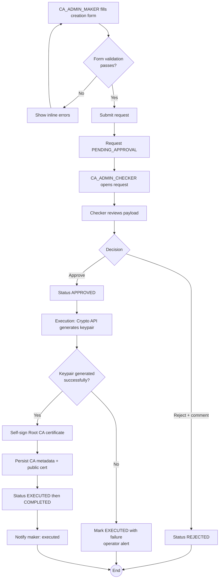

# WF-001: Root CA Creation

## Summary

CA_ADMIN_MAKER submits a request to create a new Root CA. CA_ADMIN_CHECKER reviews and approves or rejects. On approval, the Crypto API generates a keypair, self-signs a Root CA certificate, and the public certificate becomes downloadable by all authenticated users.

## Actors

| Role | Responsibility |
|---|---|
| CA_ADMIN_MAKER | Submits the creation request |
| CA_ADMIN_CHECKER | Reviews and decides (approve / reject) |

## Preconditions

- Both the maker and checker are ACTIVE users.
- At least one ACTIVE CA_ADMIN_CHECKER who did not submit the request exists in the system (per [BRD — Checker Availability](../BRD.md#checker-availability)).
- System Configuration parameters are loaded — specifically Allowed Key Algorithms, Minimum RSA Key Size, Minimum EC Key Size.

## Diagram

## Steps

| # | Actor | Step | Validation |
|---|---|---|---|
| 1 | CA_ADMIN_MAKER | Open *Create Root CA* form | Role check enforced by JWT claim. |
| 2 | CA_ADMIN_MAKER | Fill required creation fields: CN, O, C, Key Algorithm, Key Size, Validity Period (years) | CN non-empty, ≤ 64 chars; O non-empty, ≤ 64 chars; C is a valid ISO 3166-1 alpha-2 code; Key Algorithm ∈ Allowed Key Algorithms; Key Size ≥ configured minimum for the chosen algorithm; Validity Period > 0 and ≤ configured CA maximum. |
| 3 | CA_ADMIN_MAKER | Submit | Server re-validates all fields. On any failure, returns 400 with field-level errors. On success, persists a new Request row with status `PENDING_APPROVAL`. |
| 4 | System | Notify assigned checker | Email per [branding.md — Action Required template](../branding.md#action-required--request-pending-approval-to-checker). |
| 5 | CA_ADMIN_CHECKER | Open the request from queue | Self-approval check: if checker is the same user as the maker, the Approve and Reject controls are disabled. |
| 6 | CA_ADMIN_CHECKER | Review payload (no Before snapshot — create operation) | UI renders empty Before pane per [checker-review.md](../checker-review.md). |
| 7a | CA_ADMIN_CHECKER | Click Approve, optional comment | Status transitions `PENDING_APPROVAL → APPROVED`. Notify maker. |
| 7b | CA_ADMIN_CHECKER | Click Reject, mandatory comment | Status transitions `PENDING_APPROVAL → REJECTED`. Notify maker. Flow ends. |
| 8 | System | Execute approved request | Business Logic API calls Crypto API `POST /v1/ca/root` with subject, algorithm, key size, validity. |
| 9 | Crypto API | Generate keypair, self-sign Root CA certificate, encrypt private key with KEK, persist | Per [certificate-profiles.md — Root CA Profile](../../2-Design/2.2-LLD/certificate-profiles.md). |
| 10 | System | Persist CA metadata row in Business DB and public certificate row in Crypto DB | Status `EXECUTED`. Automatic transition to `COMPLETED` per [BRD — COMPLETED Trigger](../BRD.md#completed-trigger). |
| 11 | System | Notify maker: executed; supersede peers | Any other `PENDING_APPROVAL` request targeting the same entity (none on create, but the rule still runs) is auto-rejected with reason *superseded by executed request*. |

## Validation Rules (Field-Level)

| Field | Rule | On violation |
|---|---|---|
| Common Name | Non-empty, ≤ 64 chars; printable ASCII | 400 `VAL-0001` |
| Organisation | Non-empty, ≤ 64 chars | 400 `VAL-0001` |
| Country | ISO 3166-1 alpha-2 | 400 `VAL-0002` |
| Key Algorithm | Must equal one of System Configuration *Allowed Key Algorithms* | 400 `VAL-0003` |
| Key Size | Must be ≥ Minimum RSA/EC Key Size; for RSA ∈ {2048, 3072, 4096}; for EC must map to permitted curve set (see [crypto-design.md](../../2-Design/2.2-LLD/crypto-design.md)) | 400 `VAL-0004` |
| Validity Period (years) | 1 ≤ years ≤ 30 | 400 `VAL-0005` |

## Error Paths

| Trigger | System behaviour |
|---|---|
| Self-approval attempt | UI disables controls; server returns 403 `AUTH-0010` if API called directly. |
| No ACTIVE CA_ADMIN_CHECKER exists | Request remains `PENDING_APPROVAL` (per [BRD — Checker Availability](../BRD.md#checker-availability)). Submission still succeeds; UI shows a warning banner. |
| Checker rejects without comment | UI prevents submission; server returns 400 `VAL-0006` if API called directly. |
| Crypto API unreachable on execution | Request remains in `APPROVED` state; execution is retried automatically up to N times (see [crypto-design.md](../../2-Design/2.2-LLD/crypto-design.md) for retry policy). After exhaustion, status moves to `EXECUTED` with failure metadata and the maker is notified to investigate. |
| Crypto API returns failure | Same as above — request remains `APPROVED` until retries exhaust. |
| Two CA_ADMIN_MAKER submissions for the same intended Root CA submitted concurrently | Both are accepted as separate requests. The first to be `EXECUTED` causes any other `PENDING_APPROVAL` requests targeting the same nominal entity to be auto-rejected per the *superseded by executed request* rule (note: for create operations the entity does not yet exist, so duplicate CAs may be created — uniqueness is enforced on (CN, O, C) at the persistence layer and the second execution will fail with `BUS-0011 duplicate Root CA`). |

## Post-conditions

On approval and successful execution:

- A new Root CA row exists with status `ACTIVE`.
- A keypair is stored in the Crypto DB (private key encrypted with KEK).
- The self-signed public certificate is downloadable by all authenticated users.
- Audit log contains the request payload, approval payload, Before snapshot (empty), After snapshot (new entity), and field-level changes.

On rejection:

- No CA is created.
- Audit log contains the request payload and the checker's mandatory rejection comment.

## Notifications

| Event | Recipient | Template |
|---|---|---|
| Request submitted | All ACTIVE CA_ADMIN_CHECKER users | *Action Required* |
| Approved | Maker | *Request Approved* |
| Rejected | Maker | *Request Rejected* |
| Executed | Maker | *Request Executed* |
| Pending > escalation threshold | All ACTIVE CA_ADMIN_CHECKER users | *Pending Escalation* |

## Related

- [BRD — Root CA Lifecycle](../BRD.md#root-ca-lifecycle)
- [certificate-profiles.md — Root CA Profile](../../2-Design/2.2-LLD/certificate-profiles.md)
- [sequence-diagrams.md — Root CA Creation](../../2-Design/2.1-HLD/sequence-diagrams.md)
