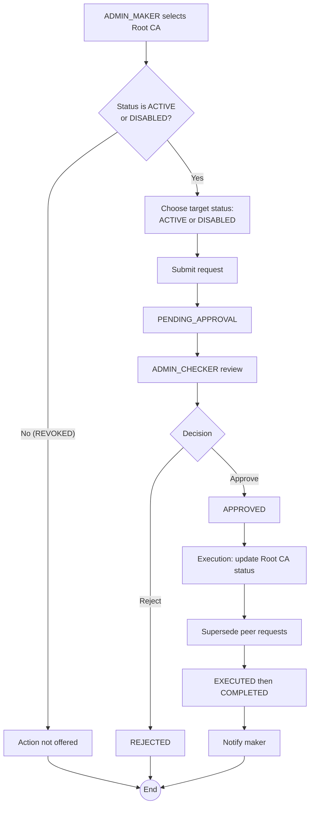

# WF-002: Root CA Enable / Disable

## Summary

ADMIN_MAKER submits a request to flip a Root CA's status between `ACTIVE` and `DISABLED`. ADMIN_CHECKER reviews and approves or rejects. Disabling a Root CA does not affect already-issued certificates but blocks new issuance requests that would chain to it. Revoked CAs cannot be enabled — this workflow does not apply to `REVOKED` CAs.

## Actors

| Role | Responsibility |
|---|---|
| ADMIN_MAKER | Submits the enable / disable request |
| ADMIN_CHECKER | Reviews and decides |

## Preconditions

- Target Root CA exists and is in status `ACTIVE` or `DISABLED` (not `REVOKED`).
- At least one ACTIVE ADMIN_CHECKER different from the maker exists.

## Diagram

## Steps

| # | Actor | Step | Validation |
|---|---|---|---|
| 1 | ADMIN_MAKER | Open Root CA detail page | Role check. |
| 2 | ADMIN_MAKER | Click *Enable* or *Disable* | Only the action consistent with the current status is offered. Both actions are hidden if status is `REVOKED`. |
| 3 | ADMIN_MAKER | Submit | Server re-validates: target status is the opposite of current status. Creates Request row, status `PENDING_APPROVAL`. |
| 4 | ADMIN_CHECKER | Open and review | Before snapshot shows current Root CA fields including status; After snapshot shows the same with status flipped. |
| 5 | ADMIN_CHECKER | Approve / Reject | Reject requires comment. Self-approval blocked. |
| 6 | System | Execute: update Root CA `status` and `status_changed_at` columns | Atomic in Business DB. |
| 7 | System | Supersede peer requests | Any other `PENDING_APPROVAL` request targeting this Root CA is auto-rejected with reason *superseded by executed request*. |
| 8 | System | Notify maker; transition to `COMPLETED` |  |

## Validation Rules

| Field | Rule | On violation |
|---|---|---|
| Target CA status | Current status ∈ {`ACTIVE`, `DISABLED`} | 409 `BUS-0020 CA is revoked` |
| Target status | Must differ from current status at submit time | 409 `BUS-0021 no-op transition` |

## Error Paths

| Trigger | System behaviour |
|---|---|
| Concurrent enable + disable requests submitted by different makers | Both accepted as separate requests. Whichever is executed first updates the status; the second is auto-rejected as *superseded* when it is approved (if status now matches its target) or rejected via the no-op check if values match. |
| CA was revoked between submission and execution | Execution check re-verifies status. If target CA is now `REVOKED`, execution fails with `BUS-0020`; the request is marked `EXECUTED` with failure metadata and the maker is notified. |
| Disable would orphan in-flight certificate issuance requests | Existing `PENDING_APPROVAL` certificate issuance requests against descendant Intermediate CAs remain pending. Once the Root CA is `DISABLED`, attempts to *approve* such issuance requests fail at execution because the signing chain is no longer entirely `ACTIVE`. |

## Post-conditions

- Root CA status changed to the requested value.
- Audit record includes Before snapshot (status = previous), After snapshot (status = new), changed field.

## Notifications

Same set as WF-001.

## Related

- [BRD — Root CA Lifecycle](../BRD.md#root-ca-lifecycle)
- [WF-009 — Root CA Revocation](WF-009-root-ca-revocation.md)
