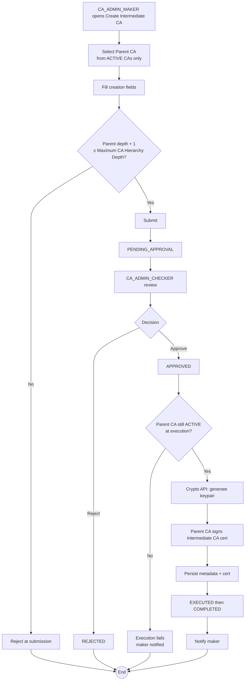

# WF-003: Intermediate CA Creation

## Summary

CA_ADMIN_MAKER submits a request to create a new Intermediate CA under an existing parent CA (Root CA or another Intermediate CA). On approval, the Crypto API generates a keypair and the parent CA signs the new Intermediate CA certificate.

## Actors

| Role | Responsibility |
|---|---|
| CA_ADMIN_MAKER | Submits the request |
| CA_ADMIN_CHECKER | Reviews and decides |

## Preconditions

- The parent CA exists and is `ACTIVE` (a `DISABLED` or `REVOKED` parent cannot sign a new Intermediate CA).
- Creating this Intermediate CA would not exceed `Maximum CA Hierarchy Depth` (System Configuration; default 3).

## Diagram

## Steps

| # | Actor | Step | Validation |
|---|---|---|---|
| 1 | CA_ADMIN_MAKER | Open *Create Intermediate CA* | Role check. |
| 2 | CA_ADMIN_MAKER | Select Parent CA | Picker filters to `ACTIVE` CAs only and excludes any CA whose `depth + 1` would exceed the configured maximum. |
| 3 | CA_ADMIN_MAKER | Fill: CN, O, C, Key Algorithm, Key Size, Validity Period (years) | Same field rules as WF-001. Validity Period must not exceed the parent CA's remaining validity. |
| 4 | CA_ADMIN_MAKER | Submit | Server re-validates parent CA status, hierarchy depth, and field rules. |
| 5 | CA_ADMIN_CHECKER | Open and review | Snapshot view shows parent CA reference and all new fields. |
| 6 | CA_ADMIN_CHECKER | Approve / Reject | Reject requires comment. |
| 7 | System | Execute | Re-check at execution time: parent CA still `ACTIVE`, depth still within bounds. |
| 8 | Crypto API | Generate keypair, request signature from parent CA's private key, encrypt new private key with KEK, persist |  |
| 9 | System | Persist Intermediate CA metadata (parent_id, depth = parent.depth + 1), public certificate; notify maker; supersede peers |  |

## Validation Rules

| Field | Rule | On violation |
|---|---|---|
| Parent CA | Must exist, status `ACTIVE` | 409 `BUS-0030 invalid parent CA` |
| Parent depth + 1 | Must be ≤ Maximum CA Hierarchy Depth | 409 `BUS-0031 hierarchy depth exceeded` |
| CN, O, C, Algo, Key Size | Same as WF-001 | 400 `VAL-0001..0004` |
| Validity Period | Computed `valid_to` must not exceed parent CA `valid_to` | 409 `BUS-0032 validity exceeds parent` |

## Error Paths

| Trigger | System behaviour |
|---|---|
| Parent CA disabled or revoked between submission and execution | Execution fails with `BUS-0030`. Request marked EXECUTED with failure metadata; maker notified. |
| Parent CA's signing operation fails in the Crypto API | Treated as a Crypto API failure; retried per policy. |
| Hierarchy depth was OK at submission but configuration was lowered before execution | Execution re-checks depth and fails with `BUS-0031` if violated. |
| Concurrent requests for similar Intermediate CAs | Each treated as independent. Uniqueness enforced on (parent_id, CN, O, C). |

## Post-conditions

- New Intermediate CA exists with status `ACTIVE`, parent_id set, depth = parent.depth + 1.
- Public certificate available to all authenticated users.
- Audit log captures payload, snapshots, parent reference, and resulting depth.

## Related

- [BRD — Intermediate CA Lifecycle](../BRD.md#intermediate-ca-lifecycle)
- [WF-015 — Intermediate CA Revocation](WF-015-intermediate-ca-revocation.md)
