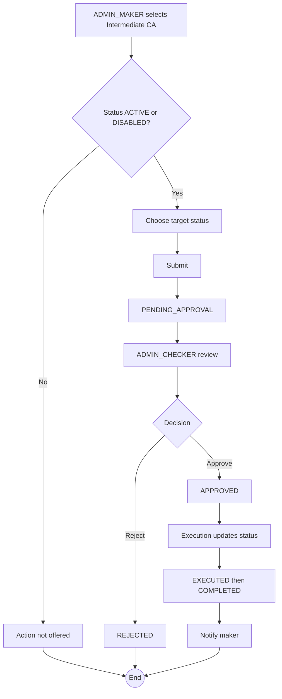

# WF-004: Intermediate CA Enable / Disable

## Summary

ADMIN_MAKER submits a request to flip an Intermediate CA's status between `ACTIVE` and `DISABLED`. ADMIN_CHECKER reviews and approves or rejects. Disabling an Intermediate CA blocks new certificate issuance against it. This workflow does not apply to `REVOKED` Intermediate CAs.

## Actors

| Role | Responsibility |
|---|---|
| ADMIN_MAKER | Submits the request |
| ADMIN_CHECKER | Reviews and decides |

## Preconditions

- Target Intermediate CA exists, status ∈ {`ACTIVE`, `DISABLED`}.
- Parent CA status is not relevant for enable/disable (a child can be re-enabled even if the parent is `DISABLED`, but new issuance against it will still fail; see Error Paths).

## Diagram

## Steps

| # | Actor | Step | Validation |
|---|---|---|---|
| 1 | ADMIN_MAKER | Open Intermediate CA detail | Role check. |
| 2 | ADMIN_MAKER | Choose Enable / Disable | Only the action consistent with current status is offered. Hidden if `REVOKED`. |
| 3 | ADMIN_MAKER | Submit | Server re-validates current status. |
| 4 | ADMIN_CHECKER | Review | Diff shows status flip. |
| 5 | ADMIN_CHECKER | Approve / Reject | Reject requires comment. |
| 6 | System | Execute | Update status, supersede peer requests, notify maker. |

## Validation Rules

| Field | Rule | On violation |
|---|---|---|
| Current status | ∈ {`ACTIVE`, `DISABLED`} | 409 `BUS-0020` |
| Target status | Differs from current | 409 `BUS-0021` |

## Error Paths

| Trigger | System behaviour |
|---|---|
| Intermediate CA was revoked between submit and execute | Execution fails with `BUS-0020`. |
| Re-enabling an Intermediate CA whose ancestor is `DISABLED` | Allowed; the Intermediate CA returns to `ACTIVE` status. New issuance requests against it will, however, fail at execution because the trust chain is not fully `ACTIVE`. |
| Disabling would orphan in-flight issuance requests | In-flight `PENDING_APPROVAL` issuance requests remain pending; their execution will fail if the chain is no longer entirely `ACTIVE`. |

## Post-conditions

- Status changed.
- Audit log captures the field change.

## Related

- [BRD — Intermediate CA Lifecycle](../BRD.md#intermediate-ca-lifecycle)
- [WF-008 — Certificate Issuance](WF-008-certificate-issuance.md)
