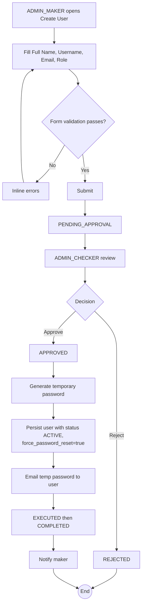

# WF-005: User Creation

## Summary

ADMIN_MAKER submits a request to create a new user account with a specified role. ADMIN_CHECKER reviews and decides. On approval, the system generates a temporary password and emails it to the new user with first-login forced password reset semantics.

## Actors

| Role | Responsibility |
|---|---|
| ADMIN_MAKER | Submits the request |
| ADMIN_CHECKER | Reviews and decides |
| New user (implicit) | Receives the temporary password by email |

## Preconditions

- Username and email are unique across all users (regardless of status).
- Role references an ACTIVE role (seeded or custom; see [BRD — Role Management](../BRD.md#role-management-configurable-rbac)).

## Diagram

## Steps

| # | Actor | Step | Validation |
|---|---|---|---|
| 1 | ADMIN_MAKER | Open *Create User* | Role check. |
| 2 | ADMIN_MAKER | Fill Full Name, Username, Email, Role | Username must be unique (case-insensitive); email must match RFC 5322 simple form and be unique; role must be one of five. |
| 3 | ADMIN_MAKER | Submit | Server re-checks uniqueness. Creates Request row `PENDING_APPROVAL`. |
| 4 | ADMIN_CHECKER | Review (snapshot empty Before; After = proposed new user) | |
| 5 | ADMIN_CHECKER | Approve / Reject | Reject requires comment. |
| 6 | System | Execute | Generate user row (status `ACTIVE`, `force_password_reset = true`, `password_hash = bcrypt(temporary password)`, `temp_password_expires_at = now + 24h`), generate temp password (16 chars meeting complexity rules), email user. |
| 7 | System | Notify maker; transition `COMPLETED` |  |

## Validation Rules

| Field | Rule | On violation |
|---|---|---|
| Full Name | Non-empty, ≤ 100 chars | 400 `VAL-0001` |
| Username | Non-empty, 3..50 chars, `[a-z0-9._-]`; case-insensitive unique | 400 `VAL-0010` / 409 `BUS-0040 username exists` |
| Email | RFC 5322 simple form; unique across all users | 400 `VAL-0011` / 409 `BUS-0041 email exists` |
| Role | ∈ {ADMIN_MAKER, ADMIN_CHECKER, OPERATOR_MAKER, OPERATOR_CHECKER, AUDITOR} | 400 `VAL-0012` |

## Error Paths

| Trigger | System behaviour |
|---|---|
| Two ADMIN_MAKERs submit the same username/email concurrently | DB unique constraint enforces a single winner; the second execution fails with `BUS-0040`/`BUS-0041`; failed request is marked EXECUTED with failure metadata. |
| SMTP relay unavailable when sending temp password | User row is persisted; temp password is **not** stored in plaintext. The maker is notified and must initiate WF-014 (admin password reset) to issue a fresh temporary password. |
| Disabling the only remaining ADMIN_CHECKER would break checker availability | Warning is shown at submission time and on execution. The system does not block, but the operator should reconcile per [BRD — Checker Availability](../BRD.md#checker-availability). |

## Post-conditions

- New user exists with status `ACTIVE`, `force_password_reset = true`.
- Temporary password email sent.
- Audit log captures the creation payload and full After snapshot (excluding the temp password — only its hash is stored).

## Related

- [BRD — User Lifecycle](../BRD.md#user-lifecycle)
- [WF-014 — Admin Password Reset](WF-014-admin-password-reset.md)
- [branding.md — Account Created template](../branding.md#account-created--temporary-password)
