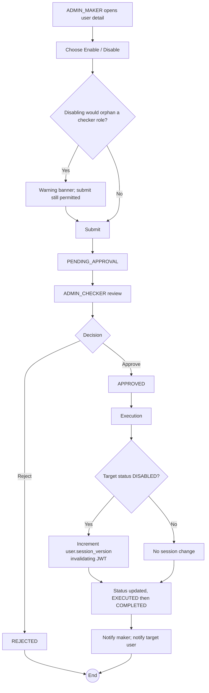

# WF-006: User Enable / Disable

## Summary

ADMIN_MAKER submits a request to flip a user account between `ACTIVE` and `DISABLED`. ADMIN_CHECKER reviews and decides. Disabling a user terminates any active session by incrementing the user's `session_version`, immediately invalidating any outstanding JWT.

## Actors

| Role | Responsibility |
|---|---|
| ADMIN_MAKER | Submits the request |
| ADMIN_CHECKER | Reviews and decides |

## Preconditions

- Target user exists.
- Disabling must not leave any checker role without an ACTIVE user, per [BRD — Checker Availability](../BRD.md#checker-availability). The system warns but does not block; the operator must reconcile.

## Diagram

## Steps

| # | Actor | Step | Validation |
|---|---|---|---|
| 1 | ADMIN_MAKER | Open user detail | Cannot target own account; cannot target the only remaining ADMIN_MAKER. |
| 2 | ADMIN_MAKER | Click Enable / Disable | Server checks current status; offered action is opposite. |
| 3 | ADMIN_MAKER | Submit | Validation as above. |
| 4 | ADMIN_CHECKER | Review | Snapshot shows status flip. |
| 5 | ADMIN_CHECKER | Approve / Reject | Reject requires comment; self-approval blocked. |
| 6 | System | Execute | Update `users.status`. If new status is `DISABLED`, also `UPDATE users SET session_version = session_version + 1`. |
| 7 | System | Notify maker; notify target user (informational) | |

## Validation Rules

| Field | Rule | On violation |
|---|---|---|
| Target user ≠ maker | Self-disable disallowed | 403 `AUTH-0011 self-action prohibited` |
| Target user is not the sole remaining ADMIN_MAKER when target status is `DISABLED` | Bootstrap accounts protection ([BRD — Bootstrap](../BRD.md#bootstrap)) | 409 `BUS-0050 must retain at least one ADMIN_MAKER` |
| Target user is not the sole remaining ADMIN_CHECKER when target status is `DISABLED` | Same | 409 `BUS-0051 must retain at least one ADMIN_CHECKER` |

## Error Paths

| Trigger | System behaviour |
|---|---|
| Target user is the maker of pending requests | Pending requests remain. After disable, any approve/reject the disabled user attempted would be blocked by JWT invalidation anyway. |
| Disabling the only OPERATOR_CHECKER | Allowed with warning. Outstanding `PENDING_APPROVAL` operational requests remain pending until a new OPERATOR_CHECKER is created and activated. |

## Post-conditions

- User status flipped.
- For disable: any active session of the user is invalidated on next request (401 + redirect to login).
- Audit log captures the status change.

## Related

- [BRD — User Lifecycle](../BRD.md#user-lifecycle)
- [architecture.md — Single Active Session Enforcement](../../2-Design/2.1-HLD/architecture.md#single-active-session-enforcement)
