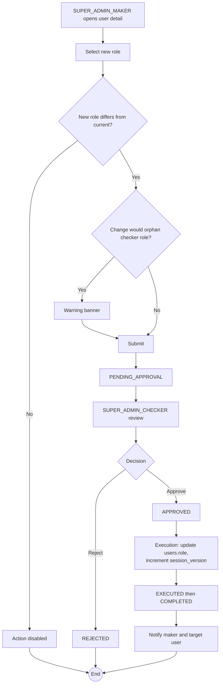

# WF-007: Role Assignment

## Summary

SUPER_ADMIN_MAKER submits a request to change a user's role. SUPER_ADMIN_CHECKER reviews and decides. On approval, the user's `role` is updated and their `session_version` is incremented so any active JWT (which embeds the old role) is invalidated and the user is forced to log in again to receive a JWT with the new role.

Role assignment also covers the *initial* role choice for a new user. The initial role is part of the User Creation request (WF-005); this workflow handles **post-creation** role changes only.

## Actors

| Role | Responsibility |
|---|---|
| SUPER_ADMIN_MAKER | Submits the request |
| SUPER_ADMIN_CHECKER | Reviews and decides |

## Preconditions

- Target user exists and is `ACTIVE`.
- New role references an ACTIVE role (seeded or custom) and differs from current role.
- The change does not leave a checker role without an ACTIVE user.

## Diagram

## Steps

| # | Actor | Step | Validation |
|---|---|---|---|
| 1 | SUPER_ADMIN_MAKER | Open user detail | Cannot change own role. |
| 2 | SUPER_ADMIN_MAKER | Select new role | Must differ from current. |
| 3 | SUPER_ADMIN_MAKER | Submit | Server re-validates difference; checks orphaned-checker rule and warns. |
| 4 | SUPER_ADMIN_CHECKER | Review | Snapshot shows role change. |
| 5 | SUPER_ADMIN_CHECKER | Approve / Reject | Reject requires comment. |
| 6 | System | Execute | Update `users.role`; increment `users.session_version` to invalidate JWT. |
| 7 | System | Notify maker and target user; transition `COMPLETED` | |

## Validation Rules

| Field | Rule | On violation |
|---|---|---|
| Target user ≠ maker | Self-role-change prohibited | 403 `AUTH-0011` |
| New role ≠ current role | No-op rejected | 409 `BUS-0021` |
| New role references an ACTIVE role (seeded or custom) | | 400 `VAL-0012` |

## Error Paths

| Trigger | System behaviour |
|---|---|
| Demoting the only SUPER_ADMIN_MAKER / SUPER_ADMIN_CHECKER | **Blocked** (409 `BUS-0050` / `BUS-0051`). At least one active user must hold each SUPER_ADMIN role at all times — the request is rejected at both submission and execution (see [BRD — SUPER_ADMIN Immutability](../BRD.md#super_admin-immutability)). |
| Demoting the only holder of another (non-immutable) checker/maker role | Allowed with warning; if executed and the resulting set has zero, the system continues to function but new requests for that feature cannot be raised or approved until a replacement is created. |
| Target user role changed between submit and execute by another concurrent request | Whichever executes first wins. The second is auto-rejected as *superseded by executed request*. |

## Post-conditions

- `users.role` updated.
- `users.session_version` incremented — any active JWT for the user is invalidated.
- Audit log captures previous role and new role.

## Related

- [BRD — Roles](../BRD.md#roles)
- [WF-005 — User Creation](WF-005-user-creation.md)
