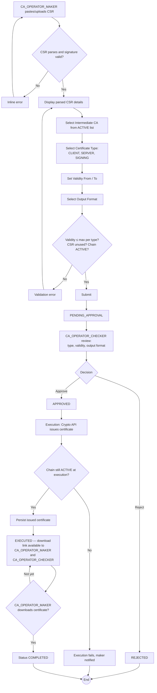

# WF-008: Certificate Issuance

## Summary

CA_OPERATOR_MAKER submits a CSR for issuance under a selected ACTIVE Intermediate CA, specifying certificate type, validity window, and output format. CA_OPERATOR_CHECKER reviews and decides. On approval, the Crypto API validates the CSR against the chosen Intermediate CA's chain, signs the certificate per the chosen certificate profile, and persists the issued certificate in all requested-and-related output formats. The issuance request remains `EXECUTED` until CA_OPERATOR_MAKER downloads the certificate, at which point it transitions to `COMPLETED`.

## Actors

| Role | Responsibility |
|---|---|
| CA_OPERATOR_MAKER | Submits CSR, downloads the issued certificate (download triggers `COMPLETED`) |
| CA_OPERATOR_CHECKER | Reviews and decides; may also download the issued certificate |

## Preconditions

- At least one ACTIVE Intermediate CA exists.
- CSR is well-formed PKCS#10, signature valid, public-key algorithm and size meet the policy (see [crypto-design.md](../../2-Design/2.2-LLD/crypto-design.md)).
- CSR has not been submitted before (CSR `SHA-256` digest is unique across all certificate issuance requests, per [BRD — Certificate Lifecycle](../BRD.md#certificate-lifecycle): *CSR can only be used once*).

## Diagram

## Steps

| # | Actor | Step | Validation |
|---|---|---|---|
| 1 | CA_OPERATOR_MAKER | Open *Submit CSR* | Role check. |
| 2 | CA_OPERATOR_MAKER | Paste or upload CSR (PEM) | CSR parsed; UI displays Subject DN, public key algorithm and size, SANs (if present), requested extensions. CSR digest (SHA-256 over DER) is computed and checked for prior use; if previously submitted, reject with `BUS-0060 CSR already used`. |
| 3 | CA_OPERATOR_MAKER | Select Intermediate CA | Picker shows only `ACTIVE` Intermediate CAs whose entire ancestor chain (parent + … + Root CA) is `ACTIVE`. |
| 4 | CA_OPERATOR_MAKER | Select Certificate Type | One of CLIENT, SERVER, SIGNING (see [certificate-profiles.md](../../2-Design/2.2-LLD/certificate-profiles.md)). |
| 5 | CA_OPERATOR_MAKER | Set Validity From and Validity To | `Validity From ≥ system date at submission`; `Validity To > Validity From`; `(Validity To − Validity From) ≤` configured Maximum Certificate Validity for the chosen type; `Validity To ≤ chosen Intermediate CA's Valid To`. |
| 6 | CA_OPERATOR_MAKER | Select Output Format | One of: *PEM — Certificate only*, *PEM — Full chain*, *DER — Certificate only*, *DER — Full chain*, *PKCS#7 / P7B*. |
| 7 | CA_OPERATOR_MAKER | Submit | Server re-validates all of the above. Persists request `PENDING_APPROVAL`. |
| 8 | CA_OPERATOR_CHECKER | Review | UI shows CSR detail (Subject, SANs, public key), chosen CA, type, validity, output format. |
| 9 | CA_OPERATOR_CHECKER | Approve / Reject | Reject requires comment; self-approval blocked. |
| 10 | System | Execute | Re-verify chain still `ACTIVE`, CSR still unused, validity dates still in the future, Intermediate CA not revoked. Call Crypto API `POST /v1/cert/issue` with CSR DER, signing CA ID, certificate type (which determines the profile), and validity window. |
| 11 | Crypto API | Validate, build X.509 v3 certificate per the profile, sign with the Intermediate CA's private key, return DER bytes; persist DER and the chain in Crypto DB | Per [certificate-profiles.md](../../2-Design/2.2-LLD/certificate-profiles.md). |
| 12 | System | Persist certificate metadata in Business DB; notify maker | Status `EXECUTED`. Output format is recorded so re-downloads produce the same format. |
| 13 | CA_OPERATOR_MAKER | Open Certificate detail and click Download | Download link is also available to CA_OPERATOR_CHECKER for the same request, but only the **CA_OPERATOR_MAKER's first download** triggers status `COMPLETED` (per [BRD — COMPLETED Trigger](../BRD.md#completed-trigger)). CA_OPERATOR_CHECKER downloads do not affect status. |
| 14 | System | Transition `EXECUTED → COMPLETED` on CA_OPERATOR_MAKER first download | Re-downloads always serve the same persisted bytes; the output format cannot be changed. |

## Validation Rules

| Field | Rule | On violation |
|---|---|---|
| CSR | Parses as PKCS#10; signature verifies; digest unique | 400 `VAL-0020`, 400 `VAL-0021`, 409 `BUS-0060` |
| CSR public key | Algorithm ∈ Allowed Key Algorithms; key size ≥ minimum | 400 `VAL-0022` |
| Signing CA | Status `ACTIVE`; full ancestor chain `ACTIVE` | 409 `BUS-0061 chain not active` |
| Certificate Type | ∈ {CLIENT, SERVER, SIGNING} | 400 `VAL-0023` |
| Validity From | ≥ system date (at submission and at execution) | 400 `VAL-0024` |
| Validity To | > From; ≤ signing CA Valid To; (To − From) ≤ Max for type | 400 `VAL-0025`, 409 `BUS-0062`, 409 `BUS-0063` |
| Output Format | ∈ the 5 defined formats | 400 `VAL-0026` |

## Error Paths

| Trigger | System behaviour |
|---|---|
| Signing CA disabled or revoked between submit and execute | Execution fails `BUS-0061`; request EXECUTED with failure metadata; maker notified. |
| Crypto API unreachable during execution | Retried per policy. After exhaustion, EXECUTED with failure; maker notified. |
| CSR signature invalidates due to clock skew at submit | UI reports invalid signature; user must regenerate CSR. |
| Concurrent submissions of the same CSR | DB unique constraint on CSR digest enforces one winner; second submission rejected at submit time. |
| Validity period was within max at submit, but max was lowered before execute | Execution re-checks; fails with `BUS-0063` if violated. |
| CA_OPERATOR_CHECKER downloads before CA_OPERATOR_MAKER | Permitted; download serves the certificate but does **not** trigger `COMPLETED`. |
| CA_OPERATOR_MAKER never downloads | Request remains `EXECUTED` indefinitely. No automatic timeout (out of scope for v1.0). |
| Certificate reaches `Valid To` while request is `EXECUTED` (never downloaded) | Daily scheduled task transitions certificate to `EXPIRED`. The request status is unchanged — completion is bound to download, not to certificate lifecycle. |

## Post-conditions

- Issued certificate persisted in Crypto DB in the selected output format and in the formats needed to satisfy *Full chain* and *PKCS#7* outputs.
- Certificate metadata row in Business DB with status `ACTIVE`.
- Request status: `EXECUTED` until first CA_OPERATOR_MAKER download, then `COMPLETED`.
- Audit log captures CSR digest, signing CA, chosen type, validity window, output format, and signing event.

## Related

- [BRD — Certificate Lifecycle](../BRD.md#certificate-lifecycle)
- [certificate-profiles.md](../../2-Design/2.2-LLD/certificate-profiles.md)
- [crypto-design.md](../../2-Design/2.2-LLD/crypto-design.md)
- [sequence-diagrams.md — Certificate Issuance](../../2-Design/2.1-HLD/sequence-diagrams.md)
