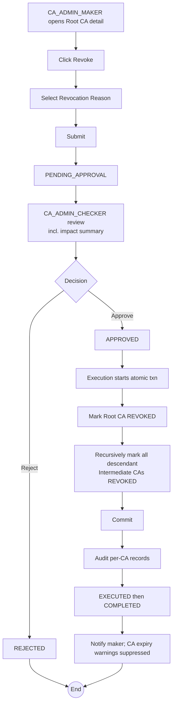

# WF-009: Root CA Revocation

## Summary

CA_ADMIN_MAKER submits a request to revoke a Root CA with a specified revocation reason. CA_ADMIN_CHECKER reviews and decides. **Revocation is permanent and irreversible.** On approval, the Root CA transitions to `REVOKED` and **all descendant Intermediate CAs are automatically REVOKED in the same execution** (cascade). Certificates issued under the chain remain in the system as historical records. External revocation notification (CRL, OCSP) is out of scope for v1.0.

## Actors

| Role | Responsibility |
|---|---|
| CA_ADMIN_MAKER | Submits the revocation request |
| CA_ADMIN_CHECKER | Reviews and decides |

## Preconditions

- Target Root CA exists, status ∈ {`ACTIVE`, `DISABLED`}.
- At least one ACTIVE CA_ADMIN_CHECKER different from the maker exists.

## Diagram

## Steps

| # | Actor | Step | Validation |
|---|---|---|---|
| 1 | CA_ADMIN_MAKER | Open Root CA detail | Cannot revoke an already-REVOKED CA (action hidden). |
| 2 | CA_ADMIN_MAKER | Click Revoke; review impact summary | UI shows: number of descendant Intermediate CAs that will cascade-revoke, count of `ACTIVE` certificates currently issued under the chain (informational; certificates are not externally revoked in v1.0). |
| 3 | CA_ADMIN_MAKER | Select Revocation Reason | One of: KEY_COMPROMISE, CESSATION_OF_OPERATION, SUPERSEDED, OTHER. |
| 4 | CA_ADMIN_MAKER | Submit | Server re-validates status; creates Request `PENDING_APPROVAL`. |
| 5 | CA_ADMIN_CHECKER | Review | Snapshot diff plus impact summary. |
| 6 | CA_ADMIN_CHECKER | Approve / Reject | Reject requires comment; self-approval blocked. |
| 7 | System | Execute in single DB transaction:   1) Set Root CA status `REVOKED`, `revocation_reason`, `revocation_date = now()`.   2) Recursively walk descendants and set each Intermediate CA status `REVOKED` with reason `SUPERSEDED` and `revocation_date = now()` and `revoked_due_to_cascade_from = <root_ca_id>`.   3) Commit. | Cascade is atomic — partial cascade is not possible. |
| 8 | System | Emit per-CA audit records (one for the Root CA + one per cascaded Intermediate CA), supersede peer requests, notify maker, suppress further CA expiry warnings for the revoked CAs |  |

## Validation Rules

| Field | Rule | On violation |
|---|---|---|
| Target CA status | ∈ {`ACTIVE`, `DISABLED`} | 409 `BUS-0020` |
| Revocation Reason | ∈ {KEY_COMPROMISE, CESSATION_OF_OPERATION, SUPERSEDED, OTHER} | 400 `VAL-0030` |

## Error Paths

| Trigger | System behaviour |
|---|---|
| CA was already revoked by another request executed first | Execution check fails; this request marked EXECUTED with failure metadata. |
| Cascade transaction fails partway | Full rollback. Request remains `APPROVED`; retried per policy. After exhaustion, EXECUTED with failure; CA_ADMIN_MAKER notified to investigate. **No partial cascade can ever be persisted.** |
| Concurrent enable/disable requests on cascaded Intermediate CAs | Those requests are auto-rejected as *superseded by executed request* when the cascade commits. |
| Certificate issuance requests in flight under the cascaded chain | They remain `PENDING_APPROVAL`. When approved, execution will fail with `BUS-0061 chain not active`. Operators should manually reject those requests for cleanliness. |

## Post-conditions

- Root CA: status `REVOKED`, revocation_reason set, revocation_date set.
- Every descendant Intermediate CA: status `REVOKED`, revocation_reason `SUPERSEDED`, revocation_date set, `revoked_due_to_cascade_from` set.
- One audit record per CA captures previous state, new state, and (for descendants) the parent revocation that triggered the cascade.
- Status change is irreversible.

## Related

- [BRD — Root CA Lifecycle](../BRD.md#root-ca-lifecycle)
- [BRD — Revocation Reasons](../BRD.md#revocation-reasons)
- [WF-015 — Intermediate CA Revocation](WF-015-intermediate-ca-revocation.md)
