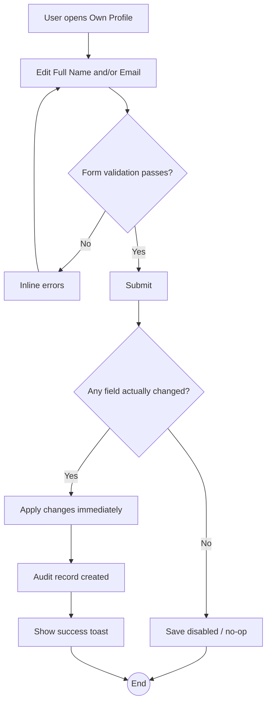

# WF-010: Self Profile Update

## Summary

Any authenticated user may update their own Full Name and Email without maker-checker approval. User ID, Username, Role, and Status are not self-editable. Changes take effect immediately on save and are captured in the audit log.

## Actors

| Role | Responsibility |
|---|---|
| Any ACTIVE user | Updates their own profile |

## Preconditions

- User is authenticated and ACTIVE.

## Diagram

## Steps

| # | Actor | Step | Validation |
|---|---|---|---|
| 1 | User | Open *Profile* | Always available to authenticated users. |
| 2 | User | Edit Full Name and/or Email | Username and User ID are read-only inputs; Role and Status are not displayed as editable. |
| 3 | User | Submit | At least one field must have changed. |
| 4 | System | Re-validate email uniqueness; apply update; emit audit record. | Field-level changes recorded (Previous vs New). |

## Validation Rules

| Field | Rule | On violation |
|---|---|---|
| Full Name | Non-empty, ≤ 100 chars | 400 `VAL-0001` |
| Email | RFC 5322 simple form; unique across all users (including DISABLED) | 400 `VAL-0011` / 409 `BUS-0041` |

## Error Paths

| Trigger | System behaviour |
|---|---|
| User attempts to edit Username, User ID, Role, or Status via direct API call | Server rejects with 403 `AUTH-0012 field not self-editable`. |
| Email update would collide with another user | Reject 409 `BUS-0041 email exists`. The change does not invalidate the user's existing session. |
| Active session continues across the update | Yes — JWT remains valid because Full Name and Email are not embedded in the JWT. |

## Post-conditions

- `users.full_name` and/or `users.email` updated immediately (no maker-checker).
- Audit record stores Before snapshot, After snapshot, changed fields.
- User session is unaffected.

## Related

- [BRD — User Lifecycle — Self-Profile Update](../BRD.md#user-lifecycle)
