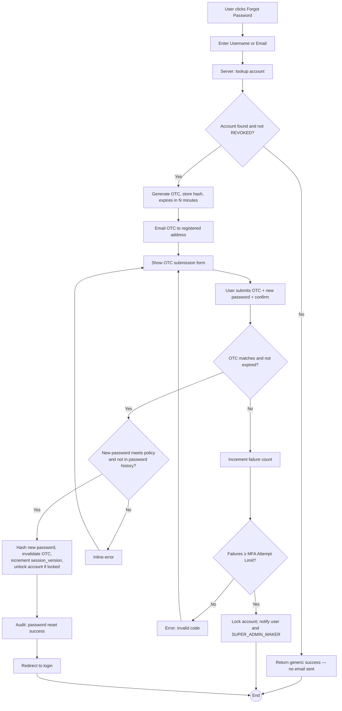

# WF-011: Forgot Password

## Summary

A user who has lost access to their account initiates a self-service password reset. The system always emits a generic "if the account exists you will receive an email" response (to avoid user enumeration). If the username/email matches an ACTIVE or DISABLED account, a One-Time Code (OTC) is emailed. The user submits the OTC, sets a new password, and is redirected to login. Successful password reset also unlocks a previously locked account.

## Actors

| Role | Responsibility |
|---|---|
| Unauthenticated user | Initiates the flow |

## Preconditions

- None (the flow is reachable from the public login screen).

## Diagram

## Steps

| # | Actor | Step | Validation |
|---|---|---|---|
| 1 | User | Click *Forgot Password* on login | Rate limited per Nginx config. |
| 2 | User | Enter Username or Email | Field accepts either; server tries username first then email. |
| 3 | Server | Lookup; if no match or user is `REVOKED`/non-existent → return generic 200 *If an account matches, you will receive an email*; do not send email. | No user enumeration. |
| 4 | Server | If match → generate 6-digit numeric OTC; store SHA-256(OTC) + expires_at = now + OTC validity; invalidate any prior unused OTC for the user; email the OTC. |  |
| 5 | User | Submit OTC + new password + confirm password |  |
| 6 | Server | Verify OTC matches the current hash AND not expired AND not already consumed | Failure increments `users.mfa_failure_count`; on threshold the account is locked (status remains `ACTIVE` but `locked_at` set; login is blocked until unlocked). |
| 7 | Server | Validate new password against the policy regex and against the last *N* passwords in `password_history` (N = Password History Depth), per [BRD — Authentication Requirements](../BRD.md#authentication-requirements) | Reject `BUS-0070` if it bcrypt-matches any retained history entry. |
| 8 | Server | Hash with bcrypt (cost 12), write `users.password_hash`, append the new hash to `password_history` and prune entries beyond the configured depth, set `password_changed_at = now()`, clear `force_password_reset` if set, clear `locked_at`, reset `mfa_failure_count = 0`, invalidate OTC, increment `session_version`. | Single transaction. |
| 9 | Server | Emit audit event `PASSWORD_RESET_SELF_SUCCESS`. |  |
| 10 | User | Redirected to login. |  |

## Validation Rules

| Field | Rule | On violation |
|---|---|---|
| OTC | 6 digits; valid only if hash matches and not expired and not previously consumed | 401 `AUTH-0020` |
| New password | Matches the configured Password Policy Regex | 400 `VAL-0040` |
| Confirm password | Equals new password | 400 `VAL-0041` |
| Reuse | Must not bcrypt-match any of the last *N* passwords (Password History Depth) | 409 `BUS-0070` |

## Error Paths

| Trigger | System behaviour |
|---|---|
| Username/email not found | Generic 200 success, no email. Audit `PASSWORD_RESET_REQUEST_UNKNOWN_ACCOUNT`. |
| Account is `REVOKED` (out-of-scope status for user, hypothetical) or `DISABLED` | Generic 200 success, no email sent. The user cannot recover via this flow. |
| OTC expired | 401 `AUTH-0021`; counts as failed attempt. |
| User exceeds MFA Attempt Limit on OTC entry | Account locked; user and SUPER_ADMIN_MAKER notified. |
| User does not complete within the OTC validity window | OTC expires; user can restart the flow. |
| Rate limit exceeded at Nginx | 429 returned. |

## Post-conditions

- Password hash updated.
- `users.session_version` incremented — any existing JWT invalidated.
- Account unlocked if previously locked.
- Audit log records the event.

## Related

- [BRD — Authentication Requirements](../BRD.md#authentication-requirements)
- [WF-014 — Admin Password Reset](WF-014-admin-password-reset.md)
- [crypto-design.md — OTC mechanics](../../2-Design/2.2-LLD/crypto-design.md)
