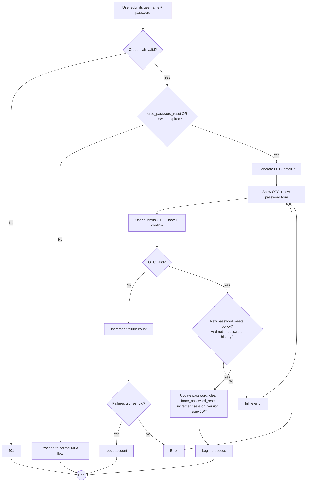

# WF-012: Force Password Reset (Password Expired or First Login)

## Summary

When a user authenticates with a password that has expired (per `Password Expiry (days)`) or with a temporary password marked `force_password_reset`, the system requires the user to set a new password before completing login. The flow includes MFA via OTC for identity proof.

## Actors

| Role | Responsibility |
|---|---|
| User attempting login | Sets a new password |

## Preconditions

- Password is valid.
- `users.force_password_reset = true` (first login or admin-initiated reset) OR `now() > password_changed_at + Password Expiry`.

## Diagram

## Steps

| # | Actor | Step | Validation |
|---|---|---|---|
| 1 | User | Submit username + password | Validated by bcrypt. |
| 2 | Server | Check `force_password_reset` and password expiry | If neither, fall through to the standard MFA flow (not this workflow). |
| 3 | Server | Generate OTC, email it, render the force-reset form | OTC mechanics identical to WF-011. |
| 4 | User | Submit OTC, new password, confirm password |  |
| 5 | Server | Validate OTC, the policy regex, and that the new password does not bcrypt-match any of the last *N* passwords in `password_history` (N = Password History Depth), per [BRD — Authentication Requirements](../BRD.md#authentication-requirements). | If the new password matches any retained history entry, reject `BUS-0070 cannot reuse a recent password`. |
| 6 | Server | Persist new password (bcrypt), append the new hash to `password_history` and prune beyond the configured depth, clear `force_password_reset`, set `password_changed_at = now()`, clear `temp_password_expires_at`, reset MFA failure count, increment `session_version`. | Single transaction. |
| 7 | Server | Issue JWT and complete login. | The MFA performed in this flow satisfies the per-session MFA requirement; no additional OTC is requested. |

## Validation Rules

| Field | Rule | On violation |
|---|---|---|
| OTC | As WF-011 | 401 `AUTH-0020`/`AUTH-0021` |
| New password | Matches the configured Password Policy Regex | 400 `VAL-0040` |
| New password vs history | Must not bcrypt-match any of the last *N* passwords (Password History Depth) | 409 `BUS-0070` |

## Error Paths

| Trigger | System behaviour |
|---|---|
| Temporary password is past `temp_password_expires_at` | Server returns 401 with code `AUTH-0030 temporary password expired`; user must request a new one via WF-014. The force-reset flow does not start. |
| User cancels mid-flow | Login is not completed; the user remains unauthenticated. The OTC remains valid until expiry but cannot be reused with a different new-password attempt. |
| Excessive OTC failures | Account locked. |

## Post-conditions

- Password updated, force-reset cleared, session_version incremented.
- User is logged in; previous JWTs invalidated.
- Audit log records the password change with event type `PASSWORD_RESET_FORCED`.

## Related

- [BRD — Authentication Requirements](../BRD.md#authentication-requirements)
- [WF-011 — Forgot Password](WF-011-forgot-password.md)
- [WF-014 — Admin Password Reset](WF-014-admin-password-reset.md)
