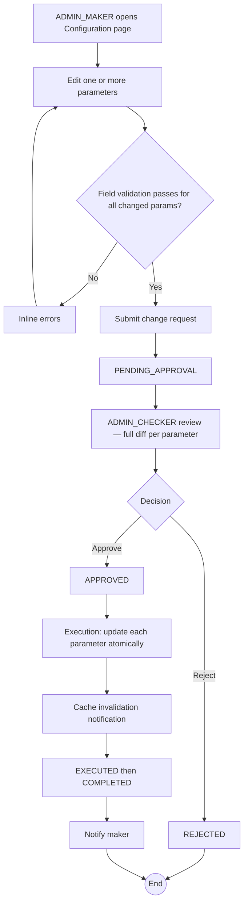

# WF-013: System Configuration Update

## Summary

ADMIN_MAKER submits a request to change one or more System Configuration parameters. ADMIN_CHECKER reviews and decides. Changes take effect on execution. All parameter changes are captured in the audit log. Configuration is read at runtime by the Business Logic API on each scheduled task tick and on each request that consults a parameter — no service restart is required.

## Actors

| Role | Responsibility |
|---|---|
| ADMIN_MAKER | Submits the change request |
| ADMIN_CHECKER | Reviews and decides |

## Preconditions

- Both maker and checker are ACTIVE.
- All new parameter values pass type and range validation.

## Diagram

## Steps

| # | Actor | Step | Validation |
|---|---|---|---|
| 1 | ADMIN_MAKER | Open *System Configuration* | Role check. Page shows all parameters in [BRD — System Configuration](../BRD.md#system-configuration). |
| 2 | ADMIN_MAKER | Edit one or more parameters | Per-parameter validation as below. |
| 3 | ADMIN_MAKER | Submit | Server re-validates all changed values. Creates Request `PENDING_APPROVAL`. The request payload is a JSON map of `{parameter_name → new_value}` for changed parameters only. |
| 4 | ADMIN_CHECKER | Review | Diff renders one row per changed parameter (Before/After). |
| 5 | ADMIN_CHECKER | Approve / Reject | Reject requires comment. Self-approval blocked. |
| 6 | System | Execute | Single DB transaction: update each `system_configuration` row's `value` column; emit one audit field-level row per changed parameter. |
| 7 | System | Notify maker; transition `COMPLETED` |  |

## Validation Rules (per parameter)

| Parameter | Type | Range | On violation |
|---|---|---|---|
| MFA Attempt Limit | int | 1..10 | 400 `VAL-0050` |
| MFA One-Time Code Validity (minutes) | int | 1..60 | 400 `VAL-0050` |
| Temporary Password Validity (hours) | int | 1..168 | 400 `VAL-0050` |
| Password Expiry (days) | int | 1..365 | 400 `VAL-0050` |
| Password Minimum Length | int | 8..64 | 400 `VAL-0050` |
| Session Timeout (minutes) | int | 5..480 | 400 `VAL-0050` |
| Allowed Key Algorithms | set | non-empty subset of {RSA, EC} | 400 `VAL-0051` |
| Minimum RSA Key Size (bits) | int | ∈ {2048, 3072, 4096} | 400 `VAL-0052` |
| Minimum EC Key Size (bits) | int | ∈ {256, 384, 521} | 400 `VAL-0053` |
| Maximum CA Hierarchy Depth | int | 1..10 | 400 `VAL-0054` |
| Maximum Certificate Validity — CLIENT (days) | int | 1..3650 | 400 `VAL-0055` |
| Maximum Certificate Validity — SERVER (days) | int | 1..3650 | 400 `VAL-0055` |
| Maximum Certificate Validity — SIGNING (days) | int | 1..3650 | 400 `VAL-0055` |
| Certificate Expiry Warning (days) | int | 1..365 | 400 `VAL-0056` |
| CA Expiry Warning (days) | int | 1..365 | 400 `VAL-0056` |
| Pending Request Escalation (days) | int | 1..30 | 400 `VAL-0057` |

## Error Paths

| Trigger | System behaviour |
|---|---|
| Lowering Maximum CA Hierarchy Depth below the depth of existing CAs | Allowed. Existing CAs remain. New Intermediate CA creation requests will be rejected if they would exceed the new max. |
| Lowering a Maximum Certificate Validity below currently issued certificates | Allowed. Existing certificates retain their original validity. New issuance requests are constrained to the new max. |
| Reducing Minimum Key Size for an algorithm that has issued CAs at that size | Allowed (only the *minimum* is raised/lowered; existing CAs are unaffected). |
| Removing an algorithm from Allowed Key Algorithms while CAs exist using that algorithm | Allowed. Existing CAs remain. New CA and certificate requests requesting that algorithm are rejected. |
| Concurrent configuration change requests | Each treated as independent. The latest-executed wins for any field changed by both. Earlier executions are not auto-rolled-back. |

## Post-conditions

- Each changed parameter is persisted; subsequent reads return the new value.
- Audit log contains one field-level change row per parameter.
- No service restart required.

## Related

- [BRD — System Configuration](../BRD.md#system-configuration)
