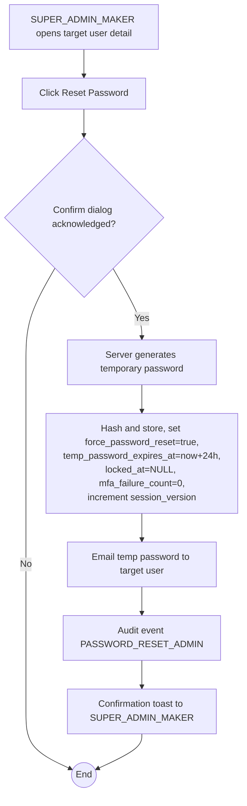

# WF-014: Admin Password Reset

## Summary

SUPER_ADMIN_MAKER initiates a password reset on behalf of a user (typically because the user is locked out, has forgotten their password, or has a stale temporary password). The system generates a new temporary password, emails it to the user, sets `force_password_reset = true`, unlocks the account, and invalidates any active session. The user must then complete WF-012 on first login.

**No maker-checker approval is required** for admin password reset — it is a single-step administrative action (per [BRD — User permissions: Reset Password](../BRD.md#permissions), which lists only SUPER_ADMIN_MAKER, with no Approve/Reject row for this operation). Audit recording is mandatory.

## Actors

| Role | Responsibility |
|---|---|
| SUPER_ADMIN_MAKER | Initiates the reset |
| Target user (implicit) | Receives temp password and completes WF-012 on next login |

## Preconditions

- Target user exists.
- Target user is not the SUPER_ADMIN_MAKER themselves (self-reset must use WF-011).

## Diagram

## Steps

| # | Actor | Step | Validation |
|---|---|---|---|
| 1 | SUPER_ADMIN_MAKER | Open target user detail | Cannot target self. |
| 2 | SUPER_ADMIN_MAKER | Click Reset Password; confirm in modal | Modal explains the user's current session will be terminated and a temp password emailed. |
| 3 | Server | Generate 16-char temporary password meeting complexity rules; bcrypt-hash and store; `force_password_reset = true`; `temp_password_expires_at = now() + Temporary Password Validity`; `locked_at = NULL`; `mfa_failure_count = 0`; increment `session_version`. | Single transaction. |
| 4 | Server | Send email with temp password per [branding.md — Account Created template](../branding.md#account-created--temporary-password) (re-used). |  |
| 5 | Server | Emit audit event `PASSWORD_RESET_ADMIN`. Audit record includes initiator, target, but not the plaintext password. |  |

## Validation Rules

| Field | Rule | On violation |
|---|---|---|
| Target user ≠ maker | Self-reset prohibited | 403 `AUTH-0011` |

## Error Paths

| Trigger | System behaviour |
|---|---|
| Target user is `REVOKED` (hypothetical — out of scope for v1.0; users are `ACTIVE` or `DISABLED`) | n/a |
| Target user is `DISABLED` | Reset is permitted (so an enabled-later user can immediately use the temp password). |
| SMTP relay unavailable | Action fails; the password hash is **not** updated. The maker is shown an error toast and may retry. (Atomicity: hash update and email send are coordinated — if email fails, the prior password remains valid.) |

## Post-conditions

- Target user has a new temporary password (in their email).
- Active session of the target user is terminated (next request will 401 due to bumped `session_version`).
- Target user is unlocked.
- Audit log records the admin-initiated reset.

## Related

- [BRD — User Lifecycle](../BRD.md#user-lifecycle)
- [BRD — Authentication Requirements](../BRD.md#authentication-requirements)
- [WF-012 — Force Password Reset](WF-012-force-password-reset.md)
