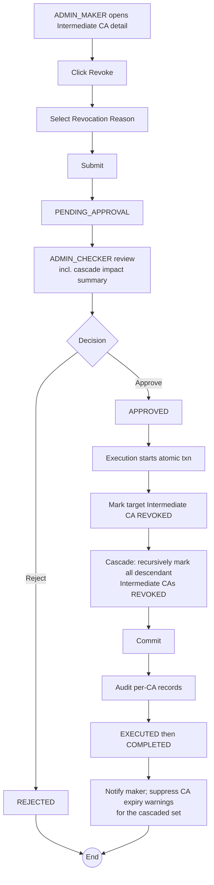

# WF-015: Intermediate CA Revocation

## Summary

ADMIN_MAKER submits a request to revoke an Intermediate CA with a specified reason. ADMIN_CHECKER reviews and decides. **Revocation is permanent and irreversible.** On approval, the target Intermediate CA transitions to `REVOKED` and **all of its descendant Intermediate CAs cascade-revoke in the same atomic transaction**. Issued end-entity certificates under the chain remain as historical records. External revocation notification (CRL, OCSP) is out of scope for v1.0.

## Actors

| Role | Responsibility |
|---|---|
| ADMIN_MAKER | Submits the revocation request |
| ADMIN_CHECKER | Reviews and decides |

## Preconditions

- Target Intermediate CA exists, status ∈ {`ACTIVE`, `DISABLED`}.

## Diagram

## Steps

| # | Actor | Step | Validation |
|---|---|---|---|
| 1 | ADMIN_MAKER | Open Intermediate CA detail | Cannot revoke an already-`REVOKED` CA. |
| 2 | ADMIN_MAKER | Click Revoke; review impact summary | UI shows: count of descendant Intermediate CAs that will cascade-revoke; count of `ACTIVE` certificates currently issued under the affected chain. |
| 3 | ADMIN_MAKER | Select Revocation Reason | One of: KEY_COMPROMISE, CESSATION_OF_OPERATION, SUPERSEDED, OTHER. |
| 4 | ADMIN_MAKER | Submit | Server re-validates status. |
| 5 | ADMIN_CHECKER | Review | Snapshot + impact summary. |
| 6 | ADMIN_CHECKER | Approve / Reject | Reject requires comment; self-approval blocked. |
| 7 | System | Execute in single DB transaction:   1) Mark target Intermediate CA `REVOKED`, `revocation_reason = <selected>`, `revocation_date = now()`.   2) Recursively walk descendants and mark each Intermediate CA `REVOKED` with reason `SUPERSEDED`, `revocation_date = now()`, `revoked_due_to_cascade_from = <target_intermediate_ca_id>`.   3) Commit. | Cascade is atomic. |
| 8 | System | Emit per-CA audit records, supersede peer requests, notify maker, suppress further CA expiry warnings for the revoked CAs. |  |

## Validation Rules

| Field | Rule | On violation |
|---|---|---|
| Target CA status | ∈ {`ACTIVE`, `DISABLED`} | 409 `BUS-0020` |
| Revocation Reason | ∈ {KEY_COMPROMISE, CESSATION_OF_OPERATION, SUPERSEDED, OTHER} | 400 `VAL-0030` |

## Error Paths

| Trigger | System behaviour |
|---|---|
| Ancestor CA was revoked between submit and execute, cascading the target as well | Execution check finds the target already `REVOKED`; this request is marked EXECUTED with failure (or no-op) metadata. The audit log already contains the ancestor's cascade record. |
| Cascade transaction fails partway | Full rollback. Request remains `APPROVED`; retried. No partial cascade can ever be persisted. |
| Two concurrent revocation requests on the same Intermediate CA | The first to execute wins; the second is auto-rejected as *superseded by executed request* when it is approved. |
| Pending certificate issuance requests under the cascaded chain | They remain `PENDING_APPROVAL`. When approved, execution will fail with `BUS-0061 chain not active`. Operators may manually reject these for housekeeping. |

## Post-conditions

- Target Intermediate CA: `REVOKED`, with chosen reason and revocation_date.
- Every descendant Intermediate CA: `REVOKED`, reason `SUPERSEDED`, revocation_date set, `revoked_due_to_cascade_from = <target_intermediate_ca_id>`.
- One audit record per CA, including the cascade source for descendants.
- Status change is irreversible.

## Related

- [BRD — Intermediate CA Lifecycle](../BRD.md#intermediate-ca-lifecycle)
- [BRD — Revocation Reasons](../BRD.md#revocation-reasons)
- [WF-009 — Root CA Revocation](WF-009-root-ca-revocation.md)
