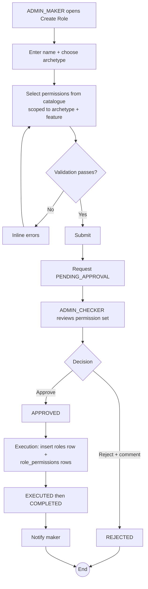

# WF-016: Role Creation

## Summary

ADMIN_MAKER (any Maker-archetype role holding **Role: Create**) submits a request to create a new custom role: a name, an **archetype** (Maker / Checker / Viewer), and a set of (feature, operation) permissions chosen from the catalogue. ADMIN_CHECKER (a Checker-archetype role holding **Role: Approve**) reviews and decides. On approval the role becomes available for assignment to users (WF-007). See [BRD — Role Management](../BRD.md#role-management-configurable-rbac).

## Actors

| Role | Responsibility |
|---|---|
| ADMIN_MAKER | Submits the creation request |
| ADMIN_CHECKER | Reviews and decides (approve / reject) |

## Preconditions

- Both maker and checker are ACTIVE users.
- At least one ACTIVE Checker holding Role: Approve who did not submit the request exists (per [BRD — Checker Availability](../BRD.md#checker-availability)).
- The permission catalogue is loaded.

## Diagram

## Steps

| # | Actor | Step | Validation |
|---|---|---|---|
| 1 | ADMIN_MAKER | Open *Create Role* | Role check: caller holds Role: Create. |
| 2 | ADMIN_MAKER | Enter name; choose archetype | Name non-empty, ≤ 50 chars, unique among non-deleted roles; archetype ∈ {MAKER, CHECKER, VIEWER}. |
| 3 | ADMIN_MAKER | Select permissions | Each (feature, operation) must be valid for the archetype and the feature. Edit/Delete allowed only for User, Role, System Configuration. Checker → only Approve/View; Viewer → only View. |
| 4 | ADMIN_MAKER | Submit | Server re-validates all fields; persists a `ROLE_CREATE` request `PENDING_APPROVAL`. |
| 5 | System | Notify checkers | Email per *Action Required* template. |
| 6 | ADMIN_CHECKER | Open request | Self-approval blocked (maker = checker disables controls). |
| 7 | ADMIN_CHECKER | Review permission set | Before pane empty (create); After pane shows the full permission grid. |
| 8a | ADMIN_CHECKER | Approve | `PENDING_APPROVAL → APPROVED`; notify maker. |
| 8b | ADMIN_CHECKER | Reject + mandatory comment | `PENDING_APPROVAL → REJECTED`; notify maker. Ends. |
| 9 | System | Execute | Insert `roles` row (`is_system = 0`, `status = ACTIVE`) and `role_permissions` rows. `EXECUTED → COMPLETED`. |

## Validation Rules (Field-Level)

| Field | Rule | On violation |
|---|---|---|
| Name | Non-empty, ≤ 50 chars; unique among non-deleted roles | 400 `VAL-0060`, 409 `BUS-0100` |
| Archetype | ∈ {MAKER, CHECKER, VIEWER} | 400 `VAL-0061` |
| Permission | (feature, operation) in catalogue and valid for archetype | 400 `VAL-0062` |
| Edit/Delete operation | Only on USER, ROLE, SYSTEM_CONFIG | 400 `VAL-0063` |
| Segregation of duties | Role cannot mix maker and approve operations (guaranteed by exclusive archetype) | 409 `BUS-0101` |

## Error Paths

| Trigger | System behaviour |
|---|---|
| Duplicate role name | 409 `BUS-0100` at submit and re-checked at execute. |
| Maker attempts to grant an operation outside the catalogue | 400 `VAL-0062`; the catalogue is the hard upper bound (no privilege escalation). |
| No ACTIVE checker for Role: Approve | Submission succeeds; request stays `PENDING_APPROVAL` with a warning banner (per Checker Availability). |

## Post-conditions

- A new ACTIVE role exists with its permission set; available for assignment via WF-007.
- Audit log captures the request payload, approval payload, empty before snapshot, after snapshot (the permission set), and field-level additions.

## Related

- [BRD — Role Management](../BRD.md#role-management-configurable-rbac)
- [WF-017 — Role Edit](WF-017-role-edit.md), [WF-018 — Role Deletion](WF-018-role-deletion.md)
- [WF-007 — Role Assignment](WF-007-role-assignment.md)
- [data-model.md — roles](../../2-Design/2.2-LLD/data-model.md#roles)
