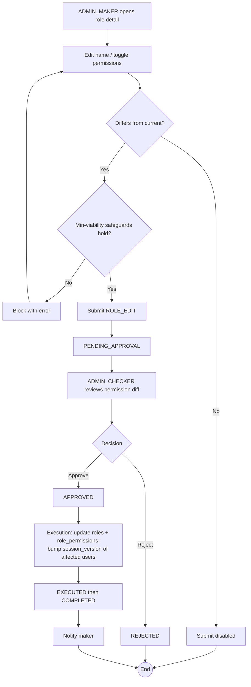

# WF-017: Role Edit

## Summary

ADMIN_MAKER submits a request to change a role's **name** and/or **permission set**. ADMIN_CHECKER reviews the before/after permission diff and decides. On approval the role definition is updated. The **archetype is immutable** — changing Maker↔Checker↔Viewer would break segregation of duties, so a new role must be created instead (WF-016). Editing applies to both seeded and custom roles, subject to the minimum-viability safeguards. See [BRD — Role Management](../BRD.md#role-management-configurable-rbac).

## Actors

| Role | Responsibility |
|---|---|
| ADMIN_MAKER | Submits the edit request |
| ADMIN_CHECKER | Reviews and decides |

## Preconditions

- Target role exists and is ACTIVE.
- The change differs from the current definition.
- The change does not violate the minimum-viability safeguards (below).

## Diagram

## Steps

| # | Actor | Step | Validation |
|---|---|---|---|
| 1 | ADMIN_MAKER | Open role detail, choose Edit | Caller holds Role: Edit. Archetype shown read-only. |
| 2 | ADMIN_MAKER | Change name and/or permissions | Same field rules as WF-016; archetype cannot change. |
| 3 | ADMIN_MAKER | Submit | Must differ from current; minimum-viability safeguards re-checked. Persists a `ROLE_EDIT` request. |
| 4 | ADMIN_CHECKER | Review | Before/after permission diff per [checker-review.md](../checker-review.md): added permissions (green), removed (red). |
| 5 | ADMIN_CHECKER | Approve / Reject | Reject requires comment. |
| 6 | System | Execute | Update `roles.name`, replace `role_permissions`; **increment `session_version` of every user holding the role** so their JWTs re-authorise under the new permissions. `EXECUTED → COMPLETED`. |

## Validation Rules

| Field | Rule | On violation |
|---|---|---|
| Archetype | Cannot be changed | 400 `VAL-0061` |
| Name / Permission | Same rules as WF-016 | `VAL-0060`/`VAL-0062`/`VAL-0063`, `BUS-0100` |
| Change differs from current | No-op rejected | 409 `BUS-0021` |
| Minimum viability | Edit must not leave zero active approvers for a feature, or remove the last path to administer Roles/Users | 409 `BUS-0102`, `BUS-0103` |

## Error Paths

| Trigger | System behaviour |
|---|---|
| Edit removes Approve-on-Role from the last role that has it | Rejected `BUS-0103` — would make role administration unrecoverable. |
| Edit strips the last active approver for a feature with pending requests | Rejected `BUS-0102` (validated at submit and execute). |
| Concurrent edits of the same role | First to execute wins; the second is auto-rejected as *superseded by executed request*. |

## Post-conditions

- Role definition updated; affected users re-authorise on next request (session invalidated).
- Audit log captures before/after permission sets and the field-level diff.

## Related

- [BRD — Role Management](../BRD.md#role-management-configurable-rbac)
- [WF-016 — Role Creation](WF-016-role-creation.md), [WF-018 — Role Deletion](WF-018-role-deletion.md)
- [checker-review.md](../checker-review.md)
