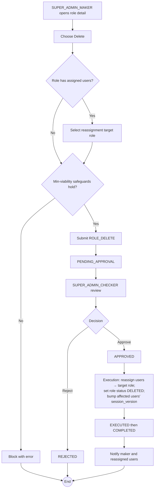

# WF-018: Role Deletion

## Summary

SUPER_ADMIN_MAKER submits a request to delete a role. Deletion is a **soft delete** — the role's `status` becomes `DELETED` and the record (with its permission history) is retained for audit; it is never physically purged. If the role has assigned users, the request must nominate a **reassignment target role** for those users. SUPER_ADMIN_CHECKER reviews and decides. Subject to the minimum-viability safeguards. See [BRD — Role Management](../BRD.md#role-management-configurable-rbac).

## Actors

| Role | Responsibility |
|---|---|
| SUPER_ADMIN_MAKER | Submits the deletion request |
| SUPER_ADMIN_CHECKER | Reviews and decides |

## Preconditions

- Target role exists and is ACTIVE.
- If users are assigned, a valid ACTIVE reassignment target role is supplied.
- Deletion does not violate the minimum-viability safeguards.

## Diagram

## Steps

| # | Actor | Step | Validation |
|---|---|---|---|
| 1 | SUPER_ADMIN_MAKER | Open role detail, choose Delete | Caller holds Role: Delete. |
| 2 | SUPER_ADMIN_MAKER | If users assigned, pick reassignment target | Target must be ACTIVE and ≠ the role being deleted. |
| 3 | SUPER_ADMIN_MAKER | Submit | Minimum-viability safeguards re-checked. Persists a `ROLE_DELETE` request. |
| 4 | SUPER_ADMIN_CHECKER | Review | Snapshot shows the role, its permissions, assigned-user count, and the reassignment target. |
| 5 | SUPER_ADMIN_CHECKER | Approve / Reject | Reject requires comment. |
| 6 | System | Execute | Reassign holders to the target role, set `roles.status = DELETED`, increment `session_version` of every affected user. `EXECUTED → COMPLETED`. |

## Validation Rules

| Field | Rule | On violation |
|---|---|---|
| Reassignment target | Required when users are assigned; ACTIVE; not the deleted role | 400 `VAL-0064` |
| Minimum viability | Deletion must not remove the last active approver for a feature, or the last path to administer Roles/Users, or the last Maker required to operate a feature | 409 `BUS-0102`, `BUS-0103`, `BUS-0104` |

## Error Paths

| Trigger | System behaviour |
|---|---|
| Deleting a role that is the only holder of Approve on a feature | Rejected `BUS-0102`. |
| Deleting the last role able to administer Roles/Users | Rejected `BUS-0103`. |
| Reassignment target deleted between submit and execute | Execution fails; maker notified; request marked EXECUTED with failure metadata. |

## Post-conditions

- Role `status = DELETED`; retained for audit. Name may be reused by a future role only after the application's uniqueness check (which ignores DELETED rows).
- Affected users moved to the reassignment role; their sessions invalidated.
- Audit log captures the deleted role's permission set, the reassignment, and affected users.

## Related

- [BRD — Role Management](../BRD.md#role-management-configurable-rbac)
- [WF-016 — Role Creation](WF-016-role-creation.md), [WF-017 — Role Edit](WF-017-role-edit.md)
- [WF-007 — Role Assignment](WF-007-role-assignment.md)
