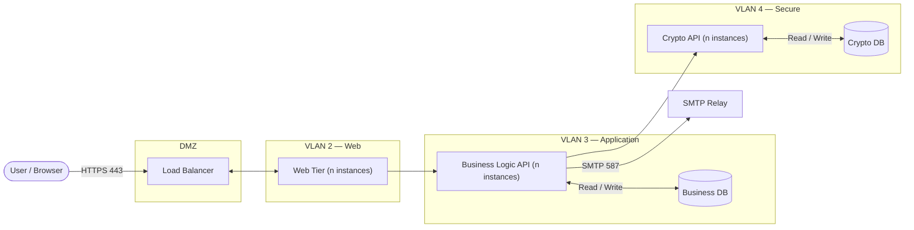

# Architecture

## System Architecture

### Overview

---

## VLANs

Each tier runs on a dedicated VLAN. Inter-VLAN traffic is controlled by firewall rules and only permitted in the directions listed below.

| Zone | Name | Components | Allowed Inbound From | Allowed Outbound To |
|---|---|---|---|---|
| DMZ | DMZ | Load Balancer | Internet (HTTPS 443) via FW-Ext | VLAN 2 via FW-Int |
| VLAN 2 | Web | Web Tier instances | DMZ only (via FW-Int) | VLAN 3 only |
| VLAN 3 | Application | Business Logic API instances, Business DB | VLAN 2 only | VLAN 4; SMTP Relay (port 587, outbound only, fixed relay IP) |
| VLAN 4 | Secure | Crypto API instances, Crypto DB | VLAN 3 only | — |

The DMZ is a screened subnet bounded by an external firewall (FW-Ext, internet-facing) and an internal firewall (FW-Int, VLAN 2-facing). No tier may initiate a connection to a tier above it. VLAN 2 and VLAN 3 have no route to VLAN 4. The outbound SMTP exception on VLAN 3 is a specific firewall rule permitting port 587 to a fixed corporate relay IP only — no other outbound traffic is permitted from VLAN 3.

---

## Statelessness

All service tiers are stateless. No instance holds any in-memory state between requests.

| Tier | How Statelessness is Achieved |
|---|---|
| Load Balancer | Routes each request independently; no session affinity required |
| Web Tier | Serves pre-built static assets; no server-side session or cache |
| Business Logic API | Authentication state carried entirely in the JWT; no server-side session store |
| Crypto API | Each request is a self-contained cryptographic operation; no state retained between calls |

All persistent state lives exclusively in the databases. Any instance of a tier can handle any request, and any instance in one tier may route to any instance in the next tier — the diagram shows a single representative route per hop for clarity.

---

## Scalability

Each tier scales horizontally and independently. Instances can be added or removed without downtime.

| Tier | Scaling Unit | Notes |
|---|---|---|
| Load Balancer | Managed / active-active pair | Distributes traffic across all Web Tier instances |
| Web Tier | Additional instances behind LB | Stateless; new instances are immediately usable |
| Business Logic API | Additional instances | Stateless; Web Tier instances distribute across all Business Logic API instances via client-side round-robin |
| Crypto API | Additional instances | Stateless; Business Logic API instances distribute across all Crypto API instances via client-side round-robin |
| Business DB | Vertical scale or read replicas | Writes go to primary; read replicas can serve reporting queries |
| Crypto DB | Vertical scale | Isolated in VLAN 4; scale independently of Business DB |

Internal load balancing between Web Tier → Business Logic API and Business Logic API → Crypto API uses client-side round-robin. Each instance is configured with the addresses of all instances in the next tier. No additional internal load balancer component is required.

---

## Scheduled Tasks

The Business Logic API tier runs a background scheduler responsible for three periodic tasks:

| Task | Frequency | Action |
|---|---|---|
| Certificate expiry transition | Daily | Transitions all ACTIVE certificates whose Valid To date has passed to EXPIRED |
| Expiry warning notifications | Daily | Sends email warnings for certificates and CAs approaching expiry within their configured warning windows |
| Pending request escalation | Daily | Sends escalation emails to checkers for requests in PENDING_APPROVAL beyond the configured escalation threshold |

Since multiple Business Logic API instances run concurrently, only one instance must execute each scheduled task per cycle. This is enforced by a distributed lock written to the Business DB: an instance acquires the lock before executing the task and releases it on completion. Instances that fail to acquire the lock skip that cycle.

---

## Component Responsibilities

### Load Balancer

- Resides in the DMZ, between the external firewall (FW-Ext) and the internal firewall (FW-Int). It is the only component reachable from the internet.
- Accepts all inbound HTTPS traffic from users.
- Distributes requests across Web Tier instances.
- Performs SSL/TLS termination.
- Performs health checks on Web Tier instances and removes unhealthy instances from rotation.

### Web Tier

- Serves the frontend UI as pre-built static assets.
- Acts as a reverse proxy: forwards `/api/*` requests to the Business Logic API over VLAN 3.
- Contains no business logic and holds no data.
- Stateless — any instance can serve any request.

### Business Logic API

- Implements all application business rules: maker-checker workflow, approvals, user management, audit logging, notifications, system configuration, and request lifecycle management.
- Authenticates all requests via JWT.
- Delegates every cryptographic operation to the Crypto API — it never handles key material directly.
- Reads and writes to the Business DB.
- Sends all outbound email via the SMTP relay: MFA codes, temporary passwords, request lifecycle notifications, expiry warnings, and escalation alerts.
- Runs background scheduled tasks (certificate expiry transition, expiry warnings, pending request escalation) with distributed lock coordination via the Business DB.
- Stateless — authentication state is in the JWT; any instance can handle any request.

### Crypto API

- Accessible from VLAN 3 only. Not reachable from the DMZ or VLAN 2.
- Requires a shared API key from all callers. Requests without a valid API key are rejected regardless of network origin. The key is injected at deployment time and never stored in the Business DB.
- Handles all cryptographic operations:
  - CA keypair generation (RSA and EC)
  - CA certificate self-signing (Root CA) and signing (Intermediate CA)
  - CSR validation and certificate issuance
- Returns only public material (certificates, signed data) to the Business Logic API.
- Private keys never leave VLAN 4.
- Stateless — any instance can handle any request.

---

## Communication

| From | To | Protocol | Direction |
|---|---|---|---|
| User | Load Balancer | HTTPS | Internet → DMZ (via FW-Ext) |
| Load Balancer | Web Tier | HTTPS | DMZ → VLAN 2 (via FW-Int) |
| Web Tier | Business Logic API | HTTPS (internal) | VLAN 2 → VLAN 3 |
| Business Logic API | Crypto API | HTTPS (internal) | VLAN 3 → VLAN 4 |
| Business Logic API | Business DB | DB protocol | Within VLAN 3 |
| Crypto API | Crypto DB | DB protocol | Within VLAN 4 |
| Business Logic API | SMTP Relay | SMTP / STARTTLS (port 587) | VLAN 3 → Corporate relay |

All inter-tier service communication uses TLS. Network isolation is the primary security boundary; TLS provides defense-in-depth on every hop.

---

## Databases

### Business DB

Stores all non-cryptographic application data. Encrypted at rest.

| Category | Data |
|---|---|
| Users | ID, full name, username, email, password hash, MFA state, role, status, session version |
| Requests | All request types, payloads, status, maker, checker, comments |
| Root CA Metadata | ID, CN, O, C, algorithm, key size, validity dates, status |
| Intermediate CA Metadata | Same as Root CA, plus parent CA reference and hierarchy depth |
| Certificate Metadata | ID, serial number, type, validity dates, status, issuing CA, output format |
| Audit Logs | Full audit event records including before/after snapshots |
| System Configuration | All configurable parameters |
| Notifications | Notification queue and delivery state |
| Scheduler Locks | Distributed lock records for scheduled task coordination |

### Crypto DB

Stores all cryptographic material, isolated in VLAN 4. Encrypted at rest.

| Category | Data |
|---|---|
| CA Private Keys | Encrypted private keys for Root CAs and Intermediate CAs |
| CA Public Certificates | PEM-encoded CA certificates |
| Issued Certificates | Raw certificate data in all requested output formats |

The Business Logic API and Web Tier have no access to the Crypto DB.

---

## Authentication

Username and password are verified first by the Business Logic API. On success, a one-time code is sent to the user's registered email address; the user must submit the code to complete login. A JWT is then issued carrying user ID, role, and session version; no server-side session store is required. Self-approval is enforced by comparing the JWT subject against the request's `created_by` field.

Sessions expire after a configurable idle period. A new login terminates any existing session.

### Single Active Session Enforcement

Each user record carries a `session_version` integer in the Business DB, incremented on every new login. The JWT embeds the `session_version` at issue time. On every authenticated request, the Business Logic API validates the JWT signature and checks that the embedded `session_version` matches the current value in the Business DB. If the values differ — because a subsequent login has incremented the version — the request is rejected with 401 and the client is redirected to login. This enforces the single active session requirement without a server-side session store.

---

## Bootstrap

A one-time `/setup` endpoint on the Business Logic API creates the initial SUPER_ADMIN_MAKER and SUPER_ADMIN_CHECKER users without maker-checker approval. It is permanently disabled after first use.

---

## CA Field Configurability

Allowed key algorithms, minimum key sizes, maximum CA hierarchy depth, and maximum certificate validity periods are system-configurable parameters stored in the Business DB. Changes take effect after maker-checker approval without requiring code changes.

---

## Key Storage

CA private keys are generated and stored exclusively within the Crypto API's VLAN 4. They are encrypted at rest in the Crypto DB. The Business Logic API receives only public certificates and signed data from the Crypto API — private key material never crosses into VLAN 3 or above.
