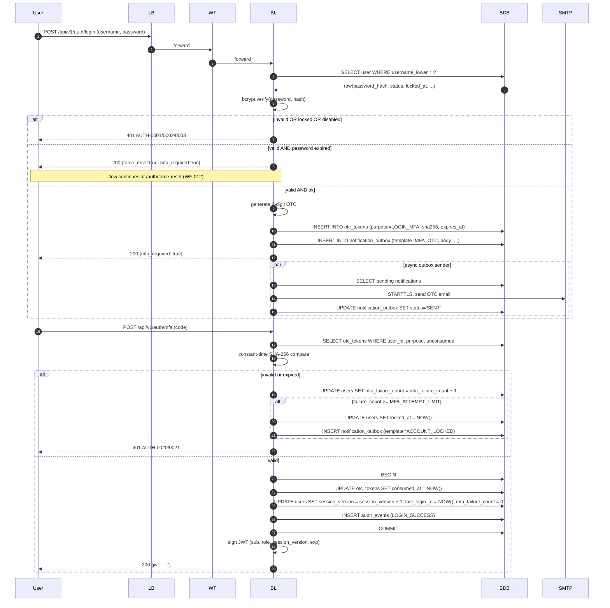
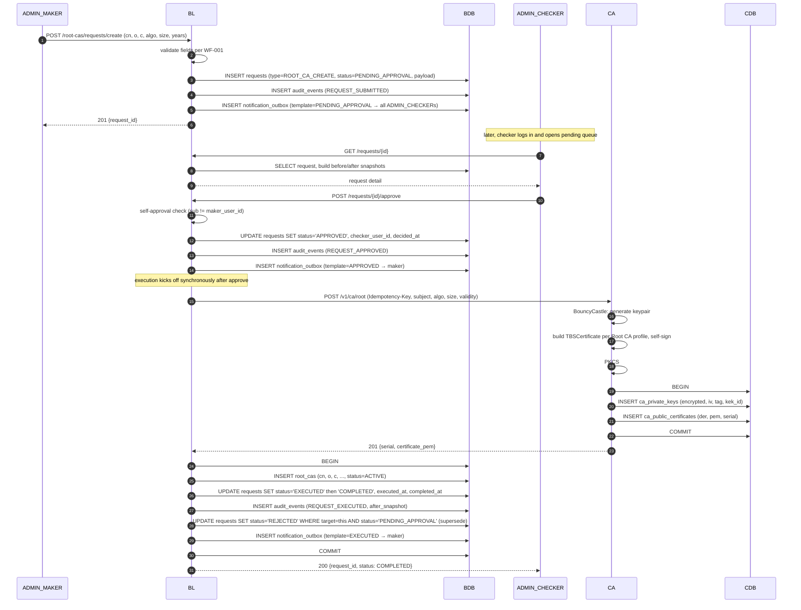
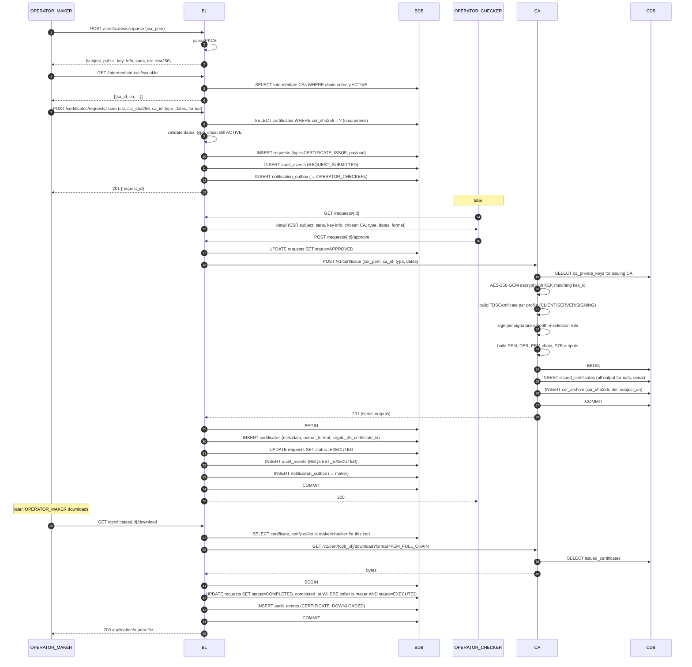
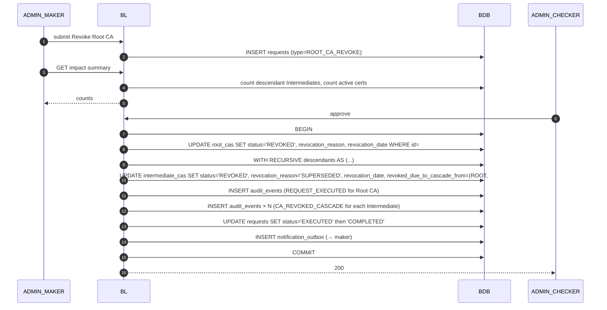
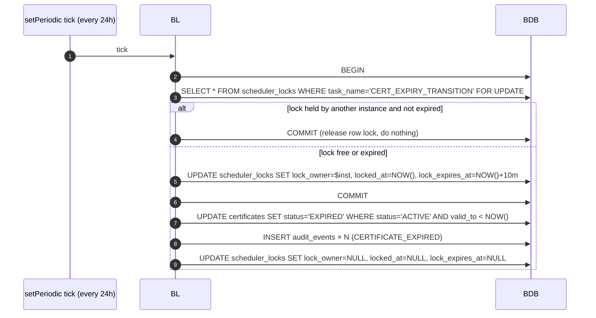

# Sequence Diagrams

End-to-end sequences for the flows that cross component boundaries. These complement the workflow files in `Docs/1-Requirements/Workflows/` — workflows describe *what happens*; sequence diagrams describe *who calls whom* and *in what order*.

Components in the diagrams below:

- **U** — User (browser)
- **LB** — Load Balancer (DMZ)
- **WT** — Web Tier (Nginx in VLAN 2)
- **BL** — Business Logic API (VLAN 3)
- **BDB** — Business DB (VLAN 3)
- **CA** — Crypto API (VLAN 4)
- **CDB** — Crypto DB (VLAN 4)
- **SMTP** — Corporate SMTP relay

---

## 1. Authentication + MFA



---

## 2. Root CA Creation (end-to-end)



Notes:
- The execution call to the Crypto API uses an `Idempotency-Key` of `request_id` so a retry produces the same persisted state.
- If the Crypto API fails after the keypair is generated but before the BL transaction completes, the BL retries; the Crypto API short-circuits to the prior response on `Idempotency-Key` replay.
- If the BL transaction fails after a successful Crypto API call, the next retry sees the Crypto DB row already exists; the BL re-fetches it and continues persistence in the Business DB.

---

## 3. Certificate Issuance (end-to-end)



---

## 4. Maker-Checker execution with concurrent requests

Illustrates how the *superseded by executed request* rule is applied at execution time.

```mermaid
sequenceDiagram
    autonumber
    participant M1 as ADMIN_MAKER A
    participant M2 as ADMIN_MAKER B
    participant BL
    participant BDB
    participant C as ADMIN_CHECKER

    M1->>BL: submit Disable Root CA #1
    BL->>BDB: INSERT requests R1 (target=RootCA#1, status=PENDING_APPROVAL)

    M2->>BL: submit Disable Root CA #1 (parallel)
    BL->>BDB: INSERT requests R2 (target=RootCA#1, status=PENDING_APPROVAL)

    C->>BL: approve R1
    BL->>BDB: BEGIN
    BL->>BDB: UPDATE requests SET status='APPROVED' WHERE id=R1
    BL->>BDB: UPDATE root_cas SET status='DISABLED' WHERE id=#1
    BL->>BDB: UPDATE requests SET status='REJECTED', checker_comment='superseded by executed request' WHERE target_entity_kind='ROOT_CA' AND target_entity_id=#1 AND status='PENDING_APPROVAL' AND id != R1
    BL->>BDB: UPDATE requests SET status='EXECUTED' WHERE id=R1
    BL->>BDB: INSERT audit_events ×3 (approved, executed, superseded)
    BL->>BDB: COMMIT
    BL-->>C: 200

    note over BDB: R2 is now REJECTED with the superseded reason; M2 is notified
```

---

## 5. Root CA Revocation cascade



If the BL transaction fails at any point, the entire cascade rolls back — no partial revocation is ever persisted (see WF-009 Error Paths).

---

## 6. Scheduled task — Certificate expiry transition



The same pattern is used for `EXPIRY_WARNING_NOTIFICATIONS` and `PENDING_REQUEST_ESCALATION`.

---

## Related

- [architecture.md](architecture.md)
- [Workflows/](../../1-Requirements/Workflows/)
- [crypto-design.md](../2.2-LLD/crypto-design.md)
- [data-model.md](../2.2-LLD/data-model.md)
