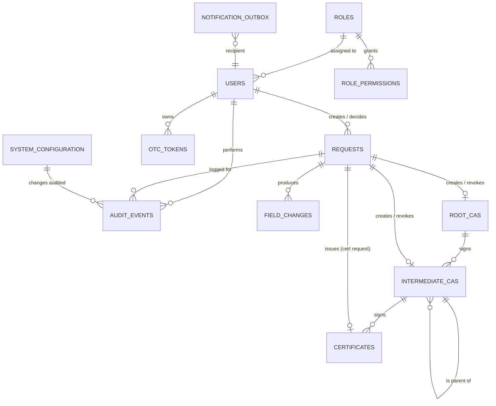

# Data Model

This document defines the persistent schema for both databases — **Business DB** (VLAN 3) and **Crypto DB** (VLAN 4). It is the source of truth for table structure during implementation. Migrations are produced as numbered `.sql` files and applied at service startup by the Vert.x MySQL Client (see [tools.md](../../3-Implementation/tools.md)).

> Engine: MySQL 8.4 LTS. Default charset/collation: `utf8mb4 / utf8mb4_0900_ai_ci`. All time columns are `DATETIME(3)` (millisecond precision), stored in UTC. All IDs are `BIGINT UNSIGNED AUTO_INCREMENT` unless noted. Boolean flags use `TINYINT(1)` (`0`/`1`).

---

## Business DB

The Business DB stores all non-cryptographic application state.

### Entity overview



### Tables

#### `users`

Authentication, authorization, and account state.

| Column | Type | Constraints | Notes |
|---|---|---|---|
| `id` | BIGINT UNSIGNED | PK, AUTO_INCREMENT | |
| `username` | VARCHAR(50) | NOT NULL, UNIQUE | Case-insensitive uniqueness enforced via `LOWER(username)` generated column index. |
| `username_lower` | VARCHAR(50) GENERATED ALWAYS AS (LOWER(username)) STORED | NOT NULL, UNIQUE | |
| `full_name` | VARCHAR(100) | NOT NULL | |
| `email` | VARCHAR(254) | NOT NULL, UNIQUE | |
| `password_hash` | VARCHAR(72) | NOT NULL | bcrypt cost 12. |
| `password_changed_at` | DATETIME(3) | NOT NULL | |
| `force_password_reset` | TINYINT(1) | NOT NULL, DEFAULT 0 | Set true for temp passwords (WF-005/WF-014). |
| `temp_password_expires_at` | DATETIME(3) | NULL | Non-null only while `force_password_reset = 1`. |
| `role_id` | BIGINT UNSIGNED | NOT NULL, FK → roles.id | Replaces the former fixed `role` ENUM; points to a seeded or custom role (see [§Role Management](../../1-Requirements/BRD.md#role-management-configurable-rbac)). |
| `status` | ENUM('ACTIVE','DISABLED','DELETED') | NOT NULL, DEFAULT 'ACTIVE' | `DELETED` is a soft delete — the row is retained for audit and never purged. |
| `locked_at` | DATETIME(3) | NULL | Non-null while account is locked due to MFA failures. |
| `mfa_failure_count` | INT UNSIGNED | NOT NULL, DEFAULT 0 | |
| `session_version` | BIGINT UNSIGNED | NOT NULL, DEFAULT 0 | Bumped on every new login and on role/status/password change. |
| `last_login_at` | DATETIME(3) | NULL | |
| `created_at` | DATETIME(3) | NOT NULL | |
| `created_by_user_id` | BIGINT UNSIGNED | NULL, FK → users.id | NULL for bootstrap. |
| `updated_at` | DATETIME(3) | NOT NULL | Application-maintained. |

Indexes: `(role_id, status)`, `(email)`, `(status)`.

#### `password_history`

Retains a user's recent bcrypt hashes to enforce the configurable **Password History Depth** (BRD — Authentication Requirements). On each password change the new hash is inserted; entries beyond the configured depth (oldest first) are pruned in the same transaction. A reuse check bcrypt-compares the candidate against the retained rows for the user.

| Column | Type | Constraints | Notes |
|---|---|---|---|
| `id` | BIGINT UNSIGNED | PK, AUTO_INCREMENT | |
| `user_id` | BIGINT UNSIGNED | NOT NULL, FK → users.id ON DELETE CASCADE | |
| `password_hash` | VARCHAR(72) | NOT NULL | bcrypt cost 12. Includes the hash that is currently live in `users.password_hash`. |
| `created_at` | DATETIME(3) | NOT NULL | Time the password was set; pruning orders by this. |

Indexes: `(user_id, created_at DESC)`. System-generated temporary passwords (WF-005/WF-014) are **not** recorded here — only user-chosen passwords participate in history.

#### `roles`

Role definitions for the configurable RBAC engine. Ships with seven **seeded** rows (`SUPER_ADMIN_MAKER`, `SUPER_ADMIN_CHECKER`, `CA_ADMIN_MAKER`, `CA_ADMIN_CHECKER`, `CA_OPERATOR_MAKER`, `CA_OPERATOR_CHECKER`, `AUDITOR`); additional **custom** roles are created via maker-checker (WF-016/017/018). Roles are soft-deleted, never purged. The two `SUPER_ADMIN` rows are **immutable** (`is_immutable = 1`) and cannot be edited, deleted, or disabled.

| Column | Type | Constraints | Notes |
|---|---|---|---|
| `id` | BIGINT UNSIGNED | PK, AUTO_INCREMENT | |
| `name` | VARCHAR(50) | NOT NULL, UNIQUE | Display name, e.g., `Certificate Operations Maker`. Uniqueness over non-deleted rows enforced at the application layer. |
| `archetype` | ENUM('MAKER','CHECKER','VIEWER') | NOT NULL | Fixes the operation palette; immutable after creation. Enforces segregation of duties. |
| `is_system` | TINYINT(1) | NOT NULL, DEFAULT 0 | `1` for the seven seeded roles. Flagged for UI and reporting; CA_ADMIN/CA_OPERATOR/AUDITOR remain editable/deletable like custom roles. |
| `is_immutable` | TINYINT(1) | NOT NULL, DEFAULT 0 | `1` for the two SUPER_ADMIN seeded rows. Any edit, delete, or disable request targeting an immutable role is rejected at both submission and execution; their permission set is fixed and they are created only at bootstrap. |
| `status` | ENUM('ACTIVE','DELETED') | NOT NULL, DEFAULT 'ACTIVE' | Soft delete only; retained for audit and to resolve historical assignments. Immutable roles cannot transition to `DELETED`. |
| `created_request_id` | BIGINT UNSIGNED | NULL, FK → requests.id | NULL for seeded rows. |
| `created_at` | DATETIME(3) | NOT NULL | |
| `updated_at` | DATETIME(3) | NOT NULL | Application-maintained. |

Indexes: `(archetype, status)`, `(status)`.

#### `role_permissions`

The set of (feature, operation) grants for a role. Operations must be valid for the role's archetype and for the feature, per the permission catalogue in the BRD. `EDIT` / `DELETE` are accepted only for `USER`, `ROLE`, and `SYSTEM_CONFIG` features (cryptographic features never carry them).

| Column | Type | Constraints | Notes |
|---|---|---|---|
| `id` | BIGINT UNSIGNED | PK, AUTO_INCREMENT | |
| `role_id` | BIGINT UNSIGNED | NOT NULL, FK → roles.id ON DELETE CASCADE | |
| `feature` | ENUM('ROOT_CA','INTERMEDIATE_CA','CERTIFICATE','USER','ROLE','SYSTEM_CONFIG','REPORTS','AUDIT') | NOT NULL | |
| `operation` | ENUM('CREATE','EDIT','DELETE','VIEW','DOWNLOAD','SUBMIT','ENABLE_DISABLE','REVOKE','RESET_PASSWORD','ASSIGN_ROLE','APPROVE') | NOT NULL | `APPROVE` is the only operation for `CHECKER`; `VIEW` is the only operation for `VIEWER`. |
| `created_at` | DATETIME(3) | NOT NULL | |

Unique key: `(role_id, feature, operation)`.

#### `system_configuration`

Single-row-per-parameter key/value table. Values stored as JSON to accommodate scalars, sets, and ints uniformly.

| Column | Type | Constraints | Notes |
|---|---|---|---|
| `param_name` | VARCHAR(80) | PK | e.g., `MFA_ATTEMPT_LIMIT`, `ALLOWED_KEY_ALGORITHMS`. |
| `value_json` | JSON | NOT NULL | e.g., `3`, `["RSA","EC"]`. |
| `updated_at` | DATETIME(3) | NOT NULL | |
| `updated_by_request_id` | BIGINT UNSIGNED | NULL, FK → requests.id | NULL for seed values. |

#### `root_cas`

| Column | Type | Constraints | Notes |
|---|---|---|---|
| `id` | BIGINT UNSIGNED | PK, AUTO_INCREMENT | |
| `cn` | VARCHAR(64) | NOT NULL | |
| `o` | VARCHAR(64) | NOT NULL | |
| `c` | CHAR(2) | NOT NULL | ISO 3166-1 alpha-2. |
| `key_algorithm` | ENUM('RSA','EC') | NOT NULL | |
| `key_size_bits` | INT UNSIGNED | NOT NULL | |
| `signature_algorithm` | VARCHAR(40) | NOT NULL | e.g., `SHA256withRSA`, `SHA384withECDSA`. |
| `serial_number_hex` | VARCHAR(40) | NOT NULL, UNIQUE | X.509 serial as hex. |
| `valid_from` | DATETIME(3) | NOT NULL | |
| `valid_to` | DATETIME(3) | NOT NULL | |
| `status` | ENUM('ACTIVE','DISABLED','REVOKED') | NOT NULL, DEFAULT 'ACTIVE' | |
| `status_changed_at` | DATETIME(3) | NOT NULL | |
| `revocation_reason` | ENUM('KEY_COMPROMISE','CESSATION_OF_OPERATION','SUPERSEDED','OTHER') | NULL | |
| `revocation_date` | DATETIME(3) | NULL | |
| `created_request_id` | BIGINT UNSIGNED | NOT NULL, FK → requests.id | |
| `created_at` | DATETIME(3) | NOT NULL | |

Unique key: `(cn, o, c)`. Indexes: `(status)`, `(valid_to)` (for expiry warnings).

#### `intermediate_cas`

| Column | Type | Constraints | Notes |
|---|---|---|---|
| `id` | BIGINT UNSIGNED | PK, AUTO_INCREMENT | |
| `cn` | VARCHAR(64) | NOT NULL | |
| `o` | VARCHAR(64) | NOT NULL | |
| `c` | CHAR(2) | NOT NULL | |
| `parent_kind` | ENUM('ROOT','INTERMEDIATE') | NOT NULL | |
| `parent_root_ca_id` | BIGINT UNSIGNED | NULL, FK → root_cas.id | Set when `parent_kind = 'ROOT'`. |
| `parent_intermediate_ca_id` | BIGINT UNSIGNED | NULL, FK → intermediate_cas.id | Set when `parent_kind = 'INTERMEDIATE'`. |
| `depth` | INT UNSIGNED | NOT NULL | Parent depth + 1; Root CA depth = 0. |
| `key_algorithm` | ENUM('RSA','EC') | NOT NULL | |
| `key_size_bits` | INT UNSIGNED | NOT NULL | |
| `signature_algorithm` | VARCHAR(40) | NOT NULL | |
| `serial_number_hex` | VARCHAR(40) | NOT NULL, UNIQUE | |
| `valid_from` | DATETIME(3) | NOT NULL | |
| `valid_to` | DATETIME(3) | NOT NULL | |
| `status` | ENUM('ACTIVE','DISABLED','REVOKED') | NOT NULL, DEFAULT 'ACTIVE' | |
| `status_changed_at` | DATETIME(3) | NOT NULL | |
| `revocation_reason` | ENUM('KEY_COMPROMISE','CESSATION_OF_OPERATION','SUPERSEDED','OTHER') | NULL | |
| `revocation_date` | DATETIME(3) | NULL | |
| `revoked_due_to_cascade_from_kind` | ENUM('ROOT','INTERMEDIATE') | NULL | Set on cascade revocation. |
| `revoked_due_to_cascade_from_id` | BIGINT UNSIGNED | NULL | The ancestor CA id whose revocation triggered the cascade. |
| `created_request_id` | BIGINT UNSIGNED | NOT NULL, FK → requests.id | |
| `created_at` | DATETIME(3) | NOT NULL | |

Constraints:
- CHECK: exactly one of `parent_root_ca_id` / `parent_intermediate_ca_id` is non-null, consistent with `parent_kind`.
- Unique: `(parent_kind, parent_root_ca_id, parent_intermediate_ca_id, cn, o, c)`.

Indexes: `(status)`, `(valid_to)`, `(parent_intermediate_ca_id)`, `(parent_root_ca_id)`.

#### `certificates`

End-entity certificate metadata. The certificate bytes live in the Crypto DB.

| Column | Type | Constraints | Notes |
|---|---|---|---|
| `id` | BIGINT UNSIGNED | PK, AUTO_INCREMENT | |
| `certificate_type` | ENUM('CLIENT','SERVER','SIGNING') | NOT NULL | |
| `subject_cn` | VARCHAR(255) | NOT NULL | From CSR. |
| `serial_number_hex` | VARCHAR(40) | NOT NULL, UNIQUE | |
| `csr_sha256` | CHAR(64) | NOT NULL, UNIQUE | Hex digest of the DER-encoded CSR; enforces *CSR can only be used once*. |
| `issuing_intermediate_ca_id` | BIGINT UNSIGNED | NOT NULL, FK → intermediate_cas.id | |
| `valid_from` | DATETIME(3) | NOT NULL | |
| `valid_to` | DATETIME(3) | NOT NULL | |
| `output_format` | ENUM('PEM_CERT_ONLY','PEM_FULL_CHAIN','DER_CERT_ONLY','DER_FULL_CHAIN','PKCS7_P7B') | NOT NULL | |
| `status` | ENUM('ACTIVE','EXPIRED') | NOT NULL, DEFAULT 'ACTIVE' | |
| `crypto_db_certificate_id` | BIGINT UNSIGNED | NOT NULL | Logical pointer into `crypto_db.issued_certificates.id`; not a FK (cross-DB). |
| `issuance_request_id` | BIGINT UNSIGNED | NOT NULL, FK → requests.id | |
| `issued_at` | DATETIME(3) | NOT NULL | |

Indexes: `(status, valid_to)`, `(issuing_intermediate_ca_id)`, `(serial_number_hex)`.

#### `requests`

Single table for all maker-checker request types.

| Column | Type | Constraints | Notes |
|---|---|---|---|
| `id` | BIGINT UNSIGNED | PK, AUTO_INCREMENT | |
| `request_type` | ENUM(...) | NOT NULL | One of: `ROOT_CA_CREATE`, `ROOT_CA_ENABLE_DISABLE`, `ROOT_CA_REVOKE`, `INTERMEDIATE_CA_CREATE`, `INTERMEDIATE_CA_ENABLE_DISABLE`, `INTERMEDIATE_CA_REVOKE`, `USER_CREATE`, `USER_ENABLE_DISABLE`, `USER_ROLE_ASSIGN`, `CERTIFICATE_ISSUE`, `SYSTEM_CONFIG_UPDATE`, `ROLE_CREATE`, `ROLE_EDIT`, `ROLE_DELETE`. |
| `status` | ENUM('PENDING_APPROVAL','APPROVED','REJECTED','EXECUTED','COMPLETED') | NOT NULL, DEFAULT 'PENDING_APPROVAL' | |
| `target_entity_kind` | VARCHAR(40) | NULL | `ROOT_CA`, `INTERMEDIATE_CA`, `USER`, `CERTIFICATE`, `SYSTEM_CONFIG`, `ROLE`, or NULL for create. |
| `target_entity_id` | BIGINT UNSIGNED | NULL | NULL for create operations (no entity exists yet). |
| `payload_json` | JSON | NOT NULL | Submitted request fields. |
| `approval_payload_json` | JSON | NULL | Set on approve/reject; contains checker comments and resolution. |
| `before_snapshot_json` | JSON | NULL | Captured at execution time. |
| `after_snapshot_json` | JSON | NULL | Captured at execution time. |
| `maker_user_id` | BIGINT UNSIGNED | NOT NULL, FK → users.id | |
| `maker_comment` | TEXT | NULL | |
| `checker_user_id` | BIGINT UNSIGNED | NULL, FK → users.id | Null until decision. |
| `checker_comment` | TEXT | NULL | Required when `status = REJECTED`. |
| `submitted_at` | DATETIME(3) | NOT NULL | |
| `decided_at` | DATETIME(3) | NULL | Set on APPROVED/REJECTED. |
| `executed_at` | DATETIME(3) | NULL | Set on EXECUTED. |
| `completed_at` | DATETIME(3) | NULL | Set on COMPLETED. |
| `execution_failure_reason` | VARCHAR(255) | NULL | Free text when execution fails after retries. |

Indexes: `(status, submitted_at)`, `(request_type, status)`, `(maker_user_id)`, `(checker_user_id)`, `(target_entity_kind, target_entity_id, status)` — supports the *supersede peer requests* query.

CHECK: `status = 'REJECTED' → checker_comment IS NOT NULL`.

#### `audit_events`

Append-only audit log. The application has no DELETE/UPDATE statements against this table. Defense in depth: a database user separate from the application identity holds DELETE/UPDATE; the application user is granted INSERT only.

| Column | Type | Constraints | Notes |
|---|---|---|---|
| `id` | BIGINT UNSIGNED | PK, AUTO_INCREMENT | |
| `event_type` | VARCHAR(64) | NOT NULL | e.g., `LOGIN_SUCCESS`, `MFA_FAILURE`, `REQUEST_SUBMITTED`, `REQUEST_APPROVED`, `REQUEST_EXECUTED`, `PASSWORD_RESET_ADMIN`. |
| `actor_user_id` | BIGINT UNSIGNED | NULL, FK → users.id | NULL for unauthenticated events (failed login with unknown user). |
| `actor_role` | VARCHAR(20) | NULL | Snapshot of role at the time of event. |
| `occurred_at` | DATETIME(3) | NOT NULL | |
| `request_id` | BIGINT UNSIGNED | NULL, FK → requests.id | |
| `target_entity_kind` | VARCHAR(40) | NULL | |
| `target_entity_id` | BIGINT UNSIGNED | NULL | |
| `action` | VARCHAR(80) | NOT NULL | Free-text action descriptor. |
| `result` | ENUM('SUCCESS','FAILURE') | NOT NULL | |
| `request_payload_json` | JSON | NULL | |
| `approval_payload_json` | JSON | NULL | |
| `before_snapshot_json` | JSON | NULL | |
| `after_snapshot_json` | JSON | NULL | |
| `approval_comments` | TEXT | NULL | |
| `correlation_id` | CHAR(36) | NULL | W3C trace_id or UUID for request correlation. |

Indexes: `(occurred_at)`, `(actor_user_id, occurred_at)`, `(request_id)`, `(event_type, occurred_at)`.

#### `audit_field_changes`

One row per changed field per audit event — supports the BRD's field-level change tracking requirement.

| Column | Type | Constraints | Notes |
|---|---|---|---|
| `id` | BIGINT UNSIGNED | PK, AUTO_INCREMENT | |
| `audit_event_id` | BIGINT UNSIGNED | NOT NULL, FK → audit_events.id | |
| `field_name` | VARCHAR(80) | NOT NULL | |
| `previous_value` | TEXT | NULL | NULL when added. |
| `new_value` | TEXT | NULL | NULL when removed. |

Index: `(audit_event_id)`.

#### `otc_tokens`

One-Time Codes for MFA, Forgot Password, and Force Password Reset.

| Column | Type | Constraints | Notes |
|---|---|---|---|
| `id` | BIGINT UNSIGNED | PK, AUTO_INCREMENT | |
| `user_id` | BIGINT UNSIGNED | NOT NULL, FK → users.id | |
| `purpose` | ENUM('LOGIN_MFA','FORGOT_PASSWORD','FORCE_RESET') | NOT NULL | |
| `code_sha256` | CHAR(64) | NOT NULL | SHA-256 hex of the 6-digit code; plaintext never stored. |
| `issued_at` | DATETIME(3) | NOT NULL | |
| `expires_at` | DATETIME(3) | NOT NULL | |
| `consumed_at` | DATETIME(3) | NULL | Set on successful verification. |

Indexes: `(user_id, purpose)`, `(expires_at)` (for cleanup task). Unique partial index pattern enforced at application layer: only one un-consumed un-expired token per `(user_id, purpose)` — new issuance marks any prior token `consumed_at = now()`.

#### `notification_outbox`

Async email queue with retry. Decouples request execution from SMTP availability.

| Column | Type | Constraints | Notes |
|---|---|---|---|
| `id` | BIGINT UNSIGNED | PK, AUTO_INCREMENT | |
| `recipient_email` | VARCHAR(254) | NOT NULL | |
| `template_id` | VARCHAR(80) | NOT NULL | e.g., `REQUEST_PENDING_APPROVAL`. |
| `subject` | VARCHAR(255) | NOT NULL | |
| `body` | MEDIUMTEXT | NOT NULL | Rendered body. |
| `status` | ENUM('PENDING','SENT','FAILED') | NOT NULL, DEFAULT 'PENDING' | |
| `attempt_count` | INT UNSIGNED | NOT NULL, DEFAULT 0 | |
| `last_error` | VARCHAR(500) | NULL | |
| `created_at` | DATETIME(3) | NOT NULL | |
| `sent_at` | DATETIME(3) | NULL | |
| `next_attempt_at` | DATETIME(3) | NOT NULL | Used for exponential backoff. |

Index: `(status, next_attempt_at)`.

#### `scheduler_locks`

Distributed lock table for the scheduled-task coordination described in [architecture.md — Scheduled Tasks](../2.1-HLD/architecture.md#scheduled-tasks).

| Column | Type | Constraints | Notes |
|---|---|---|---|
| `task_name` | VARCHAR(80) | PK | e.g., `CERT_EXPIRY_TRANSITION`. |
| `lock_owner` | VARCHAR(64) | NULL | Instance ID (`hostname:pid`). |
| `locked_at` | DATETIME(3) | NULL | |
| `lock_expires_at` | DATETIME(3) | NULL | Defensive expiry to handle crashed owners. |

Lock acquisition uses `SELECT … FOR UPDATE` on the task row inside a short transaction, then conditional UPDATE if `lock_expires_at` is in the past or `lock_owner IS NULL`.

#### `bootstrap_state`

Single-row table whose presence of `setup_completed_at != NULL` permanently disables `/setup`.

| Column | Type | Constraints | Notes |
|---|---|---|---|
| `id` | TINYINT UNSIGNED | PK | Always `1`. |
| `setup_completed_at` | DATETIME(3) | NULL | Set on first successful bootstrap; never updated afterward. |
| `setup_completed_by` | VARCHAR(120) | NULL | Identifier of the operator who ran setup (hostname, process). |

The `/setup` handler short-circuits if this row's `setup_completed_at IS NOT NULL`.

---

## Crypto DB

The Crypto DB stores all cryptographic material. Lives in VLAN 4 — only the Crypto API instances connect to it.

### Tables

#### `ca_private_keys`

| Column | Type | Constraints | Notes |
|---|---|---|---|
| `id` | BIGINT UNSIGNED | PK, AUTO_INCREMENT | |
| `ca_kind` | ENUM('ROOT','INTERMEDIATE') | NOT NULL | |
| `business_db_ca_id` | BIGINT UNSIGNED | NOT NULL | Logical pointer to `root_cas.id` or `intermediate_cas.id` in Business DB. |
| `key_algorithm` | ENUM('RSA','EC') | NOT NULL | |
| `key_size_bits` | INT UNSIGNED | NOT NULL | |
| `ec_curve_name` | VARCHAR(40) | NULL | e.g., `secp256r1`, `secp384r1`. NULL for RSA. |
| `encrypted_private_key` | VARBINARY(8192) | NOT NULL | AES-256-GCM ciphertext of the PKCS#8-encoded private key. |
| `iv` | BINARY(12) | NOT NULL | GCM nonce. |
| `gcm_tag` | BINARY(16) | NOT NULL | GCM authentication tag. |
| `kek_id` | VARCHAR(40) | NOT NULL | KEK identifier; supports KEK rotation by allowing multiple active KEKs at once. |
| `created_at` | DATETIME(3) | NOT NULL | |

Unique key: `(ca_kind, business_db_ca_id)`.

#### `ca_public_certificates`

| Column | Type | Constraints | Notes |
|---|---|---|---|
| `id` | BIGINT UNSIGNED | PK, AUTO_INCREMENT | |
| `ca_kind` | ENUM('ROOT','INTERMEDIATE') | NOT NULL | |
| `business_db_ca_id` | BIGINT UNSIGNED | NOT NULL | |
| `serial_number_hex` | VARCHAR(40) | NOT NULL, UNIQUE | |
| `der_bytes` | VARBINARY(8192) | NOT NULL | DER-encoded X.509 certificate. |
| `pem_text` | MEDIUMTEXT | NOT NULL | Pre-encoded PEM for download convenience. |
| `created_at` | DATETIME(3) | NOT NULL | |

Unique key: `(ca_kind, business_db_ca_id)`.

#### `issued_certificates`

| Column | Type | Constraints | Notes |
|---|---|---|---|
| `id` | BIGINT UNSIGNED | PK, AUTO_INCREMENT | |
| `business_db_certificate_id` | BIGINT UNSIGNED | NOT NULL, UNIQUE | Logical pointer to `certificates.id` in Business DB. |
| `serial_number_hex` | VARCHAR(40) | NOT NULL, UNIQUE | |
| `der_bytes` | LONGBLOB | NOT NULL | The signed end-entity certificate (DER). |
| `pem_cert_only` | LONGTEXT | NOT NULL | Pre-encoded for `PEM_CERT_ONLY`. |
| `pem_full_chain` | LONGTEXT | NOT NULL | Pre-encoded for `PEM_FULL_CHAIN`. |
| `der_full_chain` | LONGBLOB | NULL | Pre-encoded for `DER_FULL_CHAIN`. NULL if not requested at issuance and not yet computed lazily. |
| `pkcs7_p7b` | LONGBLOB | NOT NULL | Pre-encoded for `PKCS7_P7B`. |
| `created_at` | DATETIME(3) | NOT NULL | |

All formats are pre-computed at issuance time so download is a cheap key lookup. Although the BRD requires only the *selected* format, persisting all formats removes the need to re-construct chains during re-download and simplifies the download endpoint.

#### `csr_archive`

Audit copy of submitted CSRs (Business DB stores only the digest).

| Column | Type | Constraints | Notes |
|---|---|---|---|
| `csr_sha256` | CHAR(64) | PK | Matches `certificates.csr_sha256` in Business DB. |
| `der_bytes` | LONGBLOB | NOT NULL | |
| `subject_dn` | VARCHAR(512) | NOT NULL | |
| `submitted_at` | DATETIME(3) | NOT NULL | |

---

## Cross-DB references

Foreign keys cannot span databases. The two pointers used are application-enforced:
- `business_db.certificates.crypto_db_certificate_id` → `crypto_db.issued_certificates.id`
- `crypto_db.ca_private_keys.business_db_ca_id` and `crypto_db.ca_public_certificates.business_db_ca_id` → CA tables in the Business DB

The Crypto API treats these as opaque correlation IDs; only the Business Logic API derives Business DB rows from them.

---

## JSON column schemas

The following JSON-typed columns have implicit shapes the application enforces.

### `requests.payload_json`

One shape per `request_type`. Examples:

```jsonc
// ROOT_CA_CREATE
{
  "cn": "Internal Root CA",
  "o": "Acme Corp",
  "c": "US",
  "key_algorithm": "EC",
  "key_size_bits": 384,
  "validity_years": 20
}

// CERTIFICATE_ISSUE
{
  "csr_pem": "-----BEGIN CERTIFICATE REQUEST-----\n...",
  "csr_sha256": "abc123...",
  "issuing_intermediate_ca_id": 42,
  "certificate_type": "SERVER",
  "valid_from": "2026-06-01T00:00:00Z",
  "valid_to": "2027-06-01T00:00:00Z",
  "output_format": "PEM_FULL_CHAIN"
}

// SYSTEM_CONFIG_UPDATE
{
  "changes": {
    "MFA_ATTEMPT_LIMIT": 5,
    "ALLOWED_KEY_ALGORITHMS": ["RSA","EC"]
  }
}

// ROLE_CREATE  (ROLE_EDIT carries the same shape plus the target role id)
{
  "name": "Certificate Operations Maker",
  "archetype": "MAKER",
  "permissions": [
    { "feature": "CERTIFICATE", "operation": "SUBMIT" },
    { "feature": "CERTIFICATE", "operation": "VIEW" },
    { "feature": "CERTIFICATE", "operation": "DOWNLOAD" }
  ]
}

// ROLE_DELETE
{
  "reassign_users_to_role_id": 3   // role that current holders are moved to; null if none assigned
}
```

### `requests.before_snapshot_json` / `after_snapshot_json`

Object containing the relevant fields of the target entity at the moment of execution. For create operations, `before_snapshot_json` is `null`. The shape matches the corresponding entity's columns excluding sensitive fields (no `password_hash`).

### `audit_events.*_json`

Mirrors the values copied from `requests` at execution time. Snapshots are immutable.

---

## Migration conventions

- Files live under `business-logic-api/src/main/resources/db/migrations/` and `crypto-api/src/main/resources/db/migrations/`.
- Filename: `V0001__create_users.sql`, `V0002__create_requests.sql`, …  (4-digit sequence, two underscores, snake_case description).
- Each migration is idempotent (use `CREATE TABLE IF NOT EXISTS` only when truly needed; otherwise rely on sequence ordering).
- Schema version is recorded in a `schema_migrations` table written by the startup runner.

---

## Related

- [BRD — Audit Requirements](../../1-Requirements/BRD.md#audit-requirements)
- [architecture.md — Databases](../2.1-HLD/architecture.md#databases)
- [crypto-design.md](crypto-design.md)
- [certificate-profiles.md](certificate-profiles.md)
