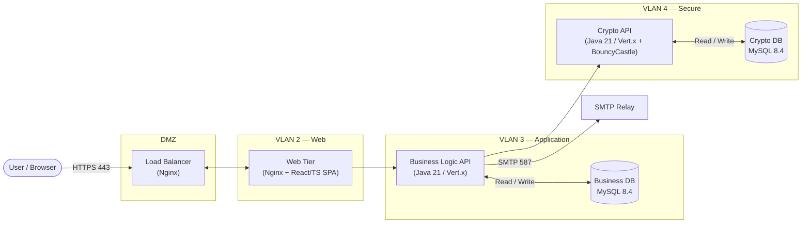

# Nexus CA

> **Anchoring Trust.**

Nexus CA is an internal Certificate Authority platform for managing the full lifecycle of Root CAs, Intermediate CAs, and issued certificates — with enforced maker-checker controls and a complete, immutable audit trail.

| | |
|---|---|
| **Version** | 1.0 (scope locked) |
| **Status** | Design baseline complete — implementation pending |
| **Audience** | Internal / private PKI only — not for public certificate issuance |
| **License** | Internal, proprietary |

---

## Contents

- [What this repository is](#what-this-repository-is)
- [Overview](#overview)
- [Scope](#scope)
- [Architecture](#architecture)
- [Technology stack](#technology-stack)
- [Roles & access control](#roles--access-control)
- [Maker-checker workflow](#maker-checker-workflow)
- [Repository structure](#repository-structure)
- [Documentation map](#documentation-map)
- [UI mockups](#ui-mockups)
- [Getting started](#getting-started)
- [Security highlights](#security-highlights)
- [Glossary](#glossary)

---

## What this repository is

This repository currently holds the **complete design baseline** for Nexus CA — requirements, architecture, low-level design, ADRs, security model, operational runbooks, and high-fidelity HTML mockups of every screen. The v1.0 scope is locked per the [BRD](Docs/1-Requirements/BRD.md).

Service code does not exist yet. The service directories described in the [developer guide](Docs/3-Implementation/developer-guide.md) (`business-logic-api/`, `crypto-api/`, `frontend/`, …) will be created when implementation begins. Until then, this is the single source of truth that implementation must conform to.

---

## Overview

Nexus CA lets an organisation run its own private PKI end to end:

- **Root CA management** — create, enable/disable, and revoke self-signed Root CAs (multiple may exist independently).
- **Intermediate CA management** — create multi-level signing hierarchies, enable/disable, and revoke; revocation cascades to all descendants.
- **Certificate issuance** — submit a CSR, issue CLIENT / SERVER / SIGNING certificates against an active Intermediate CA, and download in PEM, DER, or PKCS#7 formats.
- **User & role management** — configurable RBAC engine with five seeded roles plus custom roles, each built from a fixed permission catalogue.
- **Dual control** — every administrative and operational change runs through a maker-checker approval workflow with segregation of duties.
- **Audit & compliance** — immutable, append-only audit records with full request/approval payloads and before/after snapshots; flat reports across every entity.
- **Security** — mandatory email-based MFA, account lockout, password expiry, single active session, and email notifications for the full request lifecycle.

The name *Nexus* refers to the central connection point of a trust infrastructure — the hub from which all certificate trust chains originate. *Anchoring Trust.* reinforces the Root CA as the immovable foundation of that chain.

---

## Scope

### In scope (v1.0)

Root CA & Intermediate CA lifecycle (create / enable / disable / revoke) · multi-level CA hierarchy · CSR submission · CLIENT / SERVER / SIGNING certificate issuance · user create / enable / disable · self profile update · configurable Role Management (RBAC engine) · role assignment · maker-checker workflow · audit logging · reporting · email notifications · mandatory MFA · system configuration management.

### Out of scope (v1.0)

HSM integration · CRL · OCSP · certificate renewal · ACME · LDAP / AD integration · SSO · multi-tenancy · public certificate issuance · approval-flow customisation.

> No functionality outside the [BRD](Docs/1-Requirements/BRD.md) ships in v1.0 unless approved through formal change management.

---

## Architecture

Four deployment units across three internal VLANs plus a DMZ. CA private keys exist **only** in VLAN 4, AES-256-GCM-encrypted at rest with a deployment-injected Key Encryption Key (`CRYPTO_KEK`).



Key principles:

- **Network isolation is the primary security boundary.** No tier may initiate a connection to a tier above it; VLAN 2 and VLAN 3 have no route to VLAN 4. TLS on every hop provides defence-in-depth.
- **Crypto isolation.** The Business Logic API delegates every cryptographic operation to the Crypto API and never touches key material. Private keys never leave VLAN 4.
- **Stateless tiers.** Authentication state lives entirely in the JWT (no server-side session store); all persistent state is in the two databases. Every tier scales horizontally with client-side round-robin between tiers.
- **Scheduled work** (certificate expiry transitions, expiry warnings, pending-request escalations) runs daily on the Business Logic API, coordinated across instances by a MySQL distributed lock.

See [architecture.md](Docs/2-Design/2.1-HLD/architecture.md) for the full topology, firewall rules, and component responsibilities.

---

## Technology stack

| Layer | Technology |
|---|---|
| Load Balancer (DMZ) | Nginx — TLS termination, health checks, `limit_req` rate limiting |
| Web Tier (VLAN 2) | Nginx static server + reverse proxy; **React 18 + TypeScript 5 + Vite 5 + Tailwind CSS 3** SPA (React Router, native `fetch`, no external data/form libraries) |
| Business Logic API (VLAN 3) | **Java 21 LTS + Eclipse Vert.x 4.5** — Vert.x Web, Auth JWT, MySQL Client, Mail Client; Maven build |
| Crypto API (VLAN 4) | **Java 21 LTS + Eclipse Vert.x 4.5 + Bouncy Castle** — full X.509 lifecycle; Maven build |
| Business DB (VLAN 3) | **MySQL 8.4 LTS** — InnoDB tablespace encryption (TDE) |
| Crypto DB (VLAN 4) | **MySQL 8.4 LTS** — InnoDB TDE **plus** AES-256-GCM column encryption for private keys |
| Packaging | Docker + Docker Compose (one network per VLAN) |
| CI/CD | Gitea Actions — lint → tests → Testcontainers → OWASP/npm audit → SonarQube + Semgrep → build → image push |
| Observability | Logback JSON logs · Micrometer + Prometheus + Grafana · Vert.x Health Checks · OpenTelemetry + Zipkin |
| Secrets | OpenBao (recommended) — secrets injected as environment variables at container start |

> **BouncyCastle is the sole external crypto library.** Java's standard library can read X.509 but cannot create certificates, parse CSRs, or encode PKCS#7 chains — BouncyCastle has no standard-library substitute. See [ADR-0002](Docs/2-Design/ADRs/ADR-0002-bouncycastle-sole-crypto-library.md).

Full details, versions, and rationale: [tools.md](Docs/3-Implementation/tools.md).

---

## Roles & access control

Nexus CA ships **five seeded roles** and supports an unlimited number of **custom roles**, all built on the same configurable RBAC engine. Every role has exactly one immutable **archetype** that fixes which operations it may be granted and structurally enforces segregation of duties.

| Seeded role | Archetype | Default scope |
|---|---|---|
| `ADMIN_MAKER` | Maker | Submits CA, user, role, system-config, and CA-revocation requests |
| `ADMIN_CHECKER` | Checker | Reviews and decides administrative requests |
| `OPERATOR_MAKER` | Maker | Submits certificate issuance requests |
| `OPERATOR_CHECKER` | Checker | Reviews and decides certificate issuance requests |
| `AUDITOR` | Viewer | Read-only access across all data and requests |

- **Maker** — initiates requests (Create, Edit, Delete, Submit, Revoke, …).
- **Checker** — reviews and Approves / Rejects maker requests; never an initiator of the same feature.
- **Viewer** — read-only, for audit and compliance.

A role's permissions are a set of `(feature, operation)` pairs drawn from a fixed catalogue. Edit and Delete are offered only for User, Role, and System Configuration — cryptographic entities (Root CA, Intermediate CA, issued certificates) are never editable or deletable; their only lifecycle operations are Enable/Disable and Revoke. Delete is always a **soft delete** (records are retained with full history). Seeded roles are ordinary roles and may themselves be edited or deleted, subject to minimum-viability safeguards that prevent administrative self-lockout.

See [BRD §Role Management](Docs/1-Requirements/BRD.md#role-management-configurable-rbac).

---

## Maker-checker workflow

Every administrative and operational change is dual-controlled: one user (a **maker**) submits a request, and a different user (a **checker**) approves or rejects it before it executes.

```
PENDING_APPROVAL ──approve──▶ APPROVED ──execute──▶ EXECUTED ──▶ COMPLETED
        │
        └────reject──▶ REJECTED
```

Invariants enforced by the platform:

- **Segregation of duties** — `Created By != Approved By`. Self-approval is prohibited and checked at both UI and server.
- A **mandatory comment** is required to reject; approval comments are optional.
- Approved requests execute **exactly once**; rejected requests never execute.
- There is no withdrawal or CANCELLED state. When a request executes, all other pending requests targeting the same entity are auto-rejected as *"superseded by executed request."*
- For certificate issuance, `COMPLETED` is triggered when the OPERATOR_MAKER **downloads** the issued certificate; all other request types complete automatically on execution.
- At least one active checker must exist for a request type to be actionable; the system warns before an action would remove the last checker.

The 18 documented workflows (WF-001 … WF-018) live in [Docs/1-Requirements/Workflows/](Docs/1-Requirements/Workflows/).

---

## Repository structure

```
Certificate-Authority/
├── CLAUDE.md                 Guidance for Claude Code in this repo
├── README.md                 This file
├── Docs/                     The design baseline (source of truth)
│   ├── 1-Requirements/       BRD, workflows, branding, UI screens, checker-review
│   ├── 2-Design/
│   │   ├── 2.1-HLD/          Architecture, sequence diagrams
│   │   ├── 2.2-LLD/          Data model, crypto design, certificate profiles, error catalog, API specs
│   │   ├── ADRs/             Architecture Decision Records
│   │   └── security/         Threat model
│   ├── 3-Implementation/     Tools, developer guide, testing strategy, runbooks
│   └── glossary.md           Authoritative term definitions
├── mockups/                  High-fidelity static HTML/CSS mockups of every screen
└── .claude/                  Repo-local Claude Code agents and hooks
```

> Service directories (`business-logic-api/`, `crypto-api/`, `frontend/`, `nginx/`, `compose/`, `scripts/`, `qa/`) are described in the [developer guide](Docs/3-Implementation/developer-guide.md) and will appear once implementation begins.

---

## Documentation map

| Layer | Key documents |
|---|---|
| **Requirements** | [BRD](Docs/1-Requirements/BRD.md) · [branding](Docs/1-Requirements/branding.md) · [ui-screens](Docs/1-Requirements/ui-screens.md) · [checker-review](Docs/1-Requirements/checker-review.md) · [Workflows WF-001…WF-018](Docs/1-Requirements/Workflows/) |
| **High-Level Design** | [architecture](Docs/2-Design/2.1-HLD/architecture.md) · [sequence-diagrams](Docs/2-Design/2.1-HLD/sequence-diagrams.md) |
| **Low-Level Design** | [data-model](Docs/2-Design/2.2-LLD/data-model.md) · [crypto-design](Docs/2-Design/2.2-LLD/crypto-design.md) · [certificate-profiles](Docs/2-Design/2.2-LLD/certificate-profiles.md) · [error-catalog](Docs/2-Design/2.2-LLD/error-catalog.md) · [API specs](Docs/2-Design/2.2-LLD/api/) |
| **ADRs** | [Decision records index](Docs/2-Design/ADRs/README.md) |
| **Security** | [threat-model](Docs/2-Design/security/threat-model.md) |
| **Implementation** | [tools](Docs/3-Implementation/tools.md) · [developer-guide](Docs/3-Implementation/developer-guide.md) · [testing-strategy](Docs/3-Implementation/testing-strategy.md) · [bootstrap-procedure](Docs/3-Implementation/bootstrap-procedure.md) · [deployment-runbook](Docs/3-Implementation/deployment-runbook.md) · [key-rotation](Docs/3-Implementation/key-rotation-procedure.md) · [backup-restore](Docs/3-Implementation/backup-restore-runbook.md) · [observability](Docs/3-Implementation/observability-runbook.md) · [incident-response](Docs/3-Implementation/incident-response.md) · [disaster-recovery](Docs/3-Implementation/disaster-recovery.md) |
| **Glossary** | [glossary](Docs/glossary.md) |

---

## UI mockups

The [`mockups/`](mockups/) directory contains high-fidelity static HTML/CSS renderings of all 32 screens in the UI inventory, styled to the [brand guidelines](Docs/1-Requirements/branding.md). No build step or server is required — open the files directly in a browser.

- **By persona** — open [`mockups/personas.html`](mockups/personas.html) for a role-correct view of each of the five roles, with the right navigation and action visibility.
- **By feature** — open [`mockups/index.html`](mockups/index.html) for a gallery of every screen, grouped by feature area.

Action-bearing screens include a **"View as" role switcher** that shows and hides controls per the BRD permission matrix. See [mockups/README.md](mockups/README.md) for details.

---

## Getting started

No build, test, or run commands exist yet — implementation has not begun. Once the service code lands, per-service commands will live in each module's Maven (`pom.xml`) and npm (`package.json`) configuration, and the canonical local-dev workflow will be the [developer guide](Docs/3-Implementation/developer-guide.md).

In the meantime:

1. **Read the [BRD](Docs/1-Requirements/BRD.md)** — the canonical, scope-locked requirements.
2. **Read the [architecture](Docs/2-Design/2.1-HLD/architecture.md)** and skim the [ADRs](Docs/2-Design/ADRs/README.md) for the *why* behind the design.
3. **Browse the [mockups](mockups/index.html)** to see the intended UI.
4. **Consult the [developer guide](Docs/3-Implementation/developer-guide.md)** for the planned repository layout, prerequisites (JDK 21, Maven 3.9, Node 20, Docker), and local-run topology.

Planned toolchain prerequisites: JDK 21 LTS (Temurin) · Maven 3.9.x · Node.js 20.x LTS · npm 10.x · Docker + Docker Compose v2 · Git 2.40+.

---

## Security highlights

- **Crypto isolation** — CA private keys are generated and stored only in VLAN 4, encrypted at rest with AES-256-GCM using a deployment-injected KEK that the application never persists. Private key material never crosses into VLAN 3 or above.
- **Network segmentation** — strict, one-directional inter-VLAN firewall rules; the Crypto API is reachable from VLAN 3 only and additionally requires a shared API key on every call.
- **Mandatory MFA** — every login requires a single-use, time-bounded one-time code delivered to the user's registered email.
- **Account protection** — lockout after a configurable number of failed MFA attempts, configurable password expiry with forced reset, temporary-password expiry, and single active session enforced via a JWT `session_version`.
- **Immutable audit** — append-only audit records with full request/approval payloads and before/after snapshots; non-editable and non-deletable through the application.
- **No HSM in v1.0** — keys are software-encrypted; see [ADR-0010](Docs/2-Design/ADRs/ADR-0010-software-encrypted-keys-no-hsm-v1.md). CRL/OCSP publication is out of scope; see [ADR-0009](Docs/2-Design/ADRs/ADR-0009-no-crl-ocsp-v1.md).

Full analysis: [threat-model.md](Docs/2-Design/security/threat-model.md).

---

## Glossary

Project, PKI, and cryptographic terms are defined authoritatively in [Docs/glossary.md](Docs/glossary.md). When two documents use a term, the glossary is the canonical definition.

---

<sub>Nexus CA — internal Certificate Authority platform. v1.0 scope locked per the BRD; this README reflects the design baseline.</sub>
